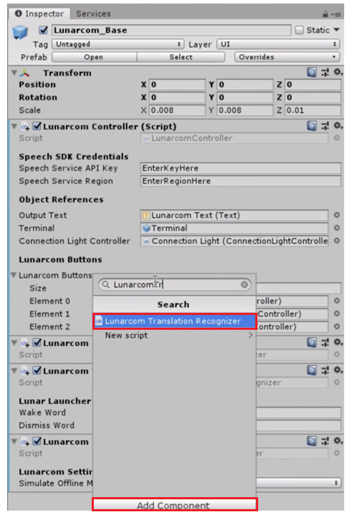
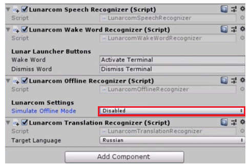
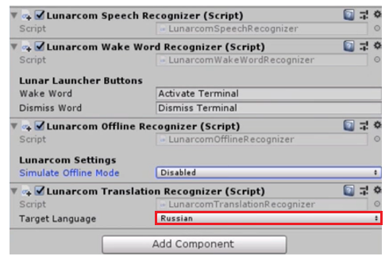
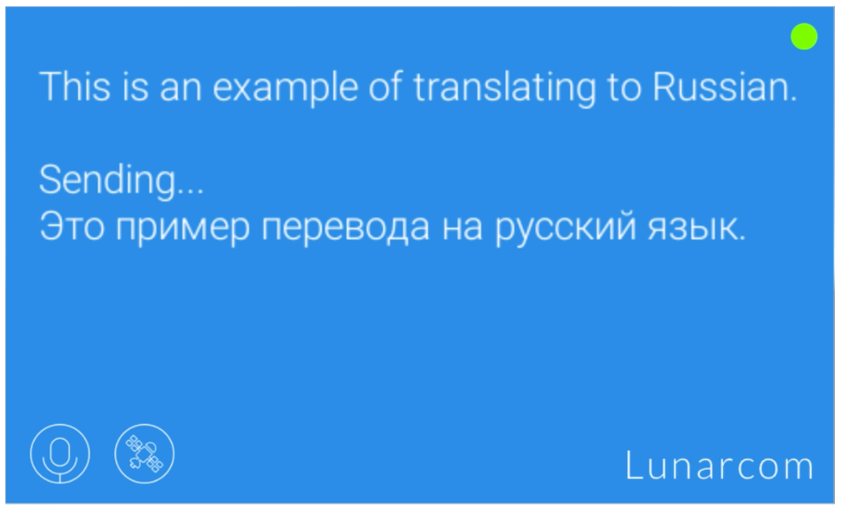

# 3. Adding the Azure Cognitive Services speech translation component

In this tutorial, we learn aabout the Azure Cognitive Services Speech Translation component in our project as well as translate into three different languages. 

## Instructions

1. Select the Lunarcom_Base object in the hierarchy, and click Add Component in the inspector panel. Search for and select LunarcomTranslationRecognizer.

> Note: Ensure the offline mode simulator is disabled before testing the Speech-SDK translator. In order to translate, you must be connected to the internet. See image below on where to find this setting. 
>
> 

2. Click the drop-down in the LunarcomTranslationRecognizer, and select the language you would like to translate to.

3. Now, run the application and test the translator by clicking the Satellite button, and begin speaking. Press the Satellite button again to stop the recognition. Below is an example of what your scene should look like. Feel free to change the language under the "Target Language" dropdown (see image above) to explore translation into other languages.

> Note: Before testing, ensure that the offline simulator is disabled, as shown in the image below.
>
> 

Below is an example of what your scene should look like:

## Congratulations

Now  your project can translate the words you speak into several different languages. Feel free to play around with the languages, and test the accuracy of the translation. 

[Next tutorial: 4.	Setting up intent and natural language understanding](mrlearning-speechSDK-ch4.md)

