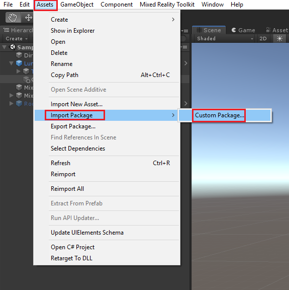
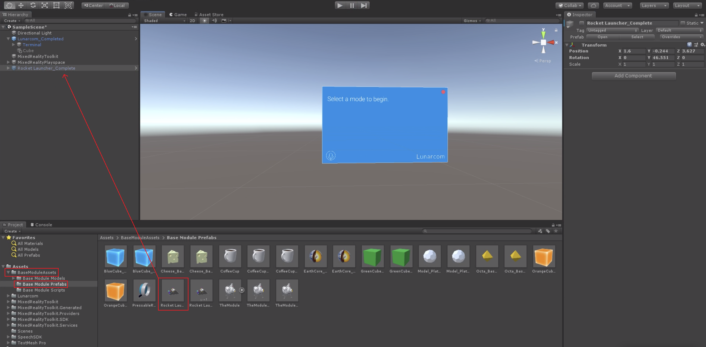
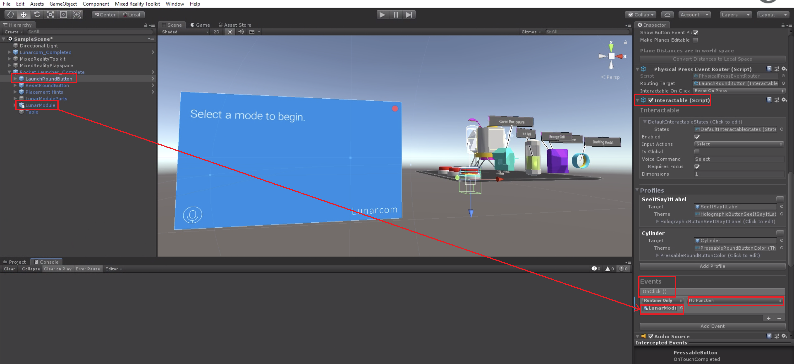
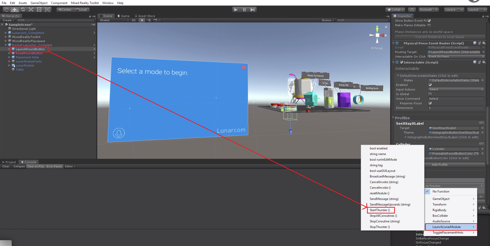
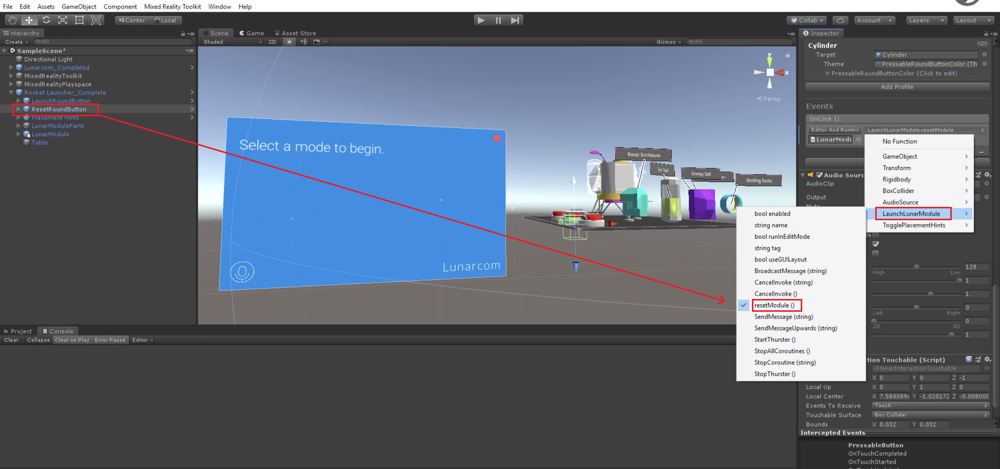
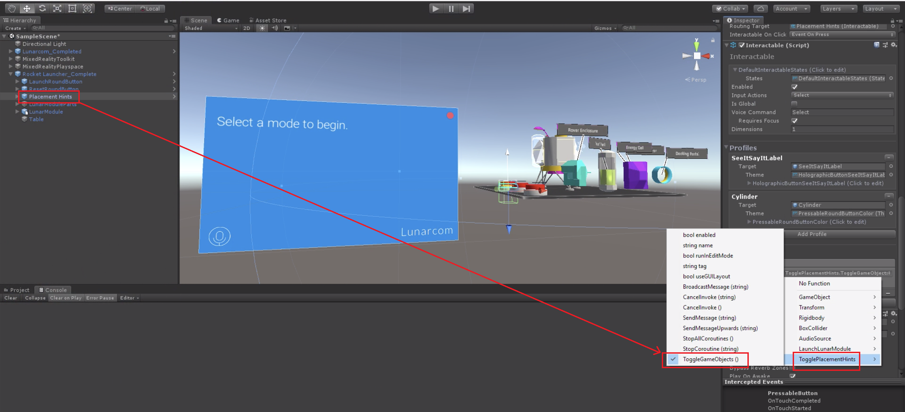
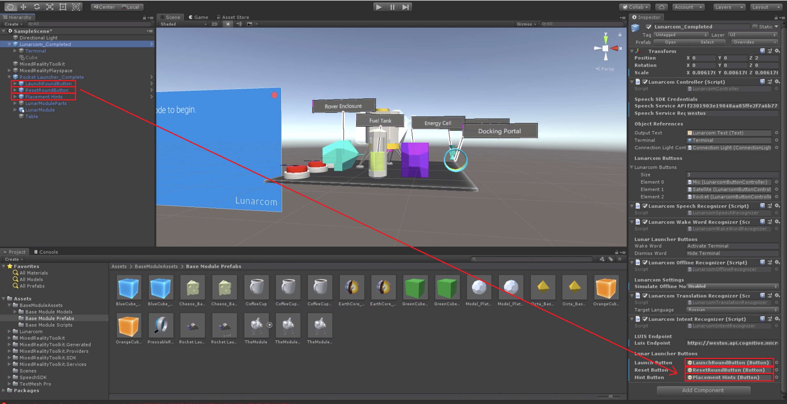
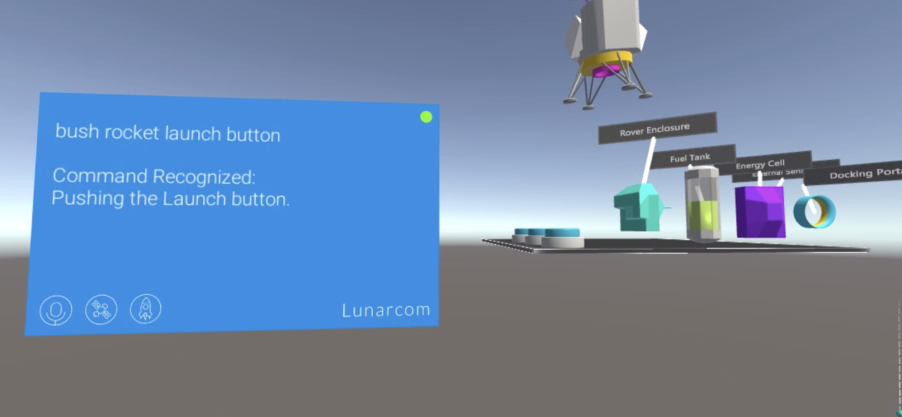
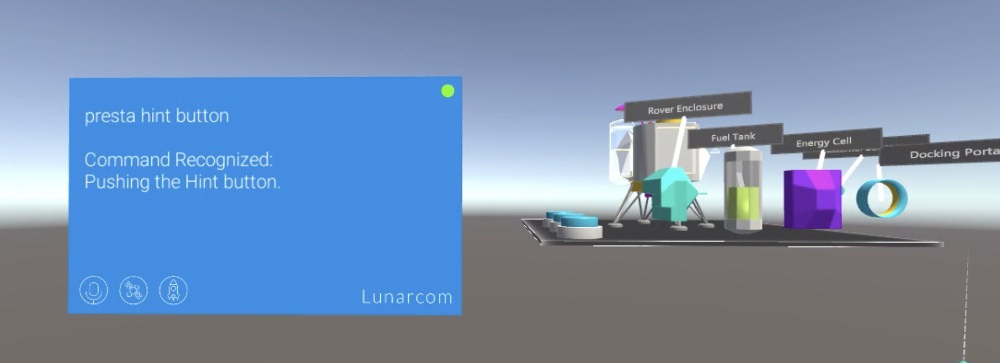
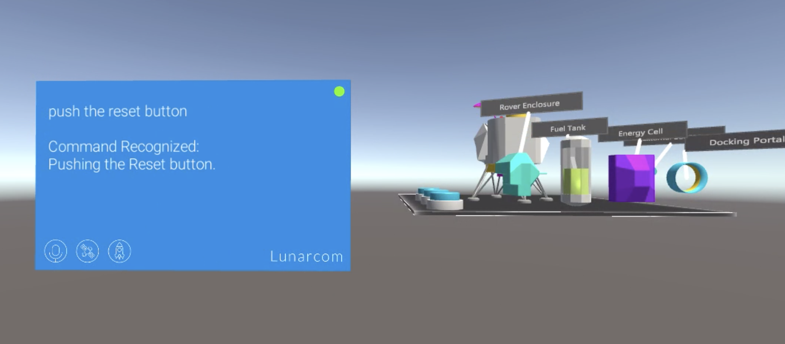

# Speech SDK Learning Module - Rocket Launcher Control Using Speech Commands

In this lesson, we will be using Azure Speech Service's Intent feature to understand the intent of the speech. We will be using the detected intent of speech as the voice commands to control the rocket launcher. During this lesson, we will be importing the Rocket Launcher asset and We will interface the detected intent voice commands to predefined control buttons to control the rocket. 

## Objectives

- Learn how to connect speech intent as voice commands.
- Learn how to use speech intent voice commands as rocket control input commands.

## Instructions
1. In this tutorial, we will be using a "BaseModule" asset to integrate rocket launcher with the speech commands. For that, we need to import the asset into our project. You can download the "Rocket Launcher" asset using this link (Attach the link). 

2. To import the asset, please go to assets->Import package->Custom package-> navigate to the downloaded file and click import.

3. After importing the "Rocket Launcher" asset, navigate inside the "Rocket Launcher" folder->Prefabs-> Select "Rocket Launcher_Complete", and then drag and drop it into the existing scene Hierarchy.

4. Now we need to integrate our "Rocket Launcher" with our LUIS project that we worked in our previous lesson (link for lesson4). For that, expand the "Rocket Launcher_Complete" prefab in the hierarchy and find the "LaunchRoundButton", "ResetRoundButton" and "Placement Hints" buttons.

5. Select "LaunchRoundButton" and in inspector panel, go to "Interactable" and under events "OnClick ()", drag and drop the "LunarModule" prefab. Then, select the function drop down and select " LunarModule" and then navigate to "StartThruster()" function and select it.

6. Select "ResetRoundButton" and in inspector panel, go to "Interactable" and under events "OnClick ()", drag and drop the "LunarModule" prefab. Then, select the function drop down and select " LunarModule" and then navigate to "resetModule()" function and select it.

7. Select "Placement Hints" and in inspector panel, go to "Interactable" and under events "OnClick ()", drag and drop the "LunarModule" prefab. Then, select the function drop down and select " LunarModule" and then navigate to "TogglePlacementHints" function and select ToggleGameOBjects().

8.  Next, Select the Lunarcom_Completed prefab in Hierarchy and navigate to "Lunarcom Intent Recognizer" script in Inspector and then drag and drop  "LaunchRoundButton", "ResetRoundButton" and "Placement Hints" buttons to their respective places.

9. Press the play button in Unity Editor and click on the "Rocket" button and utter the phrases like "Push rocket launch button","show me a placement hint", "press the rest button" or any other phrases related to launch, reset or hint's request for the rocket launcher.

## Congratulations

In this lesson, we learned how to connect the AI-powered speech commands to voice commands to use it as an input method. Now our program can use the speakers intent as voice commands to give inputs for the rocket launcher.

