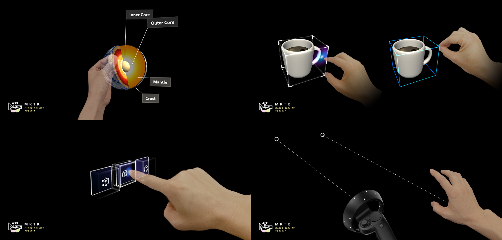
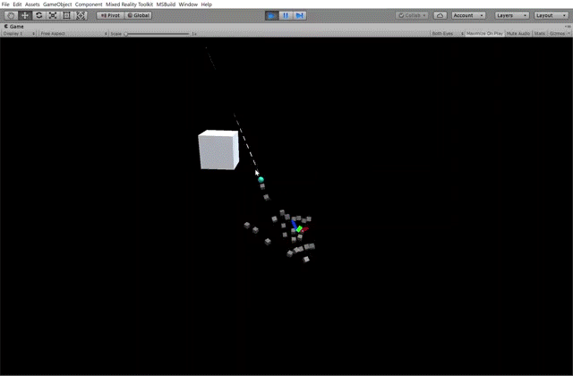
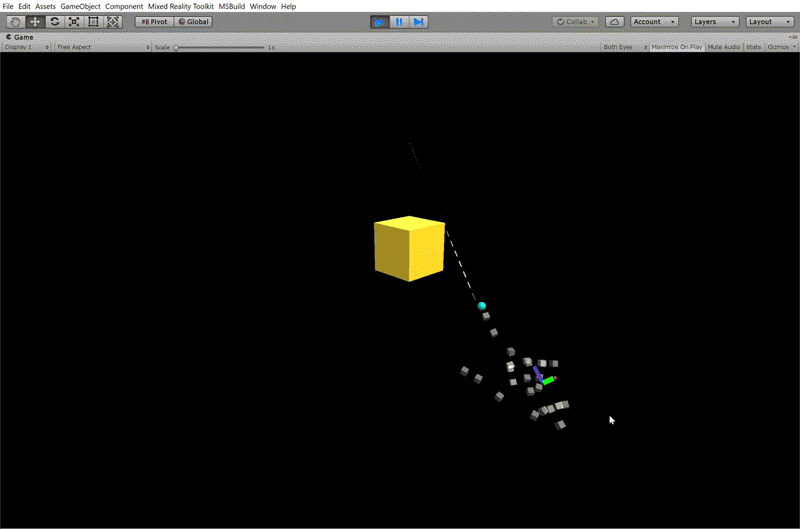
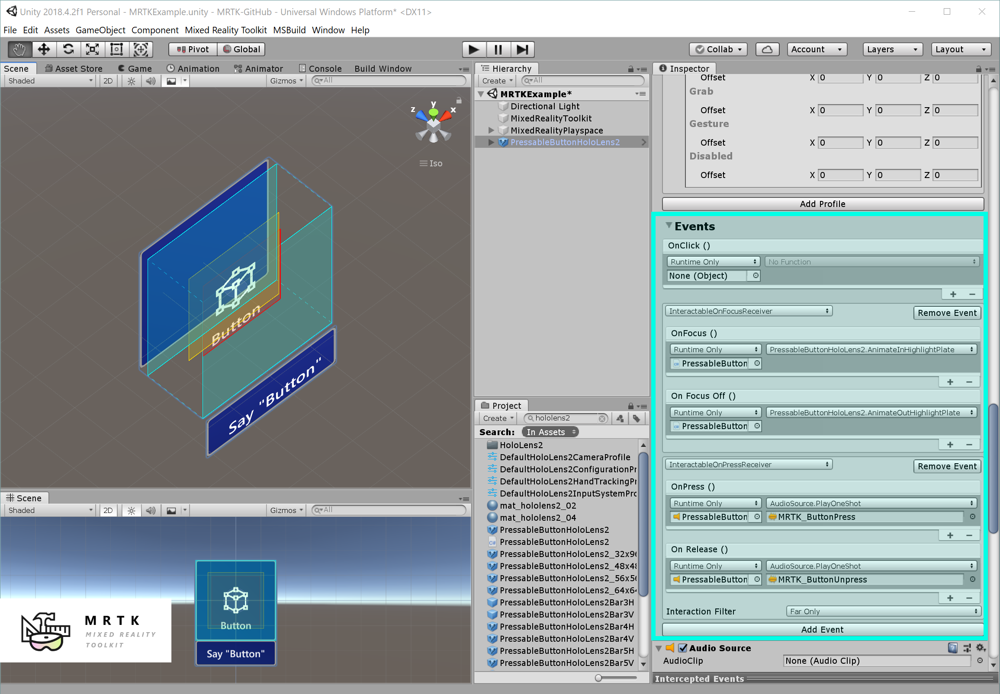
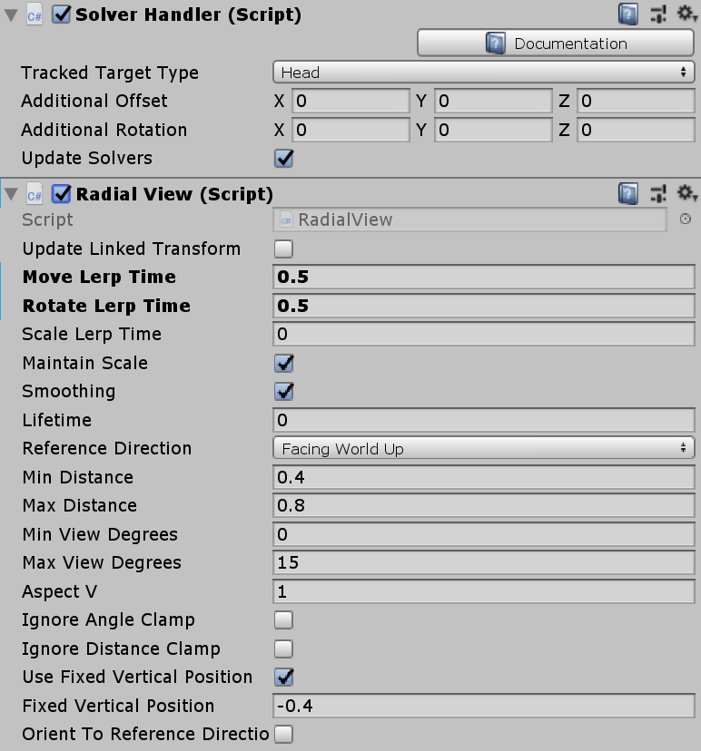
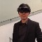

# MRTK 101: How to use Mixed Reality Toolkit Unity for Basic Interactions (HoloLens 2, HoloLens, Windows Mixed Reality, Open VR)

Learn about how to use MRTK to achieve some of the most widely used common interaction patterns in mixed reality.

- How to simulate input interactions in Unity editor?
- How to grab and move an object?
- How to resize an object?
- How to move or rotate an object with precision?
- How to make an object respond to input events?
- How to add visual feedback?
- How to add audio feedback?
- How to use HoloLens 2 style button prefabs?
- How to make an object follow you?
- How to make an object face you?

## How to simulate input interactions in Unity editor?
MRTK supports in-editor input simulation. Simply run your scene by clicking Unity's play button. Use these keys to simulate input.
Press W, A, S, D keys to move the camera.
Hold the right mouse button and move the mouse to look around.
To bring up the simulated hands, press Space bar(Right hand) or left Shift key(Left hand)
To keep simulated hands in the view, press T or Y key
To rotate simulated hands, press Q or E(horizontal) / R or F(vertical)

- [Learn more about Input Simulation in the MRTK documentation](https://microsoft.github.io/MixedRealityToolkit-Unity/Documentation/InputSimulation/InputSimulationService.html)

## How to grab and move an object?
To make an object grabbable, assign these two scripts: ManipulationHandler.cs and NearInteractionGrabbable.cs(for direct grab with articulated hand tracking input) ManipulationHandler supports both near and far interactions. You can grab and move an object with HoloLens 2's articulated hand tracking input(near), hand ray(far), motion controller's beam(far), HoloLens gaze cursor & air-tap(far).

## How to resize an object?
ManipulationHandler.cs supports two-handed scale/rotation. This works with various input types such as HoloLens 2's articulated hand input, HoloLens 1's gaze + gesture input, and Windows Mixed Reality immersive headset's motion controller input.

- [Learn more about Manipulation Handler in the MRTK documentation](https://microsoft.github.io/MixedRealityToolkit-Unity/Documentation/README_ManipulationHandler.html)

## How to move or rotate an object with precision?
Assign BoundingBox.cs to an object to use Bounding Box which is the interface for scaling and rotating an object. By default, it shows HoloLens 1 style blue handles and wires. To use HoloLens 2 style proximity-based animated handles, you need to assign prefabs and materials. Please refer to Bounding Box documentation and the BoundingBoxExamples.unity scene for the configuration details.

- [Learn more about Bounding Box in the MRTK documentation](https://microsoft.github.io/MixedRealityToolkit-Unity/Documentation/README_BoundingBox.html)

## How to make an object respond to input events?
Assign PointerHandler.cs to an object. In the inspector, you will be able to use events OnPointerDown(), OnPointerUp(), OnPointerClicked(), OnPointerDragged()
To use these events in a script, implement IMixedRealityPointerHandler.

- [Learn more about Input System in the MRTK documentation](https://microsoft.github.io/MixedRealityToolkit-Unity/Documentation/Input/Overview.html)

## How to add visual feedback?
Assign Interactable.cs to an object. In the inspector, create a new theme. Using Interactable's theme profiles, you can easily add visual feedback to all available input interaction states.

Interactable provides various types of themes including the shader theme which allows you to control properties of the shader per interaction state.

- [Learn more about Interactable in the MRTK documentation](https://microsoft.github.io/MixedRealityToolkit-Unity/Documentation/README_Interactable.html)

Another important building block for visual feedback is the MRTK Standard Shader. With MRTK Standard Shader, you can easily add visual feedback effects such as hover light and proximity light. Since MRTK Standard shader performs significantly less computation than the Unity Standard shader, you can create a performant experience.

Create a new material and select the Shader 'Mixed Reality Toolkit > Standard'. Or you can pick one of the existing materials that use MRTK Standard Shader.

  

- [Learn more about MRTK Standard Shader in the MRTK documentation](https://microsoft.github.io/MixedRealityToolkit-Unity/Documentation/README_MRTKStandardShader.html)

## How to add audio feedback?
Add AudioSource to an object. Then, in the scripts that exposes input events(e.g. Interactable.cs or PointerHandler.cs), assign the object to the event and select AudioSource.PlayOneShot(). You can use your audio clips or choose one from MRTK's audio assets.

## How to use HoloLens 2 style button prefabs?
MRTK provides various types of HoloLens 2's shell(OS) style buttons. It provides sophisticated visual feedbacks such as proximity light, compressing box, and a ripple effect on the button surface.

Simply drag and drop one of the HoloLens 2 style pressable button prefab into your scene. The prefab uses Interactable.cs which is introduced above. You can use exposed events such as OnClick() in the Interactable to trigger actions.

- [Learn more about Button prefabs in the MRTK documentation](https://microsoft.github.io/MixedRealityToolkit-Unity/Documentation/README_Button.html)

## How to make an object follow you?
Assign RadialView.cs script to an object. It is part of the Solver script series that allows you to achieve various types of object positioning in 3D space. SolverHandler.cs will be automatically added.
Below is an example of RadialView configuration to achieve 'lazy follow' tag-along behavior just like the Start menu in the HoloLens shell. You can specify the minimum/maximum distance and minimum/maximum view degrees. The example below shows positioning the object between 0.4m and 0.8m range within 15°. Adjust Lerp Time values to make the positional update faster or slower.

- [Learn more about Solvers in the MRTK documentation](https://microsoft.github.io/MixedRealityToolkit-Unity/Documentation/README_Solver.html)

## How to make an object face you?
Assign Billboard.cs script to an object. It will always face you, regardless of your position. You can specify the pivot axis option.

Ready to create amazing experiences for mixed reality? Visit the pages below and learn more about MRTK and mixed reality.

## About the author

<table style="border-collapse:collapse" padding-left="0px">
<tr>
<td style="border-style: none" width="60px"></td>
<td style="border-style: none"><b>Dong Yoon Park</b> UX Designer @Microsoft</td>
</tr>
</table>

## See also

* [Mixed Reality Toolkit-Unity (MRTK) GitHub](https://github.com/Microsoft/MixedRealityToolkit-Unity)
* [MRTK Documentation Portal](https://microsoft.github.io/MixedRealityToolkit-Unity/README.html)
* [Getting Started with MRTK](https://microsoft.github.io/MixedRealityToolkit-Unity/Documentation/GettingStartedWithTheMRTK.html)
* [HoloToolkit to MRTK Porting Guideline](https://microsoft.github.io/MixedRealityToolkit-Unity/Documentation/HTKToMRTKPortingGuide.html)
