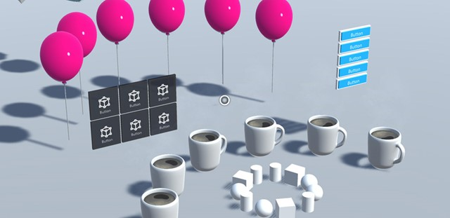
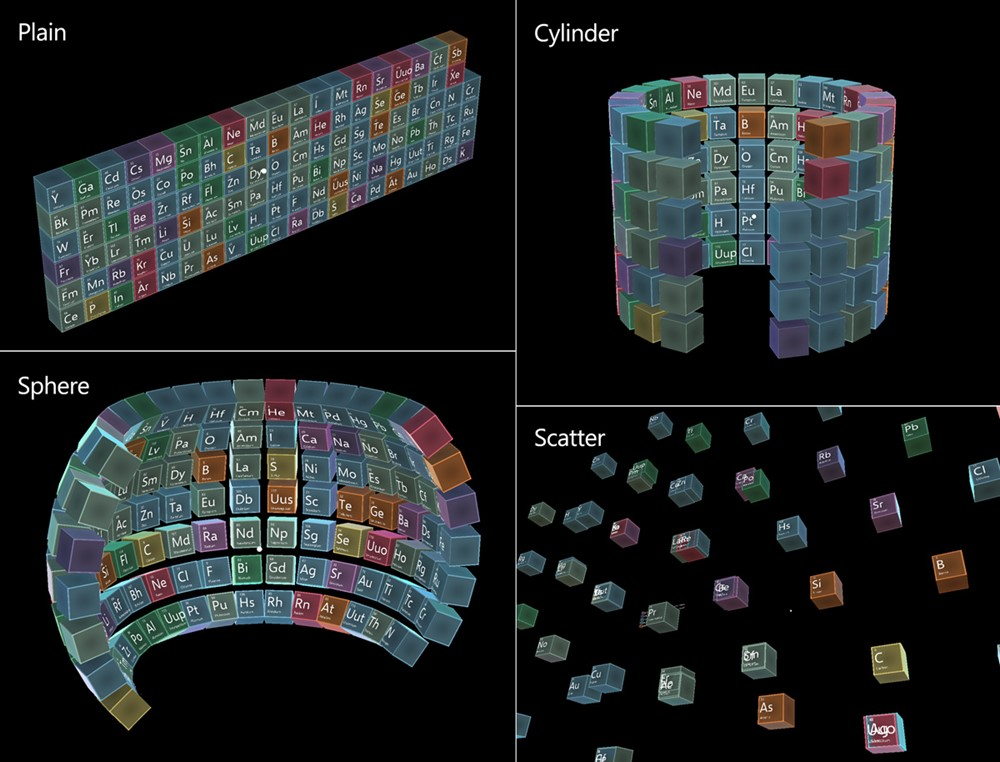
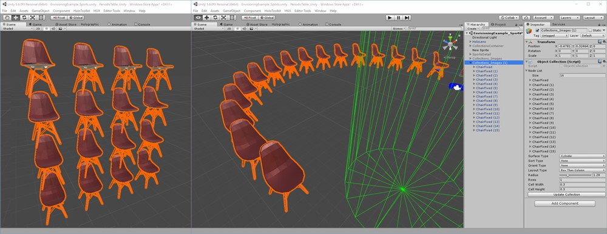
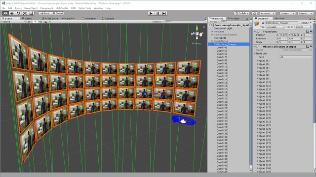
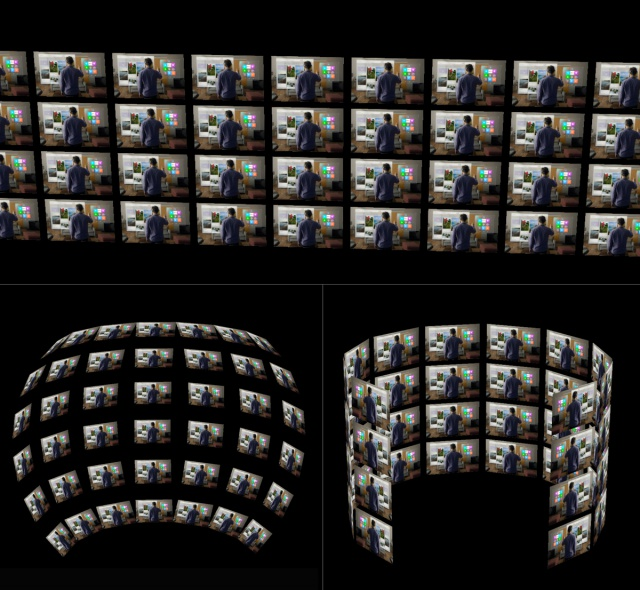

# Object collection

Object collection is a layout control which helps you lay out an array of objects in a predefined three-dimensional shape. It supports various surface styles - **plane, cylinder, sphere** and **radial**. You can adjust the radius and size of the objects and the space between them. Object collection supports any object from Unity - both 2D and 3D. In the **[Mixed Reality Toolkit](https://microsoft.github.io/MixedRealityToolkit-Unity/Documentation/README_ObjectCollection.html)**, we have created Unity script and examples that will help you create an object collection.

 
*Examples of using object collection*

## Object collection examples

[Periodic Table of the Elements](periodic-table-of-the-elements.md) is a sample app that demonstrates how Object collection works. It uses Object collection to lay out 3D chemical element boxes in different shapes.

 
*Object collection examples shown in the Periodic Table of the Elements sample app*

### 3D objects

You can use Object collection to lay out imported 3D objects. The example below shows a plane and a cylinder layout of some 3D chair objects.

 
*Examples of plane and cylindrical layouts of 3D objects*

### 2D objects

You can also use 2D images with Object collection. The examples below demonstrate how 2D images can be displayed in a grid.

 
*Examples of using object collection with 2D images*

## See also
* [Scripts and prefabs for Object collection in the Mixed Reality Toolkit on GitHub](https://github.com/microsoft/MixedRealityToolkit-Unity/blob/mrtk_release/Documentation/README_ObjectCollection.md)
* [Interactable object](interactable-object.md)
* [Bounding Box](app-bar-and-bounding-box.md)
