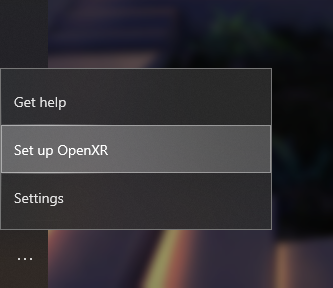

# Getting started with OpenXR

You can develop using OpenXR on a HoloLens 2 or Windows Mixed Reality immersive headset on the desktop.  If you don't have access to a headset, you can use the HoloLens 2 Emulator or the Windows Mixed Reality Simulator instead.

## Getting started with OpenXR for HoloLens 2

To start developing OpenXR applications for HoloLens 2:

1. Set up a HoloLens 2 or follow the instructions to [install the HoloLens 2 emulator](using-the-hololens-emulator.md).
1. Launch the Store app from within the device or emulator and ensure all apps are updated.  This will ensure that the OpenXR runtime on your HoloLens is updated to OpenXR 1.0.  If using the emulator, you'll want to consult the [emulator input instructions](using-the-hololens-emulator.md#basic-emulator-input) to help you use the Store app within the emulator.

## Getting started with OpenXR for Windows Mixed Reality headsets

To start developing OpenXR applications for immersive Windows Mixed Reality headsets:

1. Be sure you are running the Windows 10 May 2019 Update (1903), which is the minimum requirement for Windows Mixed Reality end users to run OpenXR applications.  If you're on an earlier version of Windows 10, you can upgrade to the May 2019 Update using the <a href="https://www.microsoft.com//software-download/windows10" target="_blank">Windows 10 Update Assistant</a>.  If you're not able to update your PC, it is also possible to [develop your OpenXR app using Windows 10 October 2018 Update (1809)](openxr.md#developing-on-windows-10-october-2018-update), although you may experience lower performance or other issues.
2. Set up a Windows Mixed Reality headset or follow the instructions to [enable the Windows Mixed Reality simulator](using-the-windows-mixed-reality-simulator.md).  After setting up Windows Mixed Reality, Mixed Reality Portal will automatically install the Windows Mixed Reality OpenXR Runtime.  The Microsoft Store will then keep the runtime up to date.
3. Make the Windows Mixed Reality OpenXR Runtime active by launching Mixed Reality Portal from the Start menu, clicking the ... menu in the lower-left and selecting "Set up OpenXR". 

If you ever need to make the Windows Mixed Reality OpenXR Runtime active again, repeat step 3.

> [!NOTE]
> The Windows Mixed Reality OpenXR Runtime will soon be set up automatically for all Windows Mixed Reality end users.

## Getting the Windows Mixed Reality OpenXR Developer Portal

To try out the Windows Mixed Reality OpenXR Runtime, you can install the <a href="https://www.microsoft.com/store/productId/9n5cvvl23qbt" target="_blank">Mixed Reality OpenXR Developer Portal app</a>.  This app provides a demo scene that exercises various features of OpenXR, along with a System Status page that provides key information about the active runtime and the current headset.

## Building a sample OpenXR app

The <a href="https://github.com/Microsoft/OpenXR-SDK-VisualStudio/tree/master/samples/BasicXrApp" target="_blank">BasicXrApp</a> project demonstrates a simple OpenXR sample with two Visual Studio project files, one for both a Win32 desktop app and one for a UWP HoloLens 2 app.  Because the solution contains a HoloLens UWP project, you'll need the [Universal Windows Platform development workload](install-the-tools.md#installation-checklist) installed in Visual Studio to fully open it.

Note that while the Win32 and UWP project files are separate due to differences in packaging and deployment, the app code inside each project is 100% the same!

After building an OpenXR Win32 desktop .EXE, you can use it with a VR headset on any desktop VR platform that supports OpenXR, whether it's a Windows Mixed Reality headset or any other headset.

After building an OpenXR UWP app package, you can [deploy that package](using-visual-studio.md) to either a HoloLens 2 device or the HoloLens 2 Emulator.

## Troubleshooting

If you have trouble getting up and running with OpenXR development, check out our [troubleshooting tips](openxr-troubleshooting.md).