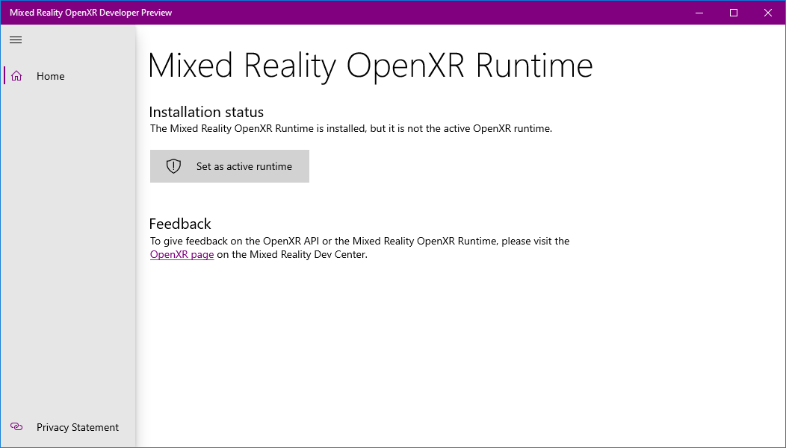

# OpenXR

OpenXR is an open royalty-free standard from [Khronos](https://www.khronos.org/) that provides native access to a wide range of devices from many vendors that span across the [mixed reality spectrum](mixed-reality.md).

With OpenXR, you can build applications that target both holographic devices (like HoloLens 2) that place digital content in the real world as if it were really there, as well as immersive devices (like Windows Mixed Reality headsets for desktop PCs) that hide the physical world and replace it with a digital experience.  OpenXR lets you write code once that's then portable across a wide range of hardware platforms.

The OpenXR standard is currently in a provisional phase, with an initial OpenXR 0.90 spec released for feedback.  For more information on OpenXR, including access to the [provisional 0.90 spec](https://www.khronos.org/registry/OpenXR/specs/0.90/html/xrspec.html) and [headers](https://github.com/KhronosGroup/OpenXR-Docs/tree/master/include/openxr), see the [Khronos OpenXR page](https://www.khronos.org/openxr/). 

You can try out the provisional OpenXR 0.90 API on a HoloLens 2 or a desktop PC using the Mixed Reality OpenXR Developer Preview.  This early runtime enables applications targeting the OpenXR 0.90 API to target HoloLens 2 or Windows Mixed Reality immersive headsets on the desktop.

If you don't have access to a headset, you can use the HoloLens 2 Emulator or the Windows Mixed Reality Simulator instead.

## Setting up the Mixed Reality OpenXR Developer Preview for HoloLens 2

To get started with the Mixed Reality OpenXR Developer Preview on HoloLens 2:

1. Set up a HoloLens 2 or follow the instructions to [install the HoloLens 2 emulator](using-the-hololens-emulator.md).
1. Launch the Store app from within the device or emulator and ensure all apps are updated.  This will install the Mixed Reality OpenXR Developer Preview for use with apps on that device.  If using the emulator, you'll want to consult the [emulator input instructions](using-the-hololens-emulator.md#basic-emulator-input) to help you use the Store app within the emulator.

## Setting up the Mixed Reality OpenXR Developer Preview for immersive desktop headsets

To get started with the Mixed Reality OpenXR Developer Preview on a desktop PC:

1. Be sure you are running the Windows 10 October 2018 Update (1809) or the Windows 10 May 2019 Update (1903).  If you're on an earlier version of Windows 10, you can upgrade to the May 2019 Update using the [Windows 10 Update Assistant](https://www.microsoft.com/en-us/software-download/windows10).
1. Set up a Windows Mixed Reality headset or follow the instructions to [enable the Windows Mixed Reality simulator](using-the-windows-mixed-reality-simulator.md).
1. Install the [Mixed Reality OpenXR Developer Preview app](https://www.microsoft.com/store/productId/9n5cvvl23qbt).  This app gets you set up with the preview OpenXR runtime on Windows 10 October 2018 Update (1809) or later.  After installing this app, the Windows Store will keep the runtime up to date.
1. Run the Mixed Reality OpenXR Developer Preview app from the Start menu and follow the instructions to make the runtime active.  Soon, this app will let you explore other OpenXR debug information as well.

### Support for Windows 10 October 2018 Update

If you're running the Windows 10 May 2019 Update (1903) and followed the steps above, you should be ready to use the Mixed Reality OpenXR Developer Preview!

If you're not ready to [upgrade your desktop PC to the May 2019 Update](https://www.microsoft.com/en-us/software-download/windows10), you can get going on the Windows 10 October 2018 Update (1809) by following one more step:

1. Follow the steps above to install the Mixed Reality OpenXR Developer Preview.
1. To set the Mixed Reality OpenXR Developer Preview as your system's active OpenXR runtime, install the [Mixed Reality OpenXR Developer Preview Compatibility Pack](https://aka.ms/openxr-compat).

## Building a sample OpenXR app

The [BasicXrApp](https://github.com/Microsoft/OpenXR-SDK-VisualStudio/tree/master/samples/BasicXrApp) project demonstrates a simple OpenXR sample with two Visual Studio project files, one for both a Win32 desktop app and one for a UWP HoloLens 2 app.  Because the solution contains a HoloLens UWP project, you'll need the [Universal Windows Platform development workload](install-the-tools.md#installation-checklist) installed in Visual Studio to fully open it.

Note that while the Win32 and UWP project files are separate due to differences in packaging and deployment, the app code inside each project is 100% the same!

## Feedback

To give feedback on the [OpenXR Provisional 0.90 specification](https://www.khronos.org/registry/OpenXR/specs/0.90/html/xrspec.html), please visit the [Khronos OpenXR Forums](https://community.khronos.org/c/openxr), [Slack #openxr channel](https://khr.io/slack) and the [spec issue tracker](https://github.com/KhronosGroup/OpenXR-Docs/issues).

## Troubleshooting

Here are some troubleshooting tips for the Mixed Reality OpenXR Developer Preview.  If you're hitting any other problems, please visit the [Khronos OpenXR Forums](https://community.khronos.org/c/openxr) or [Slack #openxr channel](https://khr.io/slack).

### OpenXR app not starting Windows Mixed Reality

If your OpenXR app is not starting Windows Mixed Reality when you run it, the Mixed Reality OpenXR Developer Preview may not be set as the active runtime.  Be sure to run the Mixed Reality OpenXR Developer Preview app and follow the instructions to make the runtime active.

### Mixed Reality OpenXR Developer Preview app cannot be installed 

Be sure you are running at least the Windows 10 October 2018 Update (1809).  If you're on an earlier version of Windows 10, you can upgrade to the May 2019 Update (1903) using the [Windows 10 Update Assistant](https://www.microsoft.com/en-us/software-download/windows10).

If the Install button on the Mixed Reality OpenXR Developer Preview app does nothing on Windows 10 October 2018 Update, your system may have cached stale system requirements for the app.  You can run the command `wsreset.exe` from a command prompt to clear the cache.

## See also

* [More information on OpenXR](https://www.khronos.org/openxr/)
* [OpenXR Provisional 0.90 specification](https://www.khronos.org/registry/OpenXR/specs/0.90/html/xrspec.html)
* [OpenXR Provisional 0.90 API reference](https://www.khronos.org/registry/OpenXR/specs/0.90/man/html/)
* [OpenXR Provisional 0.90 headers](https://github.com/KhronosGroup/OpenXR-Docs/tree/master/include/openxr)
* [OpenXR Provisional 0.90 quick reference guide](https://www.khronos.org/registry/OpenXR/specs/0.90/refguide/OpenXR-0.90-web.pdf)
