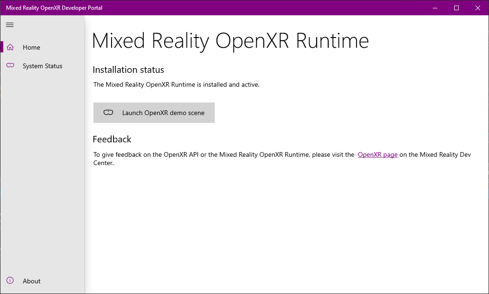

# OpenXR

OpenXR is an open royalty-free API standard from [Khronos](https://www.khronos.org/) that provides engines native access to a wide range of devices from many vendors that span across the [mixed reality spectrum](mixed-reality.md).

You can develop using OpenXR on a HoloLens 2 or Windows Mixed Reality immersive headset on the desktop.  If you don't have access to a headset, you can use the HoloLens 2 Emulator or the Windows Mixed Reality Simulator instead.

## Why OpenXR?

With OpenXR, you can build engines that target both holographic devices (like HoloLens 2) that place digital content in the real world as if it were really there, as well as immersive devices (like Windows Mixed Reality headsets for desktop PCs) that hide the physical world and replace it with a digital experience.  OpenXR lets you write code once that's then portable across a wide range of hardware platforms.

The OpenXR API uses a loader that connects your application directly to your headset's native platform support.  This offers your end users maximum performance and minimum latency, whether they're using a Windows Mixed Reality headset or any other headset.

## What is OpenXR?

The core OpenXR 1.0 API provides the base functionality you'll need to build an engine that can target both holographic devices like HoloLens 2 and immersive devices like Windows Mixed Reality headsets:
* Systems + sessions​
* Reference spaces (view, local, stage)​
* View configurations (mono, stereo)​
* Swapchains + frame timing​
* Composition layers​
* Input and haptics​
* Graphics API + platform integration​

To learn about the OpenXR API, check out the [OpenXR 1.0 specification](https://www.khronos.org/registry/OpenXR/specs/1.0/html/xrspec.html) and [OpenXR 1.0 API reference](https://www.khronos.org/registry/OpenXR/specs/1.0/man/html/openxr.html).  For more information, see the [Khronos OpenXR page](https://www.khronos.org/openxr/).

To target the full feature set of HoloLens 2, you'll also use cross-vendor and vendor-specific OpenXR extensions that enable additional features beyond the OpenXR 1.0 core, such as articulated hand tracking, eye tracking, spatial mapping and spatial anchors.  See the [Roadmap section](openxr.md#roadmap) section below for more information on the extensions coming later this year.

Note that OpenXR is not itself a mixed reality engine.  Instead, OpenXR enables engines like Unity and Unreal to write portable code once that can then access the native platform features of the user's holographic or immersive device, regardless of which vendor built that platform.

## Getting started with OpenXR for HoloLens 2

To start developing OpenXR applications for HoloLens 2:

1. Set up a HoloLens 2 or follow the instructions to [install the HoloLens 2 emulator](using-the-hololens-emulator.md).
1. Launch the Store app from within the device or emulator and ensure all apps are updated.  This will ensure that the OpenXR runtime on your HoloLens is updated to OpenXR 1.0.  If using the emulator, you'll want to consult the [emulator input instructions](using-the-hololens-emulator.md#basic-emulator-input) to help you use the Store app within the emulator.

## Getting started with OpenXR for Windows Mixed Reality headsets

To start developing OpenXR applications for immersive Windows Mixed Reality headsets:

1. Be sure you are running the Windows 10 May 2019 Update (1903), which is the minimum requirement for Windows Mixed Reality end users to run OpenXR applications.  If you're on an earlier version of Windows 10, you can upgrade to the May 2019 Update using the [Windows 10 Update Assistant](https://www.microsoft.com/en-us/software-download/windows10).  If you're not able to update your PC, it is also possible to [develop your OpenXR app using Windows 10 October 2018 Update (1809)](openxr.md#developing-on-windows-10-october-2018-update), although you may experience lower performance or other issues.
1. Set up a Windows Mixed Reality headset or follow the instructions to [enable the Windows Mixed Reality simulator](using-the-windows-mixed-reality-simulator.md).
1. Install the [Mixed Reality OpenXR Developer Portal app](https://www.microsoft.com/store/productId/9n5cvvl23qbt).  Installing this app will automatically install the Mixed Reality OpenXR Runtime.  After the OpenXR runtime is installed, the Microsoft Store will keep the runtime up to date.
1. Run the Mixed Reality OpenXR Developer Portal app from the Start menu and follow the instructions to make the runtime active.

> [!NOTE]
> The Mixed Reality OpenXR Runtime will shortly be available to all Windows Mixed Reality end users through the Mixed Reality Portal app.

## Building a sample OpenXR app

The [BasicXrApp](https://github.com/Microsoft/OpenXR-SDK-VisualStudio/tree/master/samples/BasicXrApp) project demonstrates a simple OpenXR sample with two Visual Studio project files, one for both a Win32 desktop app and one for a UWP HoloLens 2 app.  Because the solution contains a HoloLens UWP project, you'll need the [Universal Windows Platform development workload](install-the-tools.md#installation-checklist) installed in Visual Studio to fully open it.

Note that while the Win32 and UWP project files are separate due to differences in packaging and deployment, the app code inside each project is 100% the same!

## Roadmap

The OpenXR specification defines an extension mechanism that enables runtime implementers to expose additional functionality beyond the [core features](openxr.md#what-is-openxr) defined in the [base OpenXR 1.0 specification](https://www.khronos.org/registry/OpenXR/specs/1.0/html/xrspec.html).

There are three kinds of OpenXR extensions:
* **Vendor extensions (e.g. MSFT):** Enables per-vendor innovation in hardware or software features.  Any runtime vendor can introduce and ship a vendor extension at any time.
* **EXT extensions:** Cross-vendor extensions that multiple companies define and implement.  Groups of interested companies can introduce EXT extensions at any time.
* **KHR extensions:** Official Khronos extensions ratified as part of a core spec release.  KHR extensions are covered by the same license as the core spec itself.

By the end of the year, the Mixed Reality OpenXR Runtime will support a set of MSFT and EXT extensions that bring the full set of HoloLens 2 features to OpenXR applications:
* [Unbounded reference space (world-scale experiences)](coordinate-systems.md#building-a-world-scale-experience)
* [Spatial anchors + storage](spatial-anchors.md)
* [Hand articulation + hand mesh​](hands-and-tools.md)
* [Eye gaze](eye-tracking.md)
* [Secondary view configurations (Mixed Reality Capture)](mixed-reality-capture-for-developers.md#render-from-the-pv-camera-opt-in)​
* [Spatial mapping​](spatial-mapping.md)
* Interop with Windows SDK APIs

While some of these extensions may start out as vendor-specific MSFT extensions, Microsoft and other OpenXR runtime vendors are working together to design cross-vendor EXT or KHR extensions for many of these feature areas.  This will enable the code you write for those features to be portable across runtime vendors, just as with the core specification.

## Troubleshooting

Here are some troubleshooting tips for the Mixed Reality OpenXR Runtime.  If you have any other questions about the [OpenXR 1.0 specification](https://www.khronos.org/registry/OpenXR/specs/1.0/html/xrspec.html), please visit the [Khronos OpenXR Forums](https://community.khronos.org/c/openxr) or [Slack #openxr channel](https://khr.io/slack).

### Developing on Windows 10 October 2018 Update

If you're not able to [upgrade your development PC to the May 2019 Update](https://www.microsoft.com/en-us/software-download/windows10), you can set up your Windows 10 October 2018 Update (1809) PC for development by following one more step:

1. Follow the steps above to get started with OpenXR on your desktop PC.
1. To set the Mixed Reality OpenXR Runtime as your system's active OpenXR runtime, install the [Mixed Reality OpenXR Developer Compatibility Pack](https://aka.ms/openxr-compat).

> [!NOTE]
> Although Windows 10 October 2018 Update (1809) can be used when developing your OpenXR applications, the Windows 10 May 2019 Update (1903) is the minimum requirement for end users to use OpenXR with Windows Mixed Reality.  You may experience lower performance or other issues when running your OpenXR app on the October 2018 Update.  It is strongly recommended that you upgrade your development PC to the Windows 10 May 2019 Update (1903).

### OpenXR app not starting Windows Mixed Reality

If your OpenXR app is not starting Windows Mixed Reality when you run it, the Mixed Reality OpenXR Runtime may not be set as the active runtime.  Be sure to run the Mixed Reality OpenXR Developer Portal app and follow the instructions to make the runtime active.

### Mixed Reality OpenXR Developer Portal app cannot be installed 

Be sure you are running at least the Windows 10 October 2018 Update (1809).  If you're on an earlier version of Windows 10, you can upgrade to the May 2019 Update (1903) using the [Windows 10 Update Assistant](https://www.microsoft.com/en-us/software-download/windows10).

If the Install button on the Mixed Reality OpenXR Developer Portal app does nothing on Windows 10 October 2018 Update, your system may have cached stale system requirements for the app.  You can run the command `wsreset.exe` from a command prompt to clear the cache.

## See also

* [More information on OpenXR](https://www.khronos.org/openxr/)
* [OpenXR 1.0 specification](https://www.khronos.org/registry/OpenXR/specs/1.0/html/xrspec.html)
* [OpenXR 1.0 API reference](https://www.khronos.org/registry/OpenXR/specs/1.0/man/html/openxr.html)
* [OpenXR 1.0 quick reference guide](https://www.khronos.org/registry/OpenXR/specs/1.0/refguide/OpenXR-1.0-web.pdf)
