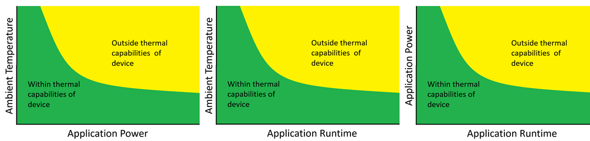
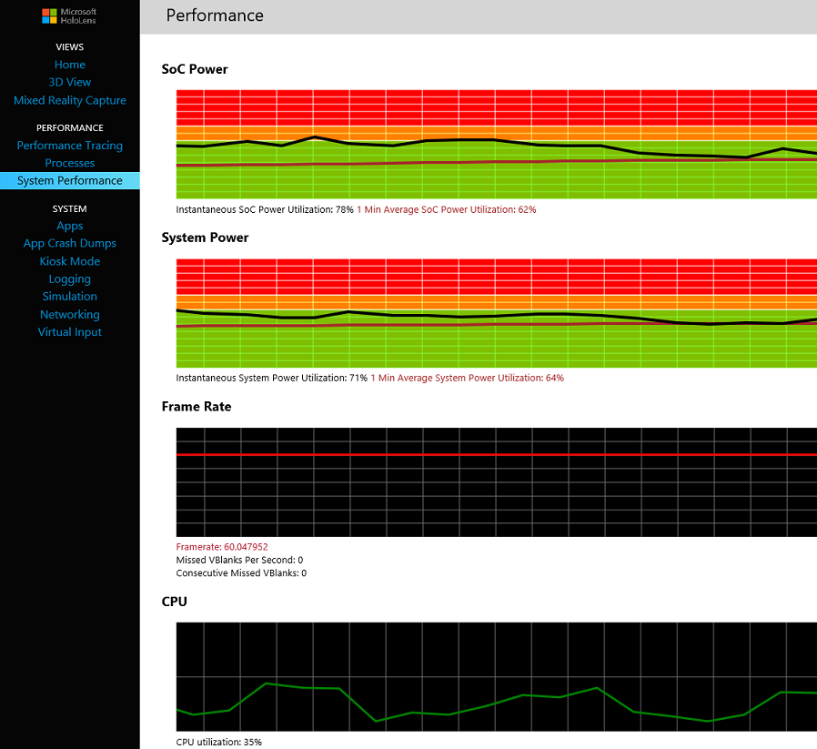

# Performance recommendations for HoloLens apps

HoloLens is capable of presenting an immersive holographic experience to the user without being tethered to a PC, phone or external cameras. To accomplish this, HoloLens has more compute power than the average laptop with passive cooling. The passive cooling means that there is no fan and no noise that disturbs the user’s experience.

Sensor processing is offloaded to the holographic processing unit (HPU) specifically designed to process camera data captured by HoloLens to ensure stable hologram presentation and real time tracking of gaze and gesture inputs. Off-loading sensor fusion to the HPU frees up the host processor for applications while also ensuring the real time requirements of the tracking infrastructure.

Developing applications for HoloLens is different from developing typical desktop applications because the user’s view has to be quickly updated as she moves around in her world. Each eye has to be presented with independent visual frames to simulate the appearance of holographic objects in accordance with the laws of physics. As the user moves around, the visual representation has to be updated with minimal latency to avoid objects shifting relative to their real world counterparts. Because of this, the rendering pipeline of a holographic application is very similar to the rendering pipeline of a 3D game from the first person point of view. Note that forward rendering is cheaper on mobile chip sets when compared to the deferred pipeline.

## Performance guidelines

Holographic applications need to balance visual complexity, presentation frame rate, rendering latency, input latency, power consumption for thermals, and battery life to achieve an optimal immersive experience. For user comfort, it is important to achieve consistent and high frame rates with minimal latency. Applications should target 60 frames per second (fps) with 1 frame latency. The HoloLens display pipeline is able to upscale the application frame rate to match the display’s native frame rate by making small corrections to the presented frames based on very high frequency tracking information. This is critical to achieving stable holograms that behave like real world objects in the user’s holographic environment.

Once the application achieves its target display rate, it is important to monitor power consumption and to ensure that the application operates within the designed thermal and power envelope of HoloLens.

Both frame rate and power consumption can be observed in the HoloLens Device Management System Performance view.

**Essential Performance Targets**

|  Metric  |  Target | 
|----------|----------|
|  [Frame Rate](hologram-stability.md#frame-rate)  |  60 fps | 
|  Power consumption  |  1-minute average in orange and green area. See System Performance Tool information. | 
|  Memory  |  < 900 MB Total Commit | 

Tip: If an application is not achieving close to 60 fps, power consumption can be misleadingly low. Therefore, ensure that the application achieves close to target frame rates before taking power measurements.

## Development process guidance

Because of the real time and low latency rendering requirements of HoloLens it is critical to track performance from the very beginning of the development process. The general guidance is to achieve [60 fps](hologram-stability.md#frame-rate) as early in the development cycle as possible. Once the application achieves 60 fps, the focus shifts to monitoring power consumption while maintaining frame rate.

When measuring and optimizing power, it can be very helpful if the application supports a scripted walk through that can be used to produce repeatable power and performance measurements.

## Content guidance

This section provides broad recommendations for application, especially visual complexity. They are meant to be a set of guidelines and not hard limits. In many cases it is possible to trade of performance between different effects or features.

**General**
* Rendering pixels is often the bottleneck, so avoid drawing too many pixels or using shaders that are too expensive.
  * Limit overdraw. Aim for no more than 1x - 1.5x overdraw.
  * Limit memory bandwidth wherever possible by reducing overdraw, geometry and texture samples. Use mip-maps wherever possible.
  * Consider trading off resolution to allow for more complex visuals and geometry.
  * Avoid full screen effects such as FXAA and SSAO.
* Batch draw calls and use instancing to minimize DirectX overhead.
* Race to sleep on CPU/GPU by aligning tasks with the Present intervals.
* Use 16bit depth buffers.
* Turn off physics if your project doesn't use it.

**Geometry**
* Perform frustum culling against the combined left and right eye frustum.
* Relax your culling frustum by about 5 degrees to account for some head movement.
* Use last frame's head pose for the culling and grab a fresh [HolographicFrame](rendering-in-directx.md) as late as possible for actual rendering.
* Tune your model complexity and create simplified meshes with lower Level Of Detail for holograms that are far away.
* Measure your scene using the Visual Studio graphics tools to see if your bottleneck is the Vertex Shader or the Pixel Shader and optimize as appropriate.
* Sub-pixel triangles are very expensive.
* Draw static geometry front to back to reject occluded pixels.
* Avoid Geometry, Hull and Compute Shaders.
* Use the SpatialMapping mesh to occlude holograms, cull this mesh to the part that is actually in view.
* Tune the number of triangles you want to receive from SpatialMapping against the holographic content you want to render.
* If you prefill your scene with the occlusion mesh, only render your occlusion mesh to the depth buffer, do not bind it to your color buffer to avoid writes.
* If you want to post process your scene and 'kill' pixels which should be occluded, set a stencil bit to mark the pixels holograms are rendered to and honor this stencil when rendering your occlusion mesh.
* Use render queries to cull objects which are fully occluded by other holograms or the spatial map of the world.
* Set your far plane to the furthest point of the furthest in view hologram to reject as much of your occlusion geometry as possible.
* Reducing the number of influences on a skeletal vert to 1 or 2 can greatly reduce skeletal deformation overhead and save some frame rate/power.

**Shaders**
* Tools often create generic Shaders that are too complex. This problem can be avoided by hand-writing Shaders in HLSL.
* If your GPU usage is high and the Visual Studio graphics tools indicate your draw calls are expensive there are several steps to reduce their cost.
* To easily distinguish a vertex bottleneck from a pixel bottleneck, use the ViewportScaleFactor to reduce your output resolution. If you see a performance gain, you have a pixel bottleneck, if you do not see a gain, you likely have a vertex shader bottleneck.
* To distinguish a vertex shader bottleneck from a CPU bottleneck, create a minimal vertex shader that still performs all the positional calculations but simply emits a white color. If you see a performance gain, you have a vertex shader bottle neck, if performance remains the same, your problem is likely on the CPU and probably related to having too many DirectX calls.
* Shader switching between holograms can be expensive, consider sorting your draw calls such that you submit all objects with the same shader in sequence.
* Use full floats for vertex position calculations but use [min16float](https://msdn.microsoft.com/library/windows/desktop/hh968108(v=vs.85).aspx) for all other calculations. Check the shader assembly to ensure that it is using 16-bit. It is easy to make simple mistakes that force 32-bit mode. HLSL compiler will give you a warning if it up-converts to 32-bit.
* Leverage "low level" HLSL intrinsic instructions to maximize ALU throughput. [HLSL intrinsic reference](https://msdn.microsoft.com/library/windows/desktop/ff471376(v=vs.85).aspx).
* Combine separate MULTIPLY and ADD instructions into a single [MAD](https://msdn.microsoft.com/library/windows/desktop/ff471418(v=vs.85).aspx) instruction when possible.

**Vertex Shader**
* Only perform vertex specific calculations in the vertex shader. Move other computations into the constant buffer or additional vertex attributes.
* You can trade off vertex shader instruction count against the total number of vertices on screen.

**Pixel Shader**
* For objects which cover a large part of the view, shade each pixel only once when possible.
* Limit to approximately 48 Pixel Shader arithmetic operations based on compiler output.
* Shader cost is often directly proportional to the screen space an object takes up. E.g. one wouldn't want to put a 30 instruction shader on SR, which could take up the full screen.
* Move work from Pixel Shader to Vertex Shader when possible. E.g. move lighting into Vertex Shader and interpolate.
* Limit to 1 texture sample.
* Static branching can be helpful. Check compiler output that it is being picked up.
* Dynamic branching can be useful if you can reject a large number of complex pixels. E.g. shading objects where most pixels are transparent.

**Texture sampling**
* Use bilinear whenever possible.
* Use trilinear sparingly.
* Anisotropic filtering should only be used when absolutely necessary.
* Use DXT compression and mip-maps when possible.
* Use 16-bit texture bandwidth.
* If Pixel Shader is texture read bound, ensure texture read instructions are at beginning of shader code. The GPU does not support prefetching of texture data.

## Tools

|  Tool  |  Metrics | 
|----------|----------|
|  HoloLens Device Portal Performance Tools  |  Power, Memory, CPU, GPU, FPS | 
|  Visual Studio Graphics Debugger  |  GPU, Shaders, Graphics Performance | 
|  Visual Studio Diagnostic Tools  |  Memory, CPU | 
|  Windows Performance Analyzer  |  Memory, CPU, GPU, FPS | 

### Windows Device Portal - Performance

The HoloLens Device Portal offers the following performance tools.
* Performance Tracing - this page offers the ability to capture performance data and analyze it with the Windows Performance Analyzer.
* Processes - shows currently running processes and related process information.
* System Performance - for real time tracking of power, cpu utilization, gpu utilization, disk I/O, memory, frame rate, and several other metrics.

### System performance

HoloLens is designed to work across a range of ambient temperature environments. If HoloLens exceeds its thermal capabilities, the foreground application will be shut down to allow the device to cool off. Thermals are dependent on three variables: ambient temperature, power consumption of the experience, and the amount of time the experience is in use. The relationship between the three variables and HoloLens’ thermal capabilities is shown below.

The System Performance page provides real time performance data for SoC power consumption, system power consumption, device frame rate, CPU and GPU utilization, disk I/O, networking bandwidth, and memory utilization.

**System power** System power shows the total power consumption for HoloLens. This includes active sensors, displays, speakers, GPU, CPU, memory, and all other components. HoloLens cannot measure the system power consumption when it is being charged. System power consumption will therefore drop to zero while charging.

**SoC power** SoC power is the combined power consumption of CPU, GPU, and memory. CPU and GPU utilization can be used to further understand which of the two is a major power contributor. It should also be kept in mind that memory transfers require significant amounts of power, hence optimizing memory bandwidth can be used to further reduce SoC power consumption.

Each graph, SoC and System power, show current power consumption and power consumption averaged over 1 minute. Brief high power loads are acceptable, e.g. during application launch.

*Green zone:* Application power consumption is well within the device's capabilities. 
*Orange zone:* Applications operating in the orange zone is acceptable even in elevated ambient temperature environments.
*Red zone:* Applications operating in the red zone might be acceptable, especially in cooler environments such as Offices or typical living environments.

**Frame Rate**

Shows the frame rate of the rendering or composition layer. When a holographic exclusive application is running, it is in full control of the display stack, and the frame rate shown, is the frame rate of the application. This counter cannot be used to measure the frame rate of traditional 2D store applications that are pinned in the Holographic shell. To measure the frame rate of your traditional 2D application in the Holographic shell, the app needs to display the frame rate itself.

**CPU**

The percentage of time the CPU cores are running a thread other than the Idle thread. 100% represents full utilization of all processor cores.

**GPU**

The percentage of time the GPU is active with graphics or compute tasks.

**I/O**

Read and write disk bandwidth for all processes.

**Network**

Network send and receive bandwidth for all processes.

**Memory**

The memory limit on HoloLens for an application is 900MB. If an application exceeds that limit, resource manager will terminate the application.

The memory graph in the System Performance section shows the total memory committed by all processes by the device. For individual process memory information, see the Processes tab.

## See also
* [Performance recommendations for immersive headset apps](performance-recommendations-for-immersive-headset-apps.md)
