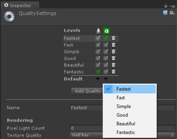
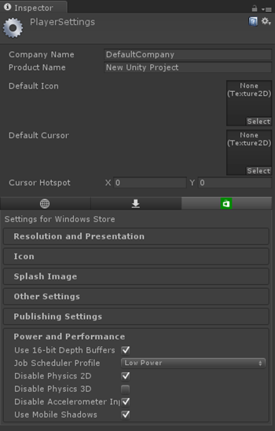

# Performance recommendations for Unity

For the most part, the general [performance recommendations for HoloLens apps](performance-recommendations-for-hololens-apps.md) apply to Unity as well, however there are a few Unity specific things you can do as well.

## Unity engine options for power and performance

Unity's defaults lean towards the average case for all platforms, including desktops. Some of the settings need to be tweaked for maximum performance on a device like HoloLens.

### Use the fastest quality settings

**Unity quality settings**

* On the *"Edit > Project Settings > Quality"* page, select the dropdown under the Windows Store logo and select *"Fastest"*. This ensures that most tunable quality options are set to maximize for performance.

### Enable player options to maximize performance

**Unity player settings**

 

Go to the player settings by navigating to *"Edit > Project Settings > Player"* page, click on the *"Windows Store"*, then consider the settings below:
* Use *Shader preloading* and other tricks to optimize [shader load time](http://docs.unity3d.com/Manual/OptimizingShaderLoadTime.html). In particular shader preloading means you won't see any hitches due to runtime shader compilation.
* Make sure *"Rendering > Rendering Path"* is set to *Forward* (this is the default). While deferred rendering is an excellent rendering technique for other platforms, it does eat up a lot of memory bandwidth (and thus power) which makes it unsuitable for mobile devices such as HoloLens.
* The "Use 16-bit Depth Buffers" setting allows you to enable 16-bit depth buffers, which drastically reduces the bandwidth (and thus power) associated with depth buffer traffic. This can be a big power win, but is only applicable for experiences with a small depth range. You should carefully tune your near/far planes to tightly encapsulate your experience so as to not waste any precision here.

### Set up the camera for holograms

The Unity Main Camera will have a skybox by default, which is not suitable for HoloLens applications. To set up the camera properly for HoloLens, select the Main Camera then look at the Camera component. Change *"Clear Flags"* to *"Solid Color"* then change the background to transparent black (0,0,0,0).

### Write efficient shaders

You should minimize the size and number of textures that your shader uses. Especially problematic are so-called "dependent texture reads", where the data in one texture is used to calculate the texture coordinates for another texture.

Unity supports using *[min16float](https://msdn.microsoft.com/library/windows/desktop/bb509646.aspx)* for HLSL using the *fixed* alias. On HoloLens hardware this can give a 2x speedup in ALU performance. D3D does not support using min16float for shader constants, so use regular floats there. You *can* (and should) use them in vertex shader outputs and pixel shader inputs. Note, *fixed* works for vector types as well, e.g. *fixed3*. Be careful to not introduce any unintentional conversions to 32 bit floats - these will happen implicitly if you mix and match data types. In particular, be sure to cast shader constants to *fixed* before using them in expressions, and avoid using the float suffix on literals (e.g. write *1.3* instead of *1.3f*) when used in expressions with *fixed* data types.

You should also use regular HLSL optimization techniques, such as trying to rearrange expressions to use the [mad](https://msdn.microsoft.com/library/windows/desktop/ff471418.aspx) intrinsics in order to do a multiply and an add at the same time. And of course, precalculate as much as you can on the CPU and pass as constants to the material. Whenever that isn't possible, do as much as you can in the vertex shader. Even for things that vary per-pixel you can sometimes get away with doing parts of the calculation in the vertex shader.

## CPU performance

In order to maintain a steady 60 frames per second and keep power utilization down, you have to be careful to write your logic in an efficient way. The the biggest factors for CPU performance are:
* Too many objects being rendered (try to keep this under 100 unique *Renderers* or UI elements)
* Expensive updates or too many object updates
* Hitches due to garbage collection
* Expensive graphics settings and shaders (shadows, reflection probes, etc.)

### Garbage collections

When writing managed code, thinking about the performance impact of the garbage collector is important. The fact that you have a garbage collector does not mean you don't have to worry about memory management, it just changes how you think about it.

While the GC doesn't typically contribute all that much to overall cycles spent or power usage, it does cause unpredictable spikes that can make you drop several frames in a row which leads to holograms looking "glitchy" or unstable. This is true even for [Generation 0 collection](https://msdn.microsoft.com/library/ee787088.aspx). So while guidance for other kinds of apps might be that short-lived allocations are cheap, this is not true for applications that need to update at 60 frames per second.

A key aspect of managing the GC is to plan for it up front. It's usually *much* harder to fix high GC usage after-the-fact than it is to take some extra care up front.

**Tips for avoiding allocations.** The ideal way to avoid allocations (and thus collections) is to allocate everything you need at the startup of the application and just reuse that data while the app runs. There are plenty of cases where it's not possible to avoid allocations (for example APIs that return allocated objects), so this isn't actually possible in practice, but it's a good goal to shoot for.

There are also some unintuitive reasons why allocations may occur even when you're not directly allocating something, here are some tips to avoid that:
* Do not use LINQ, as it causes heavy allocations.
* Do not use lambdas, as they cause allocations.
* Beware of boxing! A common case for that is passing structs to a method that takes an interface as a parameter. Instead, make the method take the concrete type (by ref) so that it can be passed without allocation.
* Prefer structs to classes whenever you can.
* Default implementations for value equality and GetHashcode uses reflection *in some cases*, which is not only slow but also performs a lot of allocations. Make sure to debug to find out which ones are causing allocations.
* Avoid foreach loops on everything except raw arrays and List<T>. Each call potentially allocates an Enumerator. Prefer regular for loops whenever possible. (See https://jacksondunstan.com/articles/3805 for more info)

**Other garbage collections concerns.** Another key concept to be aware of is that GC time is largely proportional to the number of references in the heap. Thus, it's preferable to store data as structs instead of objects. For example, instead of referring to an object by reference, you might allocate a bunch of those types of objects as a shared array of structs and then refer to them by index. This is not as important for long-lived types (e.g. the ones you allocate at startup and keep around for the duration of the application), since they will rapidly move into the oldest generation and stay there (where you hopefully don't have many collections at all), but worth keeping in mind whenever it's easy to do.

Memory utilization is also a key factor for garbage collection performance. Generally speaking, garbage collections gets significantly costlier the less free space you have available. Typically if you're doing a lot of allocations (and thus garbage collecting a lot) you'd want to keep at least half the heap free. One consequence of this is that you might think you're not doing so badly with respect to garbage collection early on, but then as more and more content gets added to your application and free memory gets used up, you could start experiencing significant GC issues all of a sudden.

Consider enabling [Sustained Low Latency](https://msdn.microsoft.com/library/system.runtime.gcsettings.latencymode.aspx) mode in the .NET garbage collector. This will cause the GC to try much harder to avoid stopping your application threads, which can reduce the number of pauses. Be aware that this can only take you so far, and will work best if you have a low rate of allocations to start with.

### Startup performance

You should consider starting your app with a smaller scene, then using [SceneManager.LoadSceneAsync](http://docs.unity3d.com/ScriptReference/SceneManagement.SceneManager.LoadSceneAsync.html) to load the rest of the scene. This allows your app to get to an interactive state as fast as possible. Be aware that there may be a large CPU spike while the new scene is being activated and that any rendered content might stutter or hitch. One way to work around this is to set the [AsyncOperation.allowSceneActivation](http://docs.unity3d.com/ScriptReference/AsyncOperation.html) property to false on the scene being loaded, wait for the scene to load, clear the screen to black, and then set back to true to complete the scene activation.

Remember that while the startup scene is loading the [holographic splash screen](recommended-settings-for-unity.md#holographic-splash-screen) will be displayed to the user.

### General CPU performance tips

Aside from Garbage Collection, you also need to be aware of the general CPU cost of updating your scene. Here are a few things that you may consider to keep things efficient:

**Basics**
* If you have a lot of objects in the scene and/or scripts that do heavy processing, avoid having *Update* functions on every object in your scene. Instead, have just a few higher level "manager" objects with *Update* functions that calls into any other objects that need attention. The specifics of using this approach is highly application-dependent, but you can often skip large numbers of objects at once using higher level logic. For example, AI logic code probably doesn't need to update every single frame, so you could instead store them all in an array and have a higher level manager object update only a small number of them per frame.
* Remember that *FixedUpdate* can be called multiple times per frame. If you use it, make sure to set the physics timestep to be equal to the refresh rate of the application each frame, or use either *Update* or your own update manager instead.
* Avoid any synchronous loading code or other long running operations. On HoloLens it's critical to always update the rendering at 60 frames per second, or you might risk causing comfort issues for the user. For this reason you should make sure that any long running operation is asynchronous.
* Consider caching often-used components. For example, if you often need to access the Rigid Body of an object, just grab it once and reference it with a private variable rather than looking it up each time.
* Avoid the *foreach* construct (except for arrays and List<T>). This will sometimes allocate an IEnumerable, and just generally introduce iteration overhead. It's usually much faster to explicitly iterate over a concrete collection type.
* Avoid deep object hierarchies for moving objects. When moving a transform, all of the parent and child transforms also get recomputed. If content moves in the scene in each frame, this cost will add up.
* Disable idle animations by disabling the Animator component (disabling the game object won't have the same effect). Avoid design patterns where an animator sits in a loop setting a value to the same thing. There is considerable overhead for this technique, with no effect on the application.

**Advanced Topics**
* Optimize for cache coherency. Cache misses are orders of magnitude more expensive than most CPU instructions, so avoiding random jumping through memory can have a *huge* impact on performance. Flat arrays of compact structs that are processed in order is ideal.
* Avoid interfaces and virtual methods in hot code such as inner loops. Interfaces in particular are *much* slower than a direct call. Virtual functions are not as bad, but still significantly slower than a direct call.
* Looping over a native array with direct indexing is by far the fastest way to process a list of items. List<T> is significantly slower, even worse if you use *foreach*, and even worse if you cast to IList first. Note, looping over a collection isn't *that* slow in the first place, so this mainly matters in hot spots of the code.

## Performance tools

Other than the tools listed in [Performance recommendations for HoloLens apps](performance-recommendations-for-hololens-apps.md), check out
* The [Unity Frame Debugger](http://docs.unity3d.com/Manual/FrameDebugger.html)
* The [Unity Profiler](http://docs.unity3d.com/Manual/Profiler.html)
  * **Note**: The Unity profiler will disable some asynchronous rendering resulting in about half of the normal allowed time for CPU and GPU work to maintain framerate. This will appear in the profiler as Device.Present taking a long time. Additionally, not all CPU work is shown in the profile such as WorldAnchor update calculations.

## See also
* [Unity development overview](unity-development-overview.md)
* [Performance recommendations for HoloLens apps](performance-recommendations-for-hololens-apps.md)
