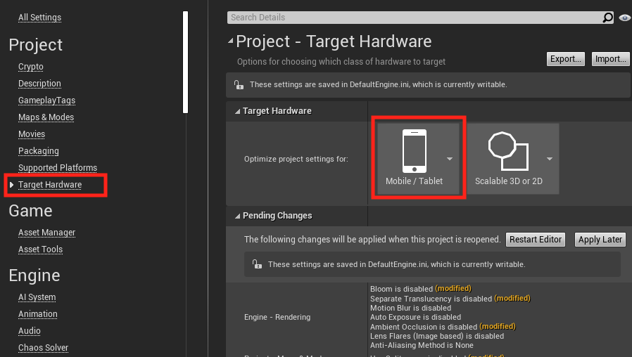
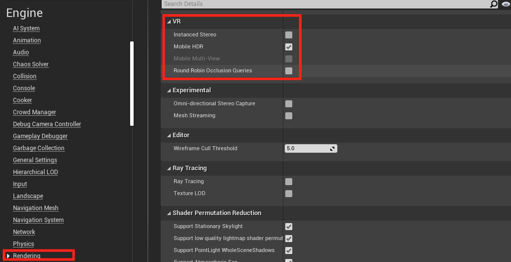

# Performance recommendations for Unreal

## Overview

This article builds on the discussion outlined in [performance recommendations for mixed reality](understanding-performance-for-mixed-reality.md), but focuses on features specific to Unreal Engine. You're encouraged to read up on application bottlenecks, analyzing and profiling mixed reality apps, and general performance fixes before continuing.

## Recommended Unreal project settings
You can find each of the following settings in **Edit > Project Settings**.

1. Using the mobile VR renderer:
    * Scroll to the **Project** section, select **Target Hardware**, and set the target platform to **Mobile/Tablet**

2. Disabling occlusion culling:
    * Scroll to the **Engine** section, select **Rendering**, expand the **Culling** section, and uncheck **Occlusion Culling**.
        + If you need occlusion culling for a detailed scene being rendered, it's recommended that you enable **Support Software Occlusion Cullin** in **Engine > Rendering**. This lets Unreal to do the work on the CPU and avoid GPU occlusion queries, which perform poorly on HoloLens 2.

3. Updating VR rendering:
    * Scroll to the **Engine** section, select **Rendering**, expand the **VR** section, and enable both **Instanced Stereo** and **Mobile Multi-View**.
        + You may need to uncheck **Mobile Post-Processing** in order to be able to check **Mobile Multi-View**

