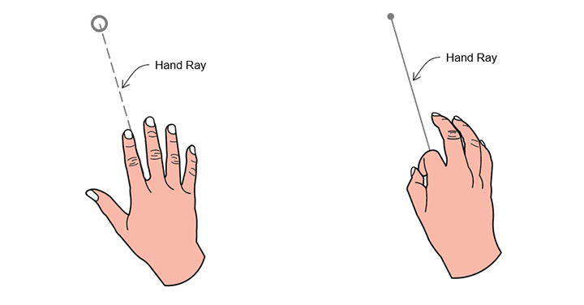
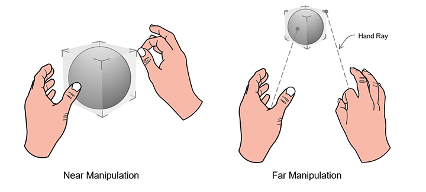
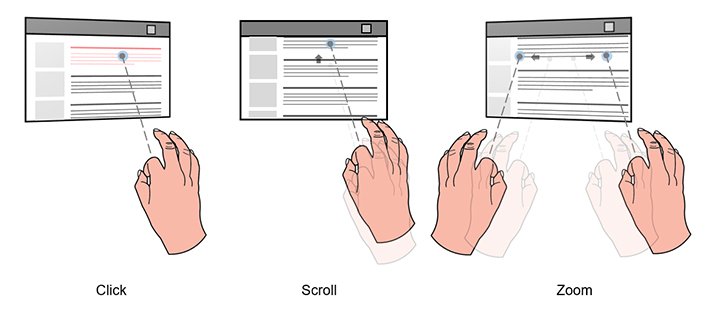
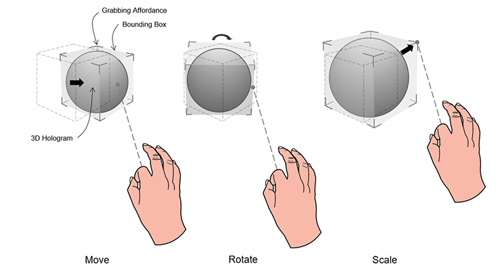
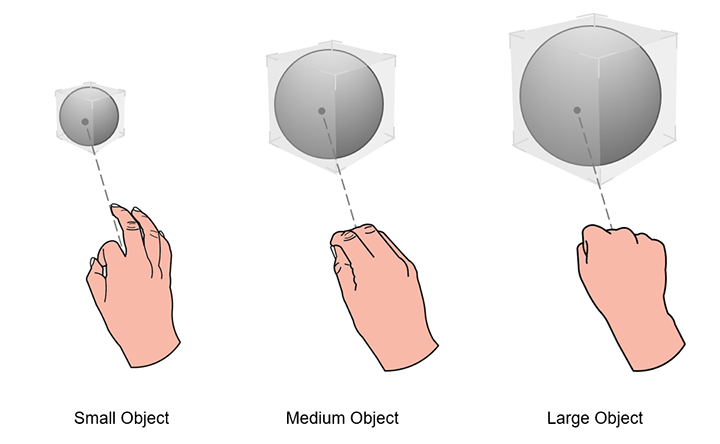

# Point and commit with hands
Point and commit with hands is an input model that enables users to target, select and manipulate 2D content and 3D objects in the distance. This "far" interaction technique is unique to mixed reality, and is not a way humans naturally intereact with the real world. For example, in the super hero movie, *X-Men*, the character [Magneto](https://en.wikipedia.org/wiki/Magneto_(comics)) is capable of reaching out and manipulating a far object in the distance with his hands. This is not something humans can do in reality. In both HoloLens (AR) and Mixed Reality (MR), we equip users with this magical power, breaking the physical constraint of the real world, not only to have a fun experience with holographic contents but also to make user interactions more effective and efficient.

## Device support

Input model | [HoloLens (1st gen)](https://docs.microsoft.com/en-us/windows/mixed-reality/hololens-hardware-details) | HoloLens 2 | [Immersive headsets](https://docs.microsoft.com/en-us/windows/mixed-reality/immersive-headset-hardware-details) |
| ---------| -----| ----- | ---------|
Point and commit with hands | ❌ Not supported | ✔️ Recommended | ✔️ Recommended

Point and commit, also known as hands far, is one of the new features that utilizes the new articulated hand-tracking system. This input model is also the primary input model on immersive headsets through the use of motion controllers.

## Hand rays

On HoloLens 2, we created a hand ray that shoots out from the center of the user's palm. This ray is treated as an extension of the hand. A donut-shaped cursor is attached to the end of the ray to indicate the location where the ray intersects with a target object. The object that the cursor lands on can then receive gestural commands from the hand.

This basic gestural command is triggered by using the thumb and index finger to perform the air-tap action. By using the hand ray to point and air tap to commit, users can activate a button or a hyperlink. With more composite gestures, users are capable of navigating web content and manipulating 3D objects from a distance. The visual design of the hand ray should also react to these point and commit states, as described and shown below: 

* In the *pointing* state, the ray is a dash line and the cursor is a donut shape.
* In the *commit* state, the ray turns into a solid line and the cursor shrinks to a dot.

## Transition between near and far

Instead of using specific gestures, such as "pointing with index finger", to direct the ray, we designed the ray coming out from the center of the palm, releasing and reserving the five fingers for more manipulative gestures, such as pinch and grab. With this design, we create only one mental model, supporting exactly the same set of hand gestures for both near and far interaction. You can use the same grab gesture to manipulate objects at different distances. The invocation of the rays is automatic and proximity based as follows:

*  When an object is within arm's length (roughly 50 cm), the rays are turned off automatically, encouraging near interaction.
*  When the object is farther than 50 cm, the rays are turned on. The transition should be smooth and seamless.

## 2D slate interaction

A 2D slate is a holographic container hosting 2D app contents, such as a web browser. The design concept for far interacting with a 2D slate is to use hand rays to target and air tap to select. After targeting with a hand ray, users can air tap to trigger a hyperlink or a button. They can use one hand to "air tap and drag" to scroll slate content up and down. The relative motion of using two hands to air tap and drag can zoom in and out the slate content.

Targeting the hand ray at the corners and edges reveals the closest manipulation affordance. By "grab and drag" manipulation affordances, users can perform uniform scaling through the corner affordances, and can reflow the slate via the edge affordances. Grabbing and dragging the holobar at the top of the 2D slate lets users move the entire slate.

For manipulating the 2D slate: 

* Users point the hand ray at the corners or edges to reveal the closest manipulation affordance. 
* By applying a manipulation gesture on the affordance, users can perform uniform scaling through the corner affordance, and can reflow the slate via the edge affordance. 
* By applying a manipulation gesture on the holobar at the top of the 2D slate, users can move the entire slate. 

 

## 3D object manipulation

In direct manipulation, there are two ways for users to manipulate 3D objects: affordance-based manipulation and non-affordance based manipulation. In the point and commit model, users are capable of achieving exactly the same tasks through the hand rays. No additional learning is needed. 

### Affordance-based manipulation
Users use hand rays to point and reveal the bounding box and manipulation affordances. Users can apply the manipulation gesture on the bounding box to move the whole object, on the edge affordances to rotate, and on the coner affordances to scale uniformly.  

  

### Non-affordance based manipulation
Users point with hand rays to reveal the bounding box then directly apply manipulation gestures on it. With one hand, the translation and rotation of the object are associated to motion and orientation of the hand. With two hands, users can translate, scale, and rotate it according to relative motions of two hands. 

 

## Instinctual gesturers
The concept of instinctual gestures for point and commit is similar to that for direct manipulation. The gestures users perform on a 3D object are guided by the design of UI affordances. For example, a small control point might motivate users to pinch with their thumb and index finger, while a user might want to grab a larger object using all five fingers.

 

## Symmetric design between hands and 6 DoF controller 
The concept of point and commit for far interaction was initially created and defined for the Mixed Reality Portal (MRP) where a user wears an immersive headset and interacts with 3D objects via motion controllers. The motion controllers shoot out rays for pointing and manipulating far objects. There are buttons on the controllers for further committing different actions. We leverage the interaction model of rays and attached them to both hands. With this symmetric design, users who are familiar with MRP won't need to learn another interaction model for far pointing and manipulation when they use HoloLen 2, and vice versa.    

 

## Instinctual gestures

## See also
* [Head-gaze and commit](gaze-and-commit.md)
* [Direct manipulation with hands](direct-manipulation.md)
* [Instinctual interactions](interaction-fundamentals.md)

