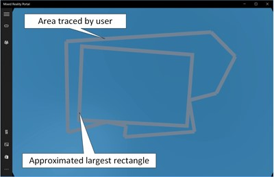

# Porting guides

## Overview

Windows 10 includes direct support for immersive and holographic headsets. If you've built content for other devices, such as the Oculus Rift or HTC Vive, these have dependencies on libraries that exist above the operating system's platform API. Bringing existing Win32 Unity VR apps over to Windows Mixed Reality involves retargeting usage of vendor-specific VR SDKs to Unity's cross-vendor VR APIs.


## Porting overview

At a high level, the following steps are involved in porting existing content:
1. **Make sure your PC is running the Windows 10 Fall Creators Update (16299).** We no longer recommend receiving preview builds from the Insider Skip Ahead ring, as those builds won't be the most stable for mixed reality development.
2. **Upgrade to the latest version of your graphics or game engine.** Game engines will need to support the Windows 10 SDK version 10.0.15063.0 (released in April 2017) or higher.
3. **Upgrade any middleware, plug-ins, or components.** If your app contains any components, it's a good idea to upgrade to the latest version.
4. **Remove dependencies on duplicate SDKs**. Depending on which device your content was targeting, you'll need to remove or conditionally compile out that SDK (for example, SteamVR) so you can target the Windows APIs instead.
5. **Work through build issues.** At this point, the porting exercise is specific to your app, your engine, and the component dependencies you have.

## Common porting steps

### Common step 1: Make sure you have the right development hardware

The [install the tools](install-the-tools.md#for-immersive-vr-headset-development) page lists the recommended development hardware.

### Common step 2: Upgrade to the latest flight of Windows 10

The Windows Mixed Reality platform is still under active development. We recommend [joining the Windows Insider Program](https://insider.windows.com/) to access the "Windows Insider Fast" flight.
1. Install the [Windows 10 Creators Update](https://www.microsoft.com/software-download/windows10)
2. [Join](https://insider.windows.com/) the Windows Insider Program.
3. Enable [Developer Mode](https://docs.microsoft.com/windows/uwp/get-started/enable-your-device-for-development)
4. Switch to the [Windows Insider Fast flights](https://blogs.technet.microsoft.com/uktechnet/2016/07/01/joining-insider-preview) through **Settings > Update & Security Section**

### Common step 3: Upgrade to the most recent build of Visual Studio
* If you are using Visual Studio then upgrade to the most recent build
* See [Install the tools](install-the-tools.md#installation-checklist) page under Visual Studio 2019

### Common step 6: Choose the correct Adapter
* In systems like notebooks with two GPUs, [target the correct adapter](rendering-in-directx.md#hybrid-graphics-pcs-and-mixed-reality-applications). This applies to Unity and native DirectX apps where a ID3D11Device is created, either explicitly or implicitly (Media Foundation), for its functionality.

## Unity porting guidance

### Unity step 1: Review the common porting steps listed above

Review the common steps listed above to make sure your dev environment is set up correctly. In step #3, if you are using Visual Studio you should select the **Game Development with Unity** workload. You may deselect the "Unity Editor optional" component since you'll be installing a newer version of Unity in teh next step.

### Unity step 2: Upgrade to the latest public build of Unity with Windows MR Support
1. Download the latest [recommended public build of Unity](install-the-tools.md) with mixed reality support.
2. Save a copy of your project before you get started
3. Review the [documentation](https://docs.unity3d.com/Manual/UpgradeGuides.html) available from Unity on upgrading if your project was built on an older version of Unity.
4. Follow the [instructions](https://docs.unity3d.com/Manual/APIUpdater.html) on Unity's site for using their automatic API updater
5. Check and see if there are additional changes that you need to make to get your project running, and work through any remaining errors and warnings. 

> [!Note] 
> If you have middleware that you depend on, check that you're using the latest release (more details in step 3 below).

### Unity step 3: Upgrade your middleware to the latest versions

With any Unity update, there's a good chance that you'll need to update one or more middleware packages that your game or application depends on. Additionally, being up to date with the latest middleware increases the likelihood of success throughout the rest of the porting process.

### Unity step 4: Target your application to run on Win32

From inside your Unity application:

* Navigate to File -> Build Settings
* Select "PC, Mac, Linux Standalone"
* Set target platform to "Windows"
* Set architecture to "x86"
Select "Switch Platform"

> [!NOTE] 
> If your application has any dependencies on device-specific services, such as match making from Steam, you'll need to disable them at this step. You can hook up to the equivalent services that Windows provides later on.

### Unity step 5: Setup your Windows Mixed Reality hardware
1. Review steps in [Immersive headset setup](https://docs.microsoft.com/windows/mixed-reality/enthusiast-guide/before-you-start
)
2. Learn about [Using the Windows Mixed Reality simulator](using-the-windows-mixed-reality-simulator.md) and [Navigating the Windows Mixed Reality home](navigating-the-windows-mixed-reality-home.md)

### Unity step 7: Target your application to run on Windows Mixed Reality
1. First, you must remove or conditionally compile out any other library support specific to a particular VR SDK. Those assets frequently change settings and properties on your project in ways that are incompatible with other VR SDKs, such as Windows Mixed Reality.
    * For example, if your project references the SteamVR SDK, you'll need to update your project to exclude those prefabs and script API calls when exporting for the Win32 build target.
    * Specific steps for conditionally excluding other VR SDKs are coming soon.
2. In your Unity project, [target the Windows 10 SDK](holograms-100.md#target-windows-10-sdk)
3. For each scene, [setup the camera](holograms-100.md#chapter-2---setup-the-camera)

### Unity step 8: Use the stage to place content on the floor

You can build Mixed Reality experiences across a wide range of [experience scales](coordinate-systems.md).

If you're porting a **seated-scale experience**, you must ensure Unity is set to the **Stationary** tracking space type:

```cs
XRDevice.SetTrackingSpaceType(TrackingSpaceType.Stationary);
```

This above code sets Unity's world coordinate system to track the [stationary frame of reference](coordinate-systems.md#spatial-coordinate-systems). In the Stationary tracking mode, content placed in the editor just in front of the camera's default location (forward is -Z) appears in front of the user when the app launches. To recenter the user's seated origin, you can call Unity's [XR.InputTracking.Recenter](https://docs.unity3d.com/ScriptReference/XR.InputTracking.Recenter.html) method.

If you're porting a **standing-scale experience** or **room-scale experience**, you'll be placing content relative to the floor. You reason about the user's floor using the **[spatial stage](coordinate-systems.md#spatial-coordinate-systems)**, which represents the user's defined floor-level origin and optional room boundary, set up during first run. For these experiences, you must ensure Unity is set to the **RoomScale** tracking space type. While RoomScale is the default, you'll want to set it explicitly and ensure you get back true, to catch situations where the user has moved their computer away from the room they calibrated:

```cs
if (XRDevice.SetTrackingSpaceType(TrackingSpaceType.RoomScale))
{
    // RoomScale mode was set successfully.  App can now assume that y=0 in Unity world coordinate represents the floor.
}
else
{
    // RoomScale mode was not set successfully.  App cannot make assumptions about where the floor plane is.
}
```

Once your app successfully sets the RoomScale tracking space type, content placed on the y=0 plane will appear on the floor. The origin at (0, 0, 0) will be the specific place on the floor where the user stood during room setup, with -Z representing the forward direction they were facing during setup.

In script code, you can then call the TryGetGeometry method on you're the UnityEngine.Experimental.XR.Boundary type to get a boundary polygon, specifying a boundary type of TrackedArea. If the user defined a boundary (you get back a list of vertices), it's safe to deliver a **room-scale experience** to the user, where they can walk around the scene you create.

The system will automatically render the boundary when the user approaches it. Your app does not need to use this polygon to render the boundary itself.

For more information, see the [Coordinate systems in Unity](coordinate-systems-in-unity.md) page.

Some applications use a rectangle to constrain their interaction. Retrieving the largest inscribed rectangle is not directly supported in the UWP API or Unity. The example code linked to below shows how to find a rectangle within the traced bounds. It's heuristic-based so may not find the optimal solution, however, results are consistent with expectations. Parameters in the algorithm can be tuned to find more precise results at the cost of processing time. The algorithm is in a fork of the Mixed Reality Toolkit that uses the 5.6 preview MRTP version of Unity. This isn't publicly available. The code should be directly usable in 2017.2 and higher versions of Unity. The code will be ported to the current MRTK in the near future.

[zip file of code on GitHub](https://github.com/KevinKennedy/MixedRealityToolkit-Unity/releases/tag/5.6.MRTP20) Important files:
* Assets/HoloToolkit/Stage/Scripts/StageManager.cs - example of usage
* Assets/HoloToolkit/Stage/Scripts/LargestRectangle.cs - implementation of the algorithm
* Assets/HoloToolkit-UnitTests/Editor/Stage/LargestRectangleTest.cs - trivial test of the algorithm

Example of results:



Algorithm is based on a blog by Daniel Smilkov: [Largest rectangle in a polygon](https://d3plus.org/blog/behind-the-scenes/2014/07/08/largest-rect/)

### Unity step 9: Work through your input model

Each game or application targeting an existing HMD will have a set of inputs that it handles, types of inputs that it needs for the experience, and specific APIs that it calls to get those inputs. We've invested in trying to make it as simple and straightforward as possible to take advantage of the inputs available in Windows Mixed Reality.
1. Read through the **[Input porting guide for Unity](input-porting-guide-for-unity.md)** for details of how Windows Mixed Reality exposes input, and how that maps to what your application may do today.
2. Choose whether you're going to leverage Unity's cross-VR-SDK input API, or the MR-specific input API. The general Input.GetButton/Input.GetAxis APIs are used by Unity VR apps today for [Oculus input](https://docs.unity3d.com/Manual/OculusControllers.html) and [OpenVR input](https://docs.unity3d.com/Manual/OpenVRControllers.html). If your apps are already using these APIs for motion controllers, this is the easiest path - you should just need to remap buttons and axes in the Input Manager.
    * You can access motion controller data in Unity using either the general cross-VR-SDK Input.GetButton/Input.GetAxis APIs or the MR-specific UnityEngine.XR.WSA.Input APIs. (previously in the UnityEngine.XR.WSA.Input namespace in Unity 5.6)
    * See the [example in Toolkit](https://github.com/Microsoft/HoloToolkit-Unity/pull/572) that combines gamepad and motion controllers.

### Unity step 10: Performance testing and tuning

Windows Mixed Reality will be available on a broad class of devices, ranging from high end gaming PCs, down to broad market mainstream PCs. Depending on what market you're targeting, there's a significant difference in the available compute and graphics budgets for your application. During this porting exercise, you're likely leveraging a premium PC, and have had significant compute and graphics budgets available to your app. If you wish to make your app available to a broader audience, you should test and profile your app on [the representative hardware that you wish to target](https://docs.microsoft.com/windows/mixed-reality/enthusiast-guide/windows-mixed-reality-minimum-pc-hardware-compatibility-guidelines).

Both [Unity](https://docs.unity3d.com/Manual/Profiler.html) and [Visual Studio](https://docs.microsoft.com/visualstudio/profiling/index) include performance profilers, and both [Microsoft](understanding-performance-for-mixed-reality.md) and [Intel](https://software.intel.com/articles/vr-content-developer-guide) publish guidelines on performance profiling and optimization. There's an extensive discussion of performance available at [Understanding Performance for Mixed Reality](understanding-performance-for-mixed-reality.md). Further, there are specific details for Unity under [Performance Recommendations for Unity](performance-recommendations-for-unity.md).

## See also
* [Input porting guide for Unity](input-porting-guide-for-unity.md)
* [Windows Mixed Reality minimum PC hardware compatibility guidelines](https://docs.microsoft.com/windows/mixed-reality/enthusiast-guide/windows-mixed-reality-minimum-pc-hardware-compatibility-guidelines)
* [Understanding Performance for Mixed Reality](understanding-performance-for-mixed-reality.md)
* [Performance Recommendations for Unity](performance-recommendations-for-unity.md)
