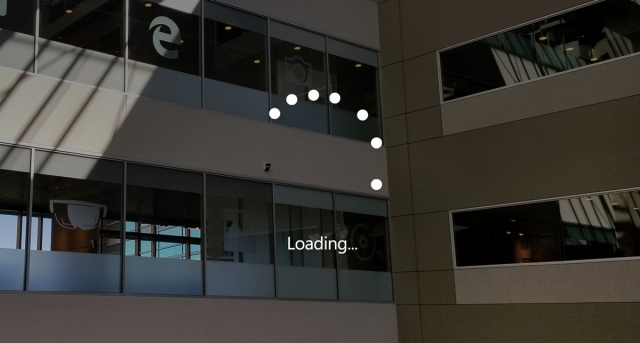

# Displaying progress

A progress control provides feedback to the user that a long-running operation is underway. It can mean that the user cannot interact with the app when the progress indicator is visible, and can also indicate how long the wait time might be, depending on the indicator used.

 
*Progress ring example in HoloLens*

## Types of progress

It is important to provide the user information about what is happening. In mixed reality users can be easily distracted by physical environment or objects if your app does not gives good visual feedback. For situations that take a few seconds, such when data is loading or a scene is updating, it is good idea to show a visual indicator. There are two options to show the user that an operation is underway – a **Progress bar** or a **Progress ring**.

### Progress bar

A Progress bar shows the percentage completed of a task. It should be used during an operation whose duration is known (determinate), but it's progress should not block the user's interaction with the app.

### Progress ring

A Progress ring only has an indeterminate state, and should be used when any further user interaction is blocked until the operation has completed.

### Progress with a custom object

You can add to your app's personality and brand identity by customizing the Progress control with your own custom 2D/3D objects.

## Best practices
* Tightly couple [billboarding or tag-along](billboarding-and-tag-along.md) to the display of Progress since the user can easily move their head into empty space and lose context. Your app might look like it has crashed if the user is unable to see anything. Billboarding and tag-along is built into the Progress prefab.
* It's always good to provide status information about what is happening to the user. The Progress prefab provides various visual styles including the Windows standard ring-type progress for providing status. You can also use a custom mesh with an animation if you want the style of your progress to align to your app’s brand.

## See also
* [Progress scripts and prefabs on Mixed Reality Toolkit](https://github.com/microsoft/MixedRealityToolkit-Unity/tree/mrtk_development/Assets/MixedRealityToolkit.SDK/Features/UX/Prefabs/Loader)
* [Bounding Box](app-bar-and-bounding-box.md)
* [Interactable object](interactable-object.md)
* [Object collection](object-collection.md)
* [Billboarding and tag-along](billboarding-and-tag-along.md)
