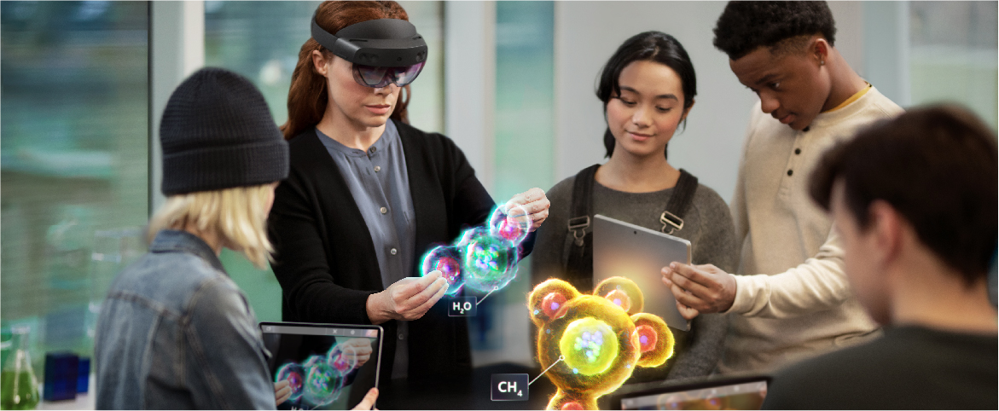
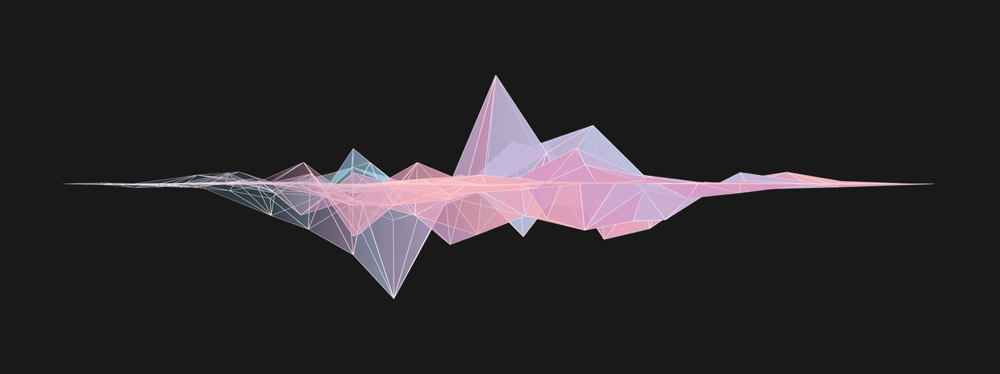
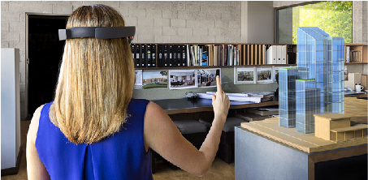
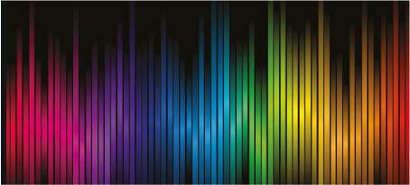

# Understanding the basics of mixed reality

<table>
<colgroup>
    <col width="10%" />
    <col width="90%" />
<tr>
     <td padding-right="0px"></td>
     <td padding-right="0px"><strong>Quick start guide</strong> Here is a recommended collection of articles and resources that will help you gain a better understanding of what defines mixed reality, how and where it’s being used, the capabilities of HoloLens and the building blocks used to create mixed reality experiences.</td>
</tr>
</table>

## What is mixed reality?

---

:::row:::
    :::column:::
        **[Mixed reality is a spectrum](mixed-reality.md)** 
        Mixed reality is the result of blending the physical world with the digital world. Mixed reality is the next evolution in human, computer, and environment interaction and unlocks possibilities that before now were restricted to our imaginations.
    :::column-end:::
    :::column:::
        
    :::column-end:::
:::row-end:::

:::row:::
    :::column:::
        **[What is a hologram?](hologram.md)** 
        Holograms are objects made of light and sound that appear in the world around you, just as if they were real objects. Holograms respond to your gaze, gestures and voice commands, and can interact with real-world surfaces around you. With holograms, you can create digital objects that are part of your world.
    :::column-end:::
    :::column:::
        
    :::column-end:::
:::row-end:::

## What can you do with mixed reality?

---

:::row:::
    :::column:::
        **[Mixed reality is a spectrum](mixed-reality.md)** 
        Mixed reality is the result of blending the physical world with the digital world. Mixed reality is the next evolution in human, computer, and environment interaction and unlocks possibilities that before now were restricted to our imaginations.
    :::column-end:::
    :::column:::
        
    :::column-end:::
:::row-end:::

:::row:::
    :::column:::
        **[What is a hologram?](hologram.md)** 
        HoloLens lets you create holograms, objects made of light and sound that appear in the world around you, just as if they were real objects. Holograms respond to your gaze, gestures and voice commands, and can interact with real-world surfaces around you. With holograms, you can create digital objects that are part of your world.
    :::column-end:::
    :::column:::
        
    :::column-end:::
:::row-end:::

## What would you like to do next?

---

:::row:::
    :::column:::
        
        **[Try out mixed reality for yourself](https://www.microsoft.com/en-us/windows/windows-mixed-reality?icid=SSM_Search_Promo_XCat_WindowsMixedReality_CTA1#storelocator)** 
        Get a demo of Mixed Reality and HoloLens at your local Microsoft Store. 
    :::column-end:::
    :::column:::
         
         **[Become a creator](quick-start-creating.md)** 
        Learn the basic concepts you need to begin designing and prototyping.
    :::column-end:::
    :::column:::
         
         **[Come to a design or development event](sf-academy-events.md)** 
        See the hardware and get a hands-on tutorial to make your first HoloLens 2 application.
    :::column-end:::
    :::column:::
         
         **[Start developing](quick-start-developer.md)** 
        Choose a development path based on your skill level, work style. or platform interest.
    :::column-end:::
:::row-end:::