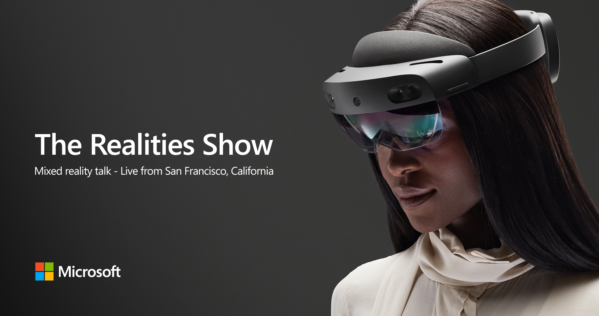

# The Realities Show

**The Realities Show is a 30 minute livestream about HoloLens 2, Mixed Reality Services and MR technologies. In each episode we'll dive into features, capabilities, the tech behind it, how to develop for the different devices, recommend best practices and of course answer questions from our audience. Streamed to developers worldwide from our San Francisco Reactor stage setup as a living room environment (and occasionally from other sites).**

**[Watch live and past episodes here](http://aka.ms/trs)**
---

## **HoloLens 2 and Mixed Reality Services** - March 12, 2019, 8 AM (PDT)
The first episode of The Realities Show is all about HoloLens 2 and Mixed Reality Services. We'll talk about the main features, the vision behind it, the new interaction model and the cloud's superpowers!

---

## **Human Understanding** - Coming soon
This episode is all about Human Understanding: near interactions, far interactions, eye-tracking and voice.

---
## **World Understanding** - Coming soon
How intelligent edge devices leveredge the cloud's compute power to understand the world. Including HoloLens 2, Computer vision, Shared Anchor Service, Semantic Labelling and Azure Kinect DK.

---
## **MixedRealityToolkit** - Coming soon
The MixedRealityToolkit (MRTK) provides a set of foundational components and features to accelerate MR app development. The latest Release of MRTK-Unity (V2) supports HoloLens/HoloLens 2, Windows Mixed Reality, and OpenVR platforms.Let's take a deep dive with the endineers and designers behind it.

---
## **Designing for HoloLens 2** - Coming soon
The biggest challenge in Mixed Reality development is designing for it. It's so new, so screen-less and so real, that traditional design does not necesarily apply. Let's take a look at how to design for HoloLens 2 and check out the design tools that the MixedRealityToolkit gives us.

