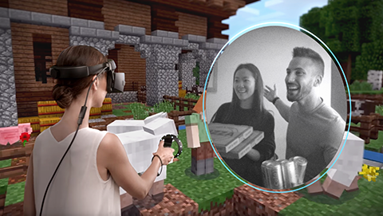

# Release notes

The **[Windows 10 October 2018 Update](https://blogs.windows.com/XXX)** (also known as RS5) includes new features for both HoloLens and Windows Mixed Reality immersive headsets connected to PCs. 

To update to the latest release on PC for Windows Mixed Reality immersive (VR) headsets, open the **Settings** app, go to **Update & Security**, then select the **Check for updates** button. On a Windows 10 PC, you can also manually install the Windows 10 October 2018 Update using the [Windows media creation tool](https://www.microsoft.com/en-us/software-download/windows10).

The public release of Windows 10 October 2018 Update (RS5) will be coming to HoloLens via Windows Update in the coming weeks, but you can try its new features now by running the [RS5 Insider Preview build](https://docs.microsoft.com/en-us/hololens/hololens-insider).

**Latest release for Desktop:** Windows 10 October 2018 Update (**10.0.XXXXX.X**) 
**Latest release for HoloLens:** Coming soon (Insider preview available) 
 

## New features for Windows Mixed Reality immersive headsets

The Windows 10 October 2018 Update includes many improvements for using Windows Mixed Reality immersive (VR) headsets with your desktop PC, such as: 

* **Mixed Reality Flashlight** - Open a portal into the real world to find your keyboard, see someone nearby, or take a look at your surroundings without removing your headset! You can turn on Mixed Reality Flashlight on the Start menu, by pressing Windows + Grab on your motion controller, or by saying "Flashlight on/off." Point your controller in the direction of what you want to see, like using a flashlight in the dark.

    

* **New apps and new ways to launch content in the mixed reality home**
    * If you're using [Windows Mixed Reality for SteamVR](https://docs.microsoft.com/en-us/windows/mixed-reality/enthusiast-guide/using-steamvr-with-windows-mixed-reality), your SteamVR titles now show up in the Start menu and app launchers for each can be placed in the mixed reality home.
    * New *360 Videos* app for discovering new 360-degree videos.
    * New *WebVR Showcase* app for discovering new WebVR experiences.
    * First-time Windows Mixed Reality customers will enter the Cliff House and find it pre-populated with 3D app launchers for some of our favorite immersive apps and games from the Microsoft Store.
    * Microsoft Edge windows now include a *Share* button.
    
    

* MR menu stuff:
* Visual feedback for volume changes
* Audio mirroring to headset and speakers/headphones
* New quick action menu

Under the hood:
* Backpack PC (run with headset as display)
* Mixed Reality Portal - quicker updates via Microsoft Store (decoupled from Windows releases)
* Updated sleep behavior

For developers:
* Hardware DRM support for exclusive apps

Video stuff:
* Misbah's stuff

## New features for HoloLens

The Windows 10 October 2018 Update will be publicly available for HoloLens soon. Here are some of the new features you'll experience when it arrives. If you'd like to use these features now, you can install the [RS5 Insider Preview build](https://docs.microsoft.com/en-us/hololens/hololens-insider) for HoloLens.

### For everyone

Feature | Details  | Instructions 
--- | --- | ---
Stop video capture from the Start or quick actions menu | If you start video capture from the Start menu or quick actions menu, you’ll be able to stop recording from the same place. (Don’t forget, you can always do this with voice commands too.) | To start recording, select **Start > Video**. To stop recording, select **Start > Stop video**.
Project to a Miracast-enabled device | Project your HoloLens content to a nearby Surface device or TV/Monitor if using Microsoft Display adapter | On **Start**, select **Connect**. Select the device you want to project to. 
New notifications | View and respond to notification toasts on HoloLens, just like you do on a PC. | You’ll now see notifications from apps that provide them. Gaze to respond to or dismiss them (or if you’re in an immersive experience, use the bloom gesture).  
HoloLens overlays (file picker, keyboard, dialogs, etc.) | You’ll now see overlays such as the keyboard, dialogs, file picker, etc. when using immersive apps. | When you’re using an immersive app, input text, select a file from the file picker, or interact with dialogs without leaving the app. 
Visual feedback overlay UI for volume change | When you use the volume up/down buttons on your HoloLens you’ll see a visual display of the volume level. | Adjust the device volume using the volume up/down buttons located on the right arm of the HoloLens. Use the visual display to track the volume level. 
New UI for device boot | A loading indicator was added during the boot process to provide visual feedback that the system is loading. | Reboot your device to see the new loading indicator—it’s between the "Hello" message and the Windows boot logo. 
Share UX: Nearby Sharing | Addition of the Windows Nearby Sharing experience, allowing you to share a capture with a nearby Windows device. | Capture a photo or video on HoloLens (or use the share button from an app such as Microsoft Edge).  Select a nearby Windows device to share with. 
Share from Microsoft Edge | Share button is now available on Microsoft Edge windows on HoloLens. | In Microsoft Edge, select **Share**. Use the HoloLens share picker to share web content. 

### For developers

- Support for Holographic [Camera Capture UI API](https://docs.microsoft.com/windows/uwp/audio-video-camera/capture-photos-and-video-with-cameracaptureui), which will let developers expose a way for users to seamlessly invoke camera or video capture from within their applications. For example, users can now capture and insert photo or video content directly within apps like Word.  
- Mixed Reality Capture has been improved to exclude hidden mesh from captures, which means videos captures by apps will no longer contain black corners around the content.  

### For commercial customers

Feature | Details | Instructions 
--- | --- | ---
Enable post-setup provisioning | Can now apply a runtime provisioning package at any time using **Settings**. | On your PC:  1. Create a provisioning package as described at [Create a provisioning package for HoloLens using the HoloLens wizard](hololens-provisioning.md).  2. Connect the HoloLens device via USB to a PC. HoloLens will show up as a device in File Explorer on the PC.  3. Drag and drop the provisioning package to the Documents folder on the HoloLens.   On your HoloLens:   1. Go to **Settings > Accounts > Access work or school**.  2. In **Related Settings**, select **Add or remove a provisioning package**. 3. On the next page, select **Add a package** to launch the file picker and select your provisioning package.  **Note:** if the folder is empty, make sure you select **This Device** and select **Documents**. After your package has been applied, it will show in the list of Installed packages. To view package details or to remove the package from the device, select the listed package. 
Assigned access with Azure AD groups | Flexibility to use Azure AD groups for configuration of Windows assigned access to set up single or multi-app kiosk configuration. | Prepare XML file to configure Assigned Access on PC:  1. In a text editor, open [the provided file AssignedAccessHoloLensConfiguration_AzureADGroup.xml](#xml). 2. Change the group ID to one available in your Azure AD tenant. You can find the group ID of an Azure Active Directory Group by either : - following the steps at [Azure Active Directory version 2 cmdlets for group management](https://docs.microsoft.com/azure/active-directory/active-directory-accessmanagement-groups-settings-v2-cmdlets), OR - in the Azure portal, with the steps at [Manage the settings for a group in Azure Active Directory](https://docs.microsoft.com/azure/active-directory/active-directory-groups-settings-azure-portal).  **Note:** The sample configures the following apps: Skype, Learning, Feedback Hub, Flow, Camera, and Calibration.   Create provisioning package with WCD:  1. On a PC, follow the steps at [Create a provisioning package for HoloLens using the HoloLens wizard](hololens-provisioning.md) to create a provisioning package. 2. Ensure that you include the license file in **Set up device**. 3. Select **Switch to advanced editor** (bottom left), and **Yes** for warning prompt. 4. Expand the runtime settings selection in the **Available customizations** panel and select **AssignedAccess > MultiAppAssignedAccessSettings**. 5. In the middle panel, you should now see the setting displayed with documentation in the panel below. Browse to the XML you modified for Assigned Access. 6. On the **Export** menu, select **Provisioning package**.  **Warning:** If you encrypt the provisioning package, provisioning the HoloLens device will fail. 7. Select **Next** to specify the output location where you want the provisioning package to go once it's built. 8. Select **Next**, and then select **Build** to start building the package. 9. When the build completes, select **Finish**.   Apply the package to HoloLens:   1. Connect HoloLens via USB to a PC and start the device, but do not continue past the **Fit** page of OOBE (the first page with the blue box). HoloLens will show up as a device in File Explorer on the PC.  2. In File Explorer, drag and drop the provisioning package (.ppkg) onto the device storage. 3. Briefly press and release the **Volume Down** and **Power** buttons simultaneously again while on the fit page.  4. The device will ask you if you trust the package and would like to apply it. Confirm that you trust the package. 5. You will see whether the package was applied successfully or not. If it failed, you can fix your package and try again. If it succeeded, proceed with OOBE.  Enable assigned access on HoloLens:   1. After applying the provisioning package, during the **Account Setup** flows in OOBE, select **My work or school owns this** to set up your device with an Azure AD account.  **Note:** This account must not be in the group chosen for Assigned Access. 2. Once you reach the Shell, ensure the Skype app is installed either via your MDM environment or from the Store.  3. After the Skype app is installed, sign out.  4. On the sign-in screen, select the **Other User** option and enter an Azure AD account email address that belongs to the group chosen for Assigned Access. Then enter the password to sign in. You should now see this user with only the apps configured in the Assigned Access profile. 
PIN sign-in on profile switch from sign-in screen  | PIN sign-in is now available for **Other User**.  | When signing in as **Other User**, the PIN option is now available under **Sign-In options**. 
Sign in with Web Cred Provider using password | You can now select the Globe sign-in option to launch web sign-in with your password. Look for additional web sign-in methods coming in the future. | From the sign-in screen, select **Sign-In options** and select the Globe option to launch web sign-in. Enter your user name if needed, then your password.  **Note:** You can choose to bypass any PIN/Smartcard options when prompted during web sign-in.  
Read device hardware info through MDM so devices can be tracked by serial # | IT administrators can see and track HoloLens by device serial number in their MDM console. | Refer to your MDM documentation for feature availability, and for how to use your MDM console to view HoloLens device serial number. 
Set HoloLens device name through MDM (rename) |  IT administrators can see and rename HoloLens devices in their MDM console. | Refer to your MDM documentation for feature availability, and for how to use your MDM console to view and set your HoloLens device name (rename). 

### For international customers

Use HoloLens with localized user interface for Simplified Chinese or Japanese, including localized Pinyin keyboard, dictation, and voice commands.

## Known issues

We've worked hard to deliver a great Windows Mixed Reality experience, but we're still tracking some known issues. If you find others, please [give us feedback](give-us-feedback.md).

### Windows Mixed Reality on Desktop

#### Visual quality

* Lorem ipsum

#### Windows Mixed Reality setup

* Lorem ipsum

#### Games and apps from the Microsoft Store

* Lorem ipsum

#### Audio

* Lorem ipsum

#### Holograms

* Lorem ipsum

#### Motion controllers

* Lorem ipsum

#### Desktop app in the Windows Mixed Reality home

* Lorem ipsum

#### Windows Mixed Reality for SteamVR

* Lorem ipsum

#### Other issues

Lorem ipsum

## Provide feedback and report issues

Please use the [Feedback Hub app on your HoloLens or Windows 10 PC](give-us-feedback.md) to provide feedback and report issues. Using Feedback Hub ensures that all necessary diagnostics information is included to help our engineers quickly debug and resolve the problem.

>[!NOTE]
>Be sure to accept the prompt that asks whether you’d like Feedback Hub to access your Documents folder (select **Yes** when prompted).

## Prior release notes

* [Release notes - April 2018](release-notes-april-2018.md)
* [Release notes - October 2017](release-notes-october-2017.md)
* [Release notes - August 2016](release-notes-august-2016.md)
* [Release notes - May 2016](release-notes-may-2016.md)
* [Release notes - March 2016](release-notes-march-2016.md)

## See also
* [Immersive headset support (external link)](https://docs.microsoft.com/en-us/windows/mixed-reality/enthusiast-guide/troubleshooting-windows-mixed-reality)
* [HoloLens support (external link)](https://support.microsoft.com/en-us/products/hololens)
* [Install the tools](install-the-tools.md)
* [Give us feedback](give-us-feedback.md)

