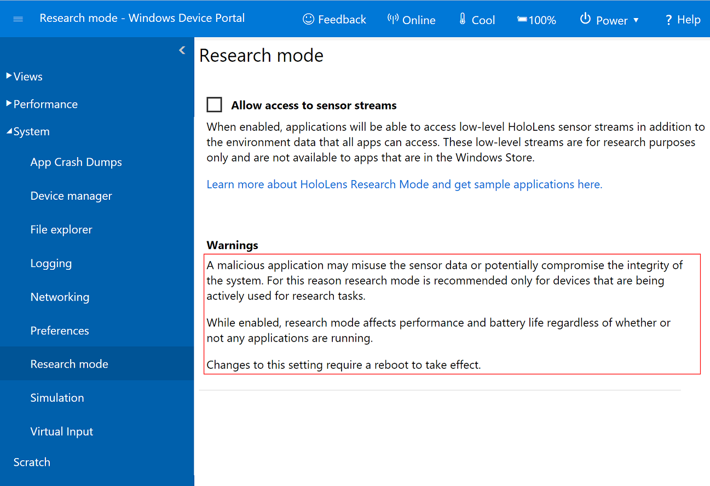

# HoloLens Research mode

> [!NOTE]
> This feature was added as part of the [Windows 10 April 2018 Update](release-notes-april-2018.md) for HoloLens, and is not available on earlier releases.

Research mode is a new capability of HoloLens that provides application access to the key sensors on the device. These include:
- The four environment tracking cameras used by the system for map building and head tracking.
- Two versions of the depth camera data – one for high-frequency (30 FPS) near-depth sensing, commonly used in hand tracking, and the other for lower-frequency (1 FPS) far-depth sensing, currently used by Spatial Mapping,
- Two versions of an IR-reflectivity stream, used by the HoloLens to compute depth, but valuable in its own right as these images are illuminated from the HoloLens and reasonably unaffected by ambient light.

 
*A mixed reality capture of a test application that displays the eight sensor streams available in Research mode*

## Device support

<table>
<tr>
<th>Feature</th><th style="width:150px"> <a href="hololens-hardware-details.md">HoloLens</a></th><th style="width:150px"> <a href="immersive-headset-hardware-details.md">Immersive headsets</a></th>
</tr><tr>
<td> Research mode</td><td style="text-align: center;"> ✔️</td><td style="text-align: center;"></td>
</tr>
</table>

## Before using Research mode

Research mode is well named: it is intended for academic and industrial researchers trying out new ideas in the fields of Computer Vision and Robotics.  Research mode is not intended for applications that will be deployed across an enterprise or made available in the Microsoft Store. The reason for this is that Research mode lowers the security of your device and consumes significantly more battery power than normal operation. Microsoft is not committing to supporting this mode on any future devices. Thus, we recommend you use it to develop and test new ideas; however, you will not be able to widely deploy applications that use Research mode or have any assurance that it will continue to work on future hardware.

## Enabling Research mode

Research mode is a sub-mode of developer mode. You first need to enable developer mode in the Settings app (**Settings > Update & Security > For developers**):

1. Set "Use developer features" to **On**
2. Set "Enable Device Portal" to **On**

Then using a web browser that is connected to the same Wi-Fi network as your HoloLens, navigate to the IP address of your HoloLens (obtained through **Settings > Network & Internet > Wi-Fi > Hardware properties**). This is the [Device Portal](using-the-windows-device-portal.md), and you will find a "Research mode" page in the "System" section of the portal:

 
*Research mode in the HoloLens Device Portal*

After selecting **Allow access to sensor streams**, you will need to reboot HoloLens. You can do this from the Device Portal, under the "Power" menu item at the top of the page.

Once your device has rebooted, applications that have been loaded through Device Portal should be able to access Research mode streams.

## Using sensor data in your apps

Applications can access sensor stream data by opening [Media Foundation](https://msdn.microsoft.com/library/windows/desktop/ms694197) streams in exactly the same way they access the photo/video camera stream. 

All APIs that work for HoloLens development are also available when in Research mode. In particular, the application can know precisely where HoloLens is in 6DoF space at each sensor frame capture time.

Sample applications showing how you access the various Research mode streams, how to use the intrinsics and extrinsics, and how to record streams are available in the [HoloLensForCV GitHub repo](https://github.com/Microsoft/HoloLensForCV).

## Known issues

See the [issue tracker](https://github.com/Microsoft/HololensForCV/issues) in the HoloLensForCV repository.

## See also

* [Microsoft Media Foundation](https://msdn.microsoft.com/library/windows/desktop/ms694197)
* [HoloLensForCV GitHub repo](https://github.com/Microsoft/HoloLensForCV)
* [Using the Windows Device Portal](using-the-windows-device-portal.md)
