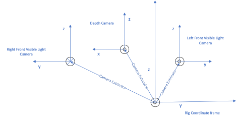

# HoloLens Research mode

## Overview

Research mode was introduced in the 1st Generation HoloLens to give access to key sensors on the device, specifically for research applications that are not intended for deployment.  Research mode for HoloLens 2 retains the capabilities of HoloLens 1, adding access to additional streams:

* **Visible Light Environment Tracking Cameras** - Gray-scale cameras used by the system for head tracking and map building.
* **Depth Camera** – Operates in two modes:  
    + AHAT, high-frequency (45 FPS) near-depth sensing used for hand tracking. Differently from the 1st version short-throw mode, AHAT gives pseudo-depth with phase wrap beyond 1 meter. 
    + Long-throw, low-frequency (1-5 FPS) far-depth sensing used by [Spatial Mapping](spatial-mapping.md)

* **Two versions of the IR-reflectivity stream** - Used by the HoloLens to compute depth. These images are illuminated by infrared and unaffected by ambient visible light.

If you're using a HoloLens 2 you also have access to the following inputs:

* **Accelerometer** – Used by the system to determine linear acceleration along the X, Y and Z axes and gravity.
* **Gyro** – Used by the system to determine rotations.
* **Magnetometer** – Used by the system to estimate absolute orientation.

> [!IMPORTANT]
> Research Mode is currently in Public Preview. It was added as part of the [Windows 10 April 2018 Update](release-notes-april-2018.md) for HoloLens and isn't available on earlier releases.

<br>
*A mixed reality capture of a test application that displays the eight sensor streams available in Research mode*

## Usage

Research mode is designed for academic and industrial researchers exploring new ideas in the fields of Computer Vision and Robotics.  It's not intended for applications deployed in enterprise environments or available through the Microsoft Store or other distribution channels.

Additionally, Microsoft doesn't provide assurances that research mode or equivalent functionality is going to be supported in future hardware or OS updates. However, this shouldn't stop you from using it to develop and test new ideas!

## Security and performance

Be aware that enabling research mode uses more battery power than using the HoloLens 2 under normal conditions. This is true even if the application using the research mode features is not running.  Enabling this mode can also lower the overall security of your device because applications may misuse sensor data.  You can find more information on device security in the [HoloLens security FAQ](https://docs.microsoft.com/hololens/hololens-faq-security).  

<!-- TODO: Is this device support correct? -->
## Device support
<table>
    <colgroup>
    <col width="33%" />
    <col width="33%" />
    <col width="33%" /> 
    </colgroup>
    <tr>
        <td><strong>Feature</strong></td>
        <td><a href="https://docs.microsoft.com/hololens/hololens1-hardware"><strong>HoloLens 1st Gen</strong></a></td>
        <td><a href="https://docs.microsoft.com/hololens/hololens2-hardware"><strong>HoloLens 2</strong></a></td>
    </tr>
     <tr>
        <td>Head Tracking Cameras</td>
        <td>✔️</td>
        <td>✔️</td>
    </tr>
    <tr>
        <td>Depth & IR Camera</td>
        <td>✔️</td>
        <td>✔️</td>
    </tr>
    <tr>
        <td>Accelerometer</td>
        <td>❌</td>
        <td>✔️</td>
    </tr>
    <tr>
        <td>Gyroscope</td>
        <td>❌</td>
        <td>✔️</td>
    </tr>
    <tr>
        <td>Magnetometer</td>
        <td>❌</td>
        <td>✔️</td>
    </tr>
</table>

## Research Mode on HoloLens (1st Gen)

Research mode is an extension of Developer Mode. Before starting, the developer features of the device need to be enabled to access the research mode settings: 

* Open **Start Menu > Settings** and select **Updates**.
* Select **For Developers** and enable **Developer Mode**.
* Scroll down and enable **Device Portal**.

After the developer features  are enabled, [connect to the device portal](https://docs.microsoft.com/windows/uwp/debug-test-perf/device-portal-hololens) to enable the research mode features:

* Go to **System > Research mode** in the **Device Portal**.
* Select **Allow access to sensor stream**.
* Restart the device from the **Power** menu item at the top of the page.

Once you've restarted the device, the applications loaded through the **Device Portal** can access Research mode streams.

<br>
*Research mode window in the HoloLens Device Portal*

### Using sensor data in your apps

Applications can access the sensor stream data in the same way that photo and video camera streams are accessed through [Media Foundation](https://msdn.microsoft.com/library/windows/desktop/ms694197). 

All APIs that work for HoloLens development are also available in Research mode. In particular, the application  knows precisely where HoloLens is in 6DoF space at each sensor frame capture time.

You can find sample applications on how to access the various Research mode streams, how to use the [intrinsics and extrinsics](https://docs.microsoft.com/windows/mixed-reality/locatable-camera#locating-the-device-camera-in-the-world), and how to record streams in the [HoloLensForCV GitHub repo](https://github.com/Microsoft/HoloLensForCV) repo.

<!-- TODO: Does the HoloLensForVC sample work on HL2 now? -->
 > [!NOTE]
 > At this time, the HoloLensForCV sample doesn't work on HoloLens 2.

## Research Mode on HoloLens 2

<!-- TODO: Add enable and implementation for HL2 -->

### API structure

<!-- TODO: Need to know how/why this section is important to using Research Mode -->
The Research Mode API is structured as follows:
1. A Research Mode Device is the first object created and used to:
    * Enumerate available Sensors by type
    * Create Sensor objects
    * Request access consent
 	
See the [Main Sensor Loop](#main-sensor-loop) section for more details and sample code.

2. Sensors provide the following functionalities:
    * Return Sensor name and type
    * Start and stop streaming
    * Wait for and retrieve frames in Streaming state
    * Return extrinsics matrices that give the relative position of the Sensor relative to a device-attached origin (rigOrigin)
    * Return Sensor Frames with sensor-specific (cameras or IMUs) payload formats

See [Sensors](#sensors) and [Sensors coordinate frames](#sensor-coordinate-frames) sections for more details, a description of the device coordinate frame (rigOrigin), and sample code.

3. Sensor Frames provide:
    * Timestamps
    * Frame sizes
    * Specialized per-sensor properties and payload formats.

See [Sensor frames](#sensor-frames) section below for more details and sample code

### Main Sensor Loop

<!-- TODO: Needs more explanation of the how/why -->
Sample code for the main sensor loop is listed below, with a breakdown at the end of the section.

```cpp
#include <windows.h>
#include <stdio.h>
#include <stdlib.h>
#include <vector>
#include <fstream>
#include <iostream>
#include "ResearchModeApi.h"

int main(int argc, _In_reads_(argc) char** ppArgv)
{
    HRESULT hr = S_OK;
    IResearchModeSensorDevice *pSensorDevice;
    std::vector<ResearchModeSensorDescriptor> sensorDescriptors;
    size_t sensorCount = 0;

    wchar_t msgBuffer[1000];
  
    // Create Research Mode device
    hr = CreateResearchModeSensorDevice(&pSensorDevice);
 
    if (FAILED(hr))
    {
        return -1;
    }
     
    pSensorDevice->DisableEyeSelection();
 
    // Get the device coordinate frame (rigNode)
    GUID guid;
    IResearchModeSensorDevicePerception* pSensorDevicePerception;
    hr = m_pSensorDevice->QueryInterface(IID_PPV_ARGS(&pSensorDevicePerception));
    if (FAILED(hr))
    {
	return -1;
    }
    hr = pSensorDevicePerception->GetRigNodeId(&guid);
    if (FAILED(hr))
    {
	return -1;
    }

    // Enumerate sensors
    hr = pSensorDevice->GetSensorCount(&sensorCount);
 
    if (FAILED(hr))
    {
        return -1;
    }
 
    sensorDescriptors.resize(sensorCount);
 
    // Get sensor descriptors
    hr = pSensorDevice->GetSensorDescriptors(sensorDescriptors.data(),  sensorDescriptors.size(), &sensorCount);
 
    if (FAILED(hr))
    {
        return -1;
    }
 
    // Loop over sensors to get sensor-specific information
    for (auto sensorDescriptor : sensorDescriptors)
    {
        IResearchModeSensor *pSensor = nullptr;        
        IResearchModeSensorFrame* pSensorFrame = nullptr;
        size_t sampleBufferSize;
        DirectX::XMFLOAT4X4 cameraPose;
 
        hr = pSensorDevice->GetSensor(sensorDescriptor.sensorType, &pSensor);        
 
	 // Get sensor name
        swprintf_s(msgBuffer, L"Sensor %ls\n", pSensor->GetFriendlyName());
        OutputDebugStringW(msgBuffer);
 
        if (FAILED(hr))
        {
            break;
        }
 
        // Get sample buffer size
        hr = pSensor->GetSampleBufferSize(&sampleBufferSize);
 
        if (FAILED(hr))
        {
            break;
        }
        
	 // Get Camera object to access calibration info
        IResearchModeCameraSensor *pCameraSensor = nullptr;
        float xy[2] = {0};
        float uv[2];
 
        hr = pSensor->QueryInterface(IID_PPV_ARGS(&pCameraSensor));
 
        if (FAILED(hr))
        {
        	break;
         }
             
         uv[0] = 640.0f / 2;
         uv[1] = 480.0f / 2;
 
	  // Get matrix of extrinsics wrt the rigNode
         pCameraSensor->GetCameraExtrinsicsMatrix(&cameraPose);
 
         // Unproject from image pixels to 3D  
	  uv[0] = 640.0f / 2;
         uv[1] = 480.0f / 2;
         for (int i = 0; i <= 10; i++)
         {
          	for (int j = 0; j <= 10; j++)
              {
                   uv[0] = i * 64.0f;
                   uv[1] = j * 48.0f;
 
                   pCameraSensor->MapImagePointToCameraUnitPlane(uv, xy);
                   swprintf_s(msgBuffer, L"(% 5.6f % 5.6f) ", xy[0], xy[1]);
                   OutputDebugStringW(msgBuffer);
               }
               swprintf_s(msgBuffer, L" EOL \n");
               OutputDebugStringW(msgBuffer);
           }
 
           pCameraSensor->Release();
           continue;
        }
         
        // Get frames
        // …        
        if (pSensor)
        {
            pSensor->Release();
        }
    }
 
    pSensorDevice->EnableEyeSelection();
    pSensorDevice->Release();
 
    return hr;
}

```

Sample code breakdown:
1. Creates Research Mode device
2. Gets the device coordinate frame, in which all sensors are positioned. We call this the rigNode and it is identified by a GUID that can be used with the HoloLens perception APIs to map sensor specific coordinates in other HoloLens perception coordinate frames.
3. Enumerates sensors
4. Gets information from sensors:
    * For cameras, use Camera objects to project / unproject image points to 3D points in the camera coordinate frame,
    * Extrinsics for positioning the sensor with respect to the device rigNode
5. Gets frames

The initialization call should be made only once for all sensors. Sensors are not thread-safe. Frames should be read from the thread the sensor was opened on. Sensors can share a thread or have a thread each. The latter is better because it will allow for parallel reading of samples giving better sample/frame rates (see MixedReality.ResearchMode repo for samples).

For sample code using the rigNode in combination with the HoloLens perception APIs, see the MixedReality.ResearchMode repo. 
For Loop reading [IMU sensor](#imu-sensors), see Main loop reading [IMU samples Appendix](#code-samples).

### Sensors

<!-- TODO: Need more explanation/background on sensors here -->
Sensors can be of the following types:

```cpp
enum ResearchModeSensorType
{
    LEFT_FRONT,
    LEFT_LEFT,
    RIGHT_FRONT,
    RIGHT_RIGHT,
    DEPTH_AHAT,
    DEPTH_LONG_THROW,
    IMU_ACCEL,
    IMU_GYRO,
    IMU_MAG
};
```

* LEFT_FRONT, LEFT_LEFT, RIGHT_FRONT and RIGHT_RIGHT give access to the 4 Visible Light Environment Tracking Cameras
* DEPTH_AHAT and DEPTH_LONG_THROW give access to the 2 Depth modes
* IMU_ACCEL, IMU_GYRO and IMU_MAG give access to accelerometer, gyro and magnetometer data.

#### Sensor coordinate frames
Each sensor returns its transform to the rigNode (device origin) expressed as an extrinsics rigid body transform. Figure 1 shows camera coordinate frames relative to rig coordinate frame.

<br>
*Figure 1 Depth and Front visible light camera coordinate frames relative to rig node coordinate frame.*

<br>
*Figure 2 Camera Map Unmap methods convert 3d (X,Y,Z) coordinates in camera reference frame in camera (x,y) image coordinates, and (x,y) image coordinates into (X,Y,Z) direction vectors in camera coordinate frames*

##### Sensor frames

<!-- TODO: Need more explanation/background on sensor frames here -->
All frame types have: 
    * Timestamps
    * Sample size in bytes.

Camera frames have:
    * Getters for resolution, exposure, gain
    * VLC camera frames return grayscale buffer
    * Depth Long throw camera frames contain active brightness buffer, distance buffer and the sigma buffer
    * Depth AHAT camera frames contain active brightness buffer and the distance buffer

IMU frames contain batches of sensor samples.

##### Camera sensors

<!-- TODO: Need more explanation/background on camera sensors here -->
* Intrinsics (project/unproject)
* These function in the camera coordinate space 
* Extrinsics returns R, T transform in rig space
* Frames are specialized for camera frames
IMU sensors
* Extrinsics returns R, T transform in rig space
* Frames are specialized for IMU frames

##### IMU sensors

<!-- TODO: Need more explanation/background on IMU sensors here -->
* Extrinsics returns R, T transform in rig space
* Frames are specialized for IMU frames

<!-- TODO: Is this the right place for this content? -->
### User Consent Prompts
Any UWP application using Research Mode API for accessing cameras or IMUs must request for user consent before opening the streams. The app will then proceed depending on the user input.  

To add consent prompt to a UWP app:
1.  Enable user consent for the camera and IMU access by declaring the following capabilities to the app manifest:

```
<DeviceCapability Name="webcam" />
<DeviceCapability Name="backgroundSpatialPerception"/>
```

2. Query for a new **SensorDeviceConsent** interface that implements the consent checks in the Research Mode API:

```cpp
hr = m_pSensorDevice->QueryInterface(IID_PPV_ARGS(&m_pSensorDeviceConsent));
```

3. Define the required consent and event that has to be set when the consent is given:

```cpp
ResearchModeSensorConsent camAccessCheck;
HANDLE camConsentGiven;

camConsenGiven = CreateEvent(nullptr, true, false, nullptr);
```

4. If the query succeeds, register for camera and/or IMU consent callback from the main UI thread of the app:

```cpp
hr = m_pSensorDeviceConsent->RequestCamAccessAsync(CamAccessOnComplete);
```

5. Define the callback functions where the user consent will be captured and an event created for this action is set:

```cpp
void CamAccessOnComplete(ResearchModeConsent consent)
{
    camAccessCheck = consent;
    SetEvent(camConsentGiven);
}
```

6. Wait on a worker thread to check if the event is set and if it is, look for the consent provided by the user and proceed forward:

```cpp
void CameraUpdateThread(SlateCameraRenderer* pSlateCameraRenderer, HANDLE camConsentGiven, ResearchModeSensorConsent *camAccessConsent)
{
    HRESULT hr = S_OK;
    DWORD waitResult = WaitForSingleObject(camConsentGiven, INFINITE);  

   // wait for the event to be set and check for the consent provided by the user.

    if (waitResult == WAIT_OBJECT_0)
    {
        switch (*camAccessConsent)
        {
        case ResearchModeSensorConsent::Allowed:
            OutputDebugString(L"Access is granted");
            break;
        case ResearchModeSensorConsent::DeniedBySystem:
            OutputDebugString(L"Access is denied by the system");
            hr = E_ACCESSDENIED;
            break;
        case ResearchModeSensorConsent::DeniedByUser:
            OutputDebugString(L"Access is denied by the user");
            hr = E_ACCESSDENIED;
            break;
        case ResearchModeSensorConsent::NotDeclaredByApp:
            OutputDebugString(L"Capability is not declared in the app manifest");
                        hr = E_ACCESSDENIED;
            break;
        case ResearchModeSensorConsent::UserPromptRequired:
            OutputDebugString(L"Capability user prompt required");
            hr = E_ACCESSDENIED;
            break;
        default:
            OutputDebugString(L"Access is denied by the system");
            hr = E_ACCESSDENIED;
            break;
        }
    }
    else
    {
        hr = E_UNEXPECTED;
    }

    if (SUCCEEDED(hr))
    { 
         hr = pSlateCameraRenderer->m_pRMCameraSensor->OpenStream();
    }
}
```

For testing if your app correctly implemented the checks, make sure to verify that the prompts appear for camera/IMU or both before the app output appears. Also, the prompts appear only on the first use of the app after a FRESH FLASH for each user. Make sure to go through OOBE as the prompts are dependent on the user. To revoke the access, go to Settings->Privacy->Camera→App and turn the access off for cameras, go to Settings->Privacy→User Movements→App and turn the access off for IMUs.

You can see the entire change for all the scenarios of the app [here](https://microsoft.visualstudio.com/DefaultCollection/Analog/_git/mixedreality.researchmode/pullrequest/4842004?path=%2FCameraWithCVAndCalibration%2FCameraWithCVAndCalibration%2FContent%2FSlateCameraRenderer.cpp&_a=files). 

**SensorVisualizationScenario.h**
```cpp
#include "BasicHologramMain.h"

namespace BasicHologram
{
    class SensorVisualizationScenario : public Scenario
    {
    public:
        SensorVisualizationScenario(std::shared_ptr<DX::DeviceResources> const& deviceResources);
        virtual ~SensorVisualizationScenario();

        void IntializeSensors();
        void IntializeModelRendering();
        void UpdateModels(DX::StepTimer &timer);
        void PositionHologram(winrt::Windows::UI::Input::Spatial::SpatialPointerPose const& pointerPose, const DX::StepTimer& timer);
        void PositionHologramNoSmoothing(winrt::Windows::UI::Input::Spatial::SpatialPointerPose const& pointerPose);
        winrt::Windows::Foundation::Numerics::float3 const& GetPosition()
        {
            return m_modelRenderers[0]->GetPosition();
        }
        void RenderModels();
        void OnDeviceLost();
        void OnDeviceRestored();
        static void CamAccessOnComplete(ResearchModeSensorConsent consent);   //Callback with user's consent

    protected:

        IResearchModeSensorDevice *m_pSensorDevice;
        IResearchModeSensorDeviceConsent* m_pSensorDeviceConsent;   //New interface for SensorDeviceConsent
        std::vector<ResearchModeSensorDescriptor> m_sensorDescriptors;
        IResearchModeSensor *m_pLFCameraSensor = nullptr;
        IResearchModeSensor *m_pRFCameraSensor = nullptr;
        IResearchModeSensor *m_pLTSensor = nullptr;
        IResearchModeSensor *m_pAHATSensor = nullptr;
        IResearchModeSensor *m_pAccelSensor = nullptr;

        std::vector<std::shared_ptr<ModelRenderer>>                 m_modelRenderers;
        std::shared_ptr<AccelRenderer>                              m_AccelRenderer;
    };
}
```

**SensorVisualizationScenario.cpp**
```cpp
#include "pch.h"
#include "SensorVisualizationScenario.h"
#include "Common\DirectXHelper.h"


#include"content\OpenCVFrameProcessing.h"

extern"C"
HMODULE LoadLibraryA(
    LPCSTR lpLibFileName
);

usingnamespace BasicHologram;
usingnamespace concurrency;
usingnamespace Microsoft::WRL;
usingnamespace std::placeholders;
usingnamespace winrt::Windows::Foundation::Numerics;
usingnamespace winrt::Windows::Gaming::Input;
usingnamespace winrt::Windows::Graphics::Holographic;
usingnamespace winrt::Windows::Graphics::DirectX::Direct3D11;
usingnamespace winrt::Windows::Perception::Spatial;
usingnamespace winrt::Windows::UI::Input::Spatial;

static ResearchModeSensorConsent camAccessCheck;
static HANDLE  camConsentGiven;

SensorVisualizationScenario::SensorVisualizationScenario(std::shared_ptr<DX::DeviceResources> const& deviceResources) :
    Scenario(deviceResources)
{
}

SensorVisualizationScenario::~SensorVisualizationScenario()
{
if (m_pLFCameraSensor)
    {
        m_pLFCameraSensor->Release();
    }
if (m_pRFCameraSensor)
    {
        m_pRFCameraSensor->Release();
    }
if (m_pLTSensor)
    {
        m_pLTSensor->Release();
    }
if (m_pLTSensor)
    {
        m_pLTSensor->Release();
    }

if (m_pSensorDevice)
    {
        m_pSensorDevice->EnableEyeSelection();
        m_pSensorDevice->Release();
    }
}

void SensorVisualizationScenario::IntializeSensors()
{
    HRESULT hr = S_OK;
    size_t sensorCount = 0;
    camConsentGiven = CreateEvent(nullptr, true, false, nullptr);

    HMODULE hrResearchMode = LoadLibraryA("ResearchModeAPI");
if (hrResearchMode)
    {
typedef HRESULT(__cdecl* PFN_CREATEPROVIDER) (IResearchModeSensorDevice** ppSensorDevice);
        PFN_CREATEPROVIDER pfnCreate = reinterpret_cast<PFN_CREATEPROVIDER>(GetProcAddress(hrResearchMode, "CreateResearchModeSensorDevice"));
if (pfnCreate)
        {
            hr = pfnCreate(&m_pSensorDevice);
        }
    }

    hr = m_pSensorDevice→QueryInterface(IID_PPV_ARGS(&m_pSensorDeviceConsent)); // 1. Query for the SensorDeviceConsent interface
if (SUCCEEDED(hr))
    {
        hr = m_pSensorDeviceConsent→RequestCamAccessAsync(SensorVisualizationScenario::CamAccessOnComplete);   //2. register the callback defined locally to get the user's consent using the new sensor device interface. THIS CALL HAS TO BE MADE FROM MAIN UI THREAD
    }
else
    {
// fall back and give the consent in case the app  
// uses an older version of the RM API that does 
// not have Consent interface
        camAccessCheck = Allowed;
        SetEvent(camConsentGiven);
        hr = S_OK;
    }

if (SUCCEEDED(hr))
    {
        m_pSensorDevice->DisableEyeSelection();

        m_pSensorDevice->GetSensorCount(&sensorCount);
        m_sensorDescriptors.resize(sensorCount);

        m_pSensorDevice->GetSensorDescriptors(m_sensorDescriptors.data(), m_sensorDescriptors.size(), &sensorCount);

for (auto sensorDescriptor : m_sensorDescriptors)
        {
            IResearchModeSensor* pSensor = nullptr;
//SIZE_T sampleBufferSize;

if (sensorDescriptor.sensorType == LEFT_FRONT)
            {
                hr = m_pSensorDevice->GetSensor(sensorDescriptor.sensorType, &m_pLFCameraSensor);

if (FAILED(hr))
                {
break;
                }
            }

if (sensorDescriptor.sensorType == RIGHT_FRONT)
            {
                hr = m_pSensorDevice->GetSensor(sensorDescriptor.sensorType, &m_pRFCameraSensor);

if (FAILED(hr))
                {
break;
                }
            }

if (sensorDescriptor.sensorType == DEPTH_LONG_THROW)
            {
                hr = m_pSensorDevice->GetSensor(sensorDescriptor.sensorType, &m_pLTSensor);

if (FAILED(hr))
                {
break;
                }
            }

if (sensorDescriptor.sensorType == DEPTH_AHAT)
            {
//hr = m_pSensorDevice->GetSensor(sensorDescriptor.sensorType, &m_pAHATSensor);

if (FAILED(hr))
                {
break;
                }
            }

if (sensorDescriptor.sensorType == IMU_ACCEL)
            {
                hr = m_pSensorDevice->GetSensor(sensorDescriptor.sensorType, &m_pAccelSensor);

if (FAILED(hr))
                {
break;
                }
            }
        }
    }
}

void SensorVisualizationScenario::CamAccessOnComplete(ResearchModeSensorConsent consent)                 //3. Retreive the consent provided by the user and set the event by indicating so
{
    camAccessCheck = consent;
    SetEvent(camConsentGiven);

}

void SensorVisualizationScenario::IntializeModelRendering()
{
    SlateCameraRenderer* pLLSlateCameraRenderer = nullptr;

if (m_pLFCameraSensor)
    {
// Initialize the sample hologram.
auto slateCameraRenderer = std::make_shared<SlateCameraRenderer>(m_deviceResources, m_pLFCameraSensor, camConsentGiven, &camAccessCheck);

        float3 offset;
        offset.x = -0.2f;
        offset.y = 0.2f;
        offset.z = 0.0f;

        slateCameraRenderer->SetOffset(offset);
        m_modelRenderers.push_back(slateCameraRenderer);

        pLLSlateCameraRenderer = slateCameraRenderer.get();
    }

if (m_pRFCameraSensor)
    {
// Initialize the sample hologram.
auto slateCameraRenderer = std::make_shared<SlateCameraRenderer>(m_deviceResources, m_pRFCameraSensor, camConsentGiven, &camAccessCheck);  //4. using an existing worker thread check for the consent. use a different thread other than the main UI thread to avoid hanging

        float3 offset;
        offset.x = 0.2f;
        offset.y = 0.2f;
        offset.z = 0.0f;

        slateCameraRenderer->SetOffset(offset);
        m_modelRenderers.push_back(slateCameraRenderer);
    }

if (m_pLTSensor)
    {
// Initialize the sample hologram.
auto slateCameraRenderer = std::make_shared<SlateCameraRenderer>(m_deviceResources, m_pLTSensor, camConsentGiven, &camAccessCheck);

        float3 offset;
        offset.x = -0.2f;
        offset.y = -0.2f;
        offset.z = 0.0f;

        slateCameraRenderer->SetOffset(offset);
        m_modelRenderers.push_back(slateCameraRenderer);
    }

if (m_pAHATSensor)
    {
// Initialize the sample hologram.
auto slateCameraRenderer = std::make_shared<SlateCameraRenderer>(m_deviceResources, m_pAHATSensor, camConsentGiven, &camAccessCheck);

        float3 offset;
        offset.x = 0.2f;
        offset.y = -0.2f;
        offset.z = 0.0f;

        slateCameraRenderer->SetOffset(offset);
        m_modelRenderers.push_back(slateCameraRenderer);
    }

if (m_pAccelSensor)
    {
        m_AccelRenderer = std::make_shared<AccelRenderer>(m_deviceResources, m_pAccelSensor);
    }
}

void SensorVisualizationScenario::PositionHologram(winrt::Windows::UI::Input::Spatial::SpatialPointerPose const& pointerPose, const DX::StepTimer& timer)
{
// When a Pressed gesture is detected, the sample hologram will be repositioned
// two meters in front of the user.
for (int i = 0; i < m_modelRenderers.size(); i++)
    {
        m_modelRenderers[i]->PositionHologram(pointerPose, timer);
    }
}

void SensorVisualizationScenario::PositionHologramNoSmoothing(winrt::Windows::UI::Input::Spatial::SpatialPointerPose const& pointerPose)
{
// When a Pressed gesture is detected, the sample hologram will be repositioned
// two meters in front of the user.
for (int i = 0; i < m_modelRenderers.size(); i++)
    {
        m_modelRenderers[i]->PositionHologramNoSmoothing(pointerPose);
    }
}

void SensorVisualizationScenario::UpdateModels(DX::StepTimer &timer)
{
    HRESULT hr = S_OK;
//DirectX::XMFLOAT4X4 cameraViewMatrix;

for (int i = 0; i < m_modelRenderers.size(); i++)
    {
        m_modelRenderers[i]->Update(timer);
    }

/*
    if (m_pLFCameraSensor && m_stationaryReferenceFrame)
    {
        ResearchModeSensorTimestamp timeStamp;

        SpatialCoordinateSystem currentCoordinateSystem =
            m_stationaryReferenceFrame.CoordinateSystem();

        winrt::com_ptr<IUnknown> spCoordinateIUknown = currentCoordinateSystem.as<IUnknown>();

        IResearchModeCameraSensorPerception *pCameraSensorPerception = nullptr;

        hr = m_pLFCameraSensor->QueryInterface(IID_PPV_ARGS(&pCameraSensorPerception));
        if (SUCCEEDED(hr))
        {
            pCameraSensorPerception->GetCameraExtrinsicsMatrixPerception(&timeStamp, spCoordinateIUknown.get(), &cameraViewMatrix);
        }
    }
    */

if (m_AccelRenderer)
    {
        m_AccelRenderer->UpdateSample();
    }
}

void SensorVisualizationScenario::RenderModels()
{
// Draw the sample hologram.
for (int i = 0; i < m_modelRenderers.size(); i++)
    {
        m_modelRenderers[i]->Render();
    }
}

void SensorVisualizationScenario::OnDeviceLost()
{
for (int i = 0; i < m_modelRenderers.size(); i++)
    {
        m_modelRenderers[i]->ReleaseDeviceDependentResources();
    }
}

void SensorVisualizationScenario::OnDeviceRestored()
{
for (int i = 0; i < m_modelRenderers.size(); i++)
    {
        m_modelRenderers[i]->CreateDeviceDependentResources();
    }
}
```

**SlateCameraRenderer.cpp**
```cpp
#include "pch.h"
#include "SlateCameraRenderer.h"

using namespace BasicHologram;
using namespace DirectX;
using namespace winrt::Windows::Foundation::Numerics;
using namespace winrt::Windows::UI::Input::Spatial;

void SlateCameraRenderer::CameraUpdateThread(SlateCameraRenderer* pSlateCameraRenderer, HANDLE camConsentGiven, ResearchModeSensorConsent *camAccessConsent)
{
    HRESULT hr = S_OK;
    DWORD waitResult = WaitForSingleObject(camConsentGiven, INFINITE);  //4. wait for the event to be set and check for the consent provided by the user. Proceed further depending on that

    if (waitResult == WAIT_OBJECT_0)
    {
        switch (*camAccessConsent)
        {
        case ResearchModeSensorConsent::Allowed:
            OutputDebugString(L"Access is granted");
            break;
        case ResearchModeSensorConsent::DeniedBySystem:
            OutputDebugString(L"Access is denied by the system");
            hr = E_ACCESSDENIED;
            break;
        case ResearchModeSensorConsent::DeniedByUser:
            OutputDebugString(L"Access is denied by the user");
            hr = E_ACCESSDENIED;
            break;
        case ResearchModeSensorConsent::NotDeclaredByApp:
            OutputDebugString(L"Capability is not declared in the app manifest");
            hr = E_ACCESSDENIED;
            break;
        case ResearchModeSensorConsent::UserPromptRequired:
            OutputDebugString(L"Capability user prompt required");
            hr = E_ACCESSDENIED;
            break;
        default:
            OutputDebugString(L"Access is denied by the system");
            hr = E_ACCESSDENIED;
            break;
        }
    }
    else
    {
        hr = E_UNEXPECTED;
    }

    if (SUCCEEDED(hr))
    {
        hr = pSlateCameraRenderer->m_pRMCameraSensor->OpenStream();

        if (FAILED(hr))
        {
            pSlateCameraRenderer->m_pRMCameraSensor->Release();
            pSlateCameraRenderer->m_pRMCameraSensor = nullptr;
        }

        while (!pSlateCameraRenderer->m_fExit && pSlateCameraRenderer->m_pRMCameraSensor)
        {
            static int gFrameCount = 0;
            HRESULT hr = S_OK;
            IResearchModeSensorFrame* pSensorFrame = nullptr;

            hr = pSlateCameraRenderer->m_pRMCameraSensor->GetNextBuffer(&pSensorFrame);

            if (SUCCEEDED(hr))
            {
                std::lock_guard<std::mutex> guard(pSlateCameraRenderer->m_mutex);

                if (pSlateCameraRenderer->m_frameCallback)
                {
                    pSlateCameraRenderer->m_frameCallback(pSensorFrame, pSlateCameraRenderer->m_frameCtx);
                }

                if (pSlateCameraRenderer->m_pSensorFrame)
                {
                    pSlateCameraRenderer->m_pSensorFrame->Release();
                }

                pSlateCameraRenderer->m_pSensorFrame = pSensorFrame;
            }
        }

        if (pSlateCameraRenderer->m_pRMCameraSensor)
        {
            pSlateCameraRenderer->m_pRMCameraSensor->CloseStream();
        }
    }
}
```

#### Code samples

**Main loop reading IMU samples**

```cpp
int main(int argc, _In_reads_(argc) char** ppArgv)
{
    HRESULT hr = S_OK;
    IResearchModeSensorDevice *pSensorDevice;
    IResearchModeSensorDeviceConsent *pSensorDeviceConsent;
    std::vector<ResearchModeSensorDescriptor> sensorDescriptors;
    size_t sensorCount = 0;
    ResearchModeSensorType sensorType;

    if ((argc == 2) && (strcmp(ppArgv[1], "G") == 0)) 
    {
        sensorType = IMU_GYRO;
    }
    else if ((argc == 2) && (strcmp(ppArgv[1], "M") == 0))
    {
        sensorType = IMU_MAG;
    }
    else
    {
        sensorType = IMU_ACCEL;
    }
    hr = CreateResearchModeSensorDevice(&pSensorDevice);

    if (FAILED(hr))
    {
        return -1;
    }
    pSensorDevice->DisableEyeSelection();

    hr = pSensorDevice->GetSensorCount(&sensorCount);

    if (FAILED(hr))
    {
        return -1;
    }

    sensorDescriptors.resize(sensorCount);

    hr = pSensorDevice->GetSensorDescriptors(sensorDescriptors.data(), sensorDescriptors.size(), &sensorCount);

    if (FAILED(hr))
    {
        return -1;
    }

    for (auto sensorDescriptor : sensorDescriptors)
    {
        IResearchModeSensor *pSensor = nullptr;
        size_t sampleBufferSize;
        //IResearchModeSensorFrame* pSensorFrame = nullptr;

        if (sensorDescriptor.sensorType != sensorType)
        {
            continue;
        }
        
        hr = pSensorDevice->GetSensor(sensorDescriptor.sensorType, &pSensor);

        hr = pSensor->GetSampleBufferSize(&sampleBufferSize);

        swprintf_s(msgBuffer, L"Sensor %S Event size %d\n", pSensor->GetFriendlyName(), sampleBufferSize);
        OutputDebugStringW(msgBuffer);

        if (FAILED(hr))
        {
            break;
        }

        if (FAILED(hr))
        {
            break;
        }

        hr = pSensor->OpenStream();

        if (FAILED(hr))
        {
            break;
        }

        for (UINT i = 0; i < 100; i++)
        {
            IResearchModeSensorFrame *pSensorFrame;

            hr = pSensor->GetNextBuffer(&pSensorFrame);

            if (FAILED(hr))
            {
                break;
            }

            PrintSensorValue(pSensorFrame);

            if (pSensorFrame)
            {
                pSensorFrame->Release();
            }
        }

        hr = pSensor->CloseStream();

        if (pSensor)
        {
            pSensor->Release();
        }
    }

    pSensorDevice->EnableEyeSelection();

    pSensorDevice->Release();
}
```

### API reference

```cpp
#pragma once
 
#include <windows.h>
#include <initguid.h>
 
#include <comdef.h>
#include <initguid.h>
 
#include <vector>
#include <cstring>
#include <string>
 
#include <DirectXMath.h>
 
interface IResearchModeCameraSensor;
interface IResearchModeSensor;
interface IResearchModeSensorFrame;
 
struct AccelDataStruct
{
    uint64_t VinylHupTicks;
    uint64_t SocTicks;
    float AccelValues[3];
    float temperature;
};
 
struct GyroDataStruct
{
    uint64_t VinylHupTicks;
    uint64_t SocTicks;
    float GyroValues[3];
    float temperature;
};
 
struct MagDataStruct
{
    uint64_t VinylHupTicks;
    uint64_t SocTicks;
    float MagValues[3];
};
 
enum ResearchModeSensorType
{
    LEFT_FRONT,
    LEFT_LEFT,
    RIGHT_FRONT,
    RIGHT_RIGHT,
    DEPTH_AHAT,
    DEPTH_LONG_THROW,
    IMU_ACCEL,
    IMU_GYRO,
    IMU_MAG
};
 
struct ResearchModeSensorDescriptor
{
    LUID sensorId;
    ResearchModeSensorType sensorType;
};
 
enum ResearchModeSensorTimestampSource
{
    SensorTimestampSource_USB_SOF = 0,
    SensorTimestampSource_Unknown = 1,
    SensorTimestampSource_CenterOfExposure = 2,
    SensorTimestampSource_Count = 3
};
 
struct ResearchModeSensorTimestamp {
    ResearchModeSensorTimestampSource Source;
    UINT64 SensorTicks;
    UINT64 SensorTicksPerSecond;
    UINT64 HostTicks;
    UINT64 HostTicksPerSecond;
};
 
struct ResearchModeSensorResolution {
    UINT32 Width;
    UINT32 Height;
    UINT32 Stride;
    UINT32 BitsPerPixel;
    UINT32 BytesPerPixel;
};
 
DECLARE_INTERFACE_IID_(IResearchModeSensorDevice, IUnknown, "65E8CC3C-3A03-4006-AE0D-34E1150058CC")
{
    STDMETHOD(DisableEyeSelection()) = 0;
    STDMETHOD(EnableEyeSelection()) = 0;
 
    STDMETHOD(GetSensorCount(
        _Out_ size_t *pOutCount)) = 0;
    STDMETHOD(GetSensorDescriptors(
        _Out_writes_(sensorCount) ResearchModeSensorDescriptor *pSensorDescriptorData,
        size_t sensorCount,
        _Out_ size_t *pOutCount)) = 0;
    STDMETHOD(GetSensor(
        ResearchModeSensorType sensorType,
        _Outptr_result_nullonfailure_ IResearchModeSensor **ppSensor)) = 0;
};
 
DECLARE_INTERFACE_IID_(IResearchModeSensor, IUnknown, "4D4D1D4B-9FDD-4001-BA1E-F8FAB1DA14D0")
{
    STDMETHOD(OpenStream()) = 0;
    STDMETHOD(CloseStream()) = 0;
    STDMETHOD_(LPCWSTR, GetFriendlyName)() = 0;
    STDMETHOD_(ResearchModeSensorType, GetSensorType)() = 0;
 
    STDMETHOD(GetSampleBufferSize(
        _Out_ size_t *pSampleBufferSize)) = 0;
    STDMETHOD(GetNextBuffer(
        _Outptr_result_nullonfailure_ IResearchModeSensorFrame **ppSensorFrame)) = 0;
};
 
DECLARE_INTERFACE_IID_(IResearchModeCameraSensor, IUnknown, "3BDB4977-960B-4F5D-8CA3-D21E68F26E76")
{
    STDMETHOD(MapImagePointToCameraUnitPlane(
        float (&uv) [2],
        float (&xy) [2])) = 0;
    STDMETHOD(MapCameraSpaceToImagePoint(
        float(&xy)[2],
        float(&uv)[2])) = 0;
    STDMETHOD(GetCameraExtrinsicsMatrix(DirectX::XMFLOAT4X4 *pCameraViewMatrix)) = 0;
};
 
DECLARE_INTERFACE_IID_(IResearchModeAccelSensor, IUnknown, "3BDB4977-960B-4F5D-8CA3-D21E68F26E76")
{
    STDMETHOD(GetExtrinsicsMatrix(DirectX::XMFLOAT4X4 *pAccel)) = 0;
};
 
DECLARE_INTERFACE_IID_(IResearchModeGyroSensor, IUnknown, "E6E8B36F-E6E7-494C-B4A8-7CFA2561BEE7")
{
    STDMETHOD(GetExtrinsicsMatrix(DirectX::XMFLOAT4X4 *pGyro)) = 0;
};
 
DECLARE_INTERFACE_IID_(IResearchModeMagSensor, IUnknown, "CB082E34-1C69-445D-A91A-43CE96B3655E")
{
};
 
DECLARE_INTERFACE_IID_(IResearchModeDepthSensor, IUnknown, "CC317D10-C26E-45B2-B91B-0E4571486CEC")
{
};
 
DECLARE_INTERFACE_IID_(IResearchModeSensorFrame, IUnknown, "73479614-89C9-4FFD-9C16-615BC32C6A09")
{
    STDMETHOD(GetResolution(
        _Out_ ResearchModeSensorResolution *pResolution)) = 0;
    // For frames with batched samples this returns the time stamp for the first sample in the frame.
    STDMETHOD(GetTimeStamp(
        _Out_ ResearchModeSensorTimestamp *pTimeStamp)) = 0;
};
 
DECLARE_INTERFACE_IID_(IResearchModeSensorVLCFrame, IUnknown, "5C693123-3851-4FDC-A2D9-51C68AF53976")
{
    STDMETHOD(GetBuffer(
        _Outptr_ const BYTE **ppBytes,
        _Out_ size_t *pBufferOutLength)) = 0;
    STDMETHOD(GetGain(
        _Out_ UINT32 *pGain)) = 0;
    STDMETHOD(GetExposure(
        _Out_ UINT64 *pExposure)) = 0;
};
 
DECLARE_INTERFACE_IID_(IResearchModeSensorDepthFrame, IUnknown, "35167E38-E020-43D9-898E-6CB917AD86D3")
{
    STDMETHOD(GetBuffer(
        _Outptr_ const UINT16 **ppBytes,
        _Out_ size_t *pBufferOutLength)) = 0;
    STDMETHOD(GetAbDepthBuffer(
        _Outptr_ const UINT16 **ppBytes,
        _Out_ size_t *pBufferOutLength)) = 0;
    STDMETHOD(GetSigmaBuffer(
        _Outptr_ const BYTE **ppBytes,
        _Out_ size_t *pBufferOutLength)) = 0;
};
 
DECLARE_INTERFACE_IID_(IResearchModeAccelFrame, IUnknown, "42AA75F8-E3FE-4C25-88C6-F2ECE1E8A2C5")
{
    STDMETHOD(GetCalibratedAccelaration(
        _Out_ DirectX::XMFLOAT3 *pAccel)) = 0;
    STDMETHOD(GetCalibratedAccelarationSamples(
        _Outptr_ const AccelDataStruct **ppAccelBuffer,
        _Out_ size_t *pBufferOutLength)) = 0;
};
 
DECLARE_INTERFACE_IID_(IResearchModeGyroFrame, IUnknown, "4C0C5EE7-CBB8-4A15-A81F-943785F524A6")
{
    STDMETHOD(GetCalibratedGyro(
        _Out_ DirectX::XMFLOAT3 *pGyro)) = 0;
    STDMETHOD(GetCalibratedGyroSamples(
        _Outptr_ const GyroDataStruct **ppAccelBuffer,
        _Out_ size_t *pBufferOutLength)) = 0;
};
 
DECLARE_INTERFACE_IID_(IResearchModeMagFrame, IUnknown, "2376C9D2-7F3D-456E-A39E-3B7730DDA9E5")
{
    STDMETHOD(GetMagnetometer(
        _Out_ DirectX::XMFLOAT3 *pMag)) = 0;
    STDMETHOD(GetMagnetometerSamples(
        _Outptr_ const MagDataStruct **ppMagBuffer,
        _Out_ size_t *pBufferOutLength)) = 0;
};
 
HRESULT CreateResearchModeSensorDevice(
    _Outptr_result_nullonfailure_ IResearchModeSensorDevice **ppSensorDevice);
```

#### Reading cameras
```cpp
#include <nt.h>
#include <ntrtl.h>
#include <nturtl.h>
 
#include <windows.h>
#include <stdio.h>
#include <stdlib.h>
#include <vector>
 
#include <fstream>
#include <iostream>
 
#include "ResearchModeApi.h"
 
////////////////////////////
// BMP file handle
////////////////////////////
inline void SaveAsBmp(
    _In_ const wchar_t* filename,
    _In_ int width,
    _In_ int height,
    _In_ int dpi,
    _In_ const BYTE *data)
{
    FILE *f;
    int k = width * height;
    int s = 3 * k;
    int filesize = 54 + s;
 
    double factor = 39.375;
    int m = static_cast<int>(factor);
 
    int ppm = dpi * m;
 
    unsigned char bmpfileheader[14] = { 'B','M', 0,0,0,0, 0,0,0,0, 54,0,0,0 };
    unsigned char bmpinfoheader[40] = { 40,0,0,0, 0,0,0,0, 0,0,0,0, 1,0,24,0 };
 
    bmpfileheader[2] = (unsigned char)(filesize);
    bmpfileheader[3] = (unsigned char)(filesize >> 8);
    bmpfileheader[4] = (unsigned char)(filesize >> 16);
    bmpfileheader[5] = (unsigned char)(filesize >> 24);
 
    bmpinfoheader[4] = (unsigned char)(width);
    bmpinfoheader[5] = (unsigned char)(width >> 8);
    bmpinfoheader[6] = (unsigned char)(width >> 16);
    bmpinfoheader[7] = (unsigned char)(width >> 24);
 
    bmpinfoheader[8] = (unsigned char)(height);
    bmpinfoheader[9] = (unsigned char)(height >> 8);
    bmpinfoheader[10] = (unsigned char)(height >> 16);
    bmpinfoheader[11] = (unsigned char)(height >> 24);
 
    bmpinfoheader[21] = (unsigned char)(s);
    bmpinfoheader[22] = (unsigned char)(s >> 8);
    bmpinfoheader[23] = (unsigned char)(s >> 16);
    bmpinfoheader[24] = (unsigned char)(s >> 24);
 
    bmpinfoheader[25] = (unsigned char)(ppm);
    bmpinfoheader[26] = (unsigned char)(ppm >> 8);
    bmpinfoheader[27] = (unsigned char)(ppm >> 16);
    bmpinfoheader[28] = (unsigned char)(ppm >> 24);
 
    bmpinfoheader[29] = (unsigned char)(ppm);
    bmpinfoheader[30] = (unsigned char)(ppm >> 8);
    bmpinfoheader[31] = (unsigned char)(ppm >> 16);
    bmpinfoheader[32] = (unsigned char)(ppm >> 24);
 
    f = _wfopen(filename, L"wb");
 
    fwrite(bmpfileheader, 1, 14, f);
    fwrite(bmpinfoheader, 1, 40, f);
 
    // Flip the image before save
    for (int j = height - 1; j >= 0; j--)
    {
        for (int i = 0; i < width; i++)
        {
            int index = j * width + i;
            unsigned char rgb = data[index];
            unsigned char color[3] = { rgb, rgb, rgb };
            fwrite(color, 1, 3, f);
        }
    }
 
    fclose(f);
}
 
void ConvertToGrayScaleImage(const USHORT* imgDat, const BYTE* pSigma, const int size, USHORT mask, USHORT maxshort, const int vmin, const int vmax, BYTE* img)
{
    for (int i = 0; i < size; i++)
    {
        USHORT v = imgDat[i];
 
        if ((mask != 0) && pSigma && (pSigma[i] & mask) > 0)
        {
            v = 0;
        }
 
        if ((maxshort != 0) && (v > maxshort))
        {
            v = 0;
        }
         
        float colorValue = 0.0f;
        if (v <= vmin)
        {
            colorValue = 0.0f;
        }
        else if (v >= vmax)
        {
            colorValue = 1.0f;
        }
        else
        {
            colorValue = (float)(v - vmin) / (float)(vmax - vmin);
        }
        img[i] = (BYTE)(colorValue * 255);
    }
}
 
 
void SaveFrame(IResearchModeSensor *pSensor, IResearchModeSensorFrame* pSensorFrame, int bufferCount)
{
    ResearchModeSensorResolution resolution;
    ResearchModeSensorTimestamp timestamp;
    wchar_t filename[260];
    const BYTE *pImage = nullptr;
    IResearchModeSensorDepthFrame *pDepthFrame = nullptr;
    IResearchModeSensorVLCFrame *pVLCFrame = nullptr;
    HRESULT hr = S_OK;
    size_t outBufferCount;
 
    pSensorFrame->GetResolution(&resolution);
    pSensorFrame->GetTimeStamp(×tamp);
 
    hr = pSensorFrame->QueryInterface(IID_PPV_ARGS(&pVLCFrame));
 
    if (SUCCEEDED(hr))
    {
        UINT32 gain;
        UINT64 exposure;
 
        pVLCFrame->GetBuffer(&pImage, &outBufferCount);
 
        swprintf_s(filename, L"%s_%d_ts%d.bmp", pSensor->GetFriendlyName(), bufferCount, timestamp.HostTicks);
        SaveAsBmp(filename, resolution.Width, resolution.Height, 24, pImage);
 
        swprintf_s(filename, L"  %S_%d_ts%d.bmp\n", pSensor->GetFriendlyName(), bufferCount, timestamp.HostTicks);
        OutputDebugStringW(filename);
 
        hr = pVLCFrame->GetGain(&gain);
 
        if (SUCCEEDED(hr))
        {
            swprintf_s(filename, L"  Gain %d\n", gain);
            OutputDebugStringW(filename);
        }
 
        hr = pVLCFrame->GetExposure(&exposure);
 
        if (SUCCEEDED(hr))
        {
            swprintf_s(filename, L"  Exposure %d\n", exposure);
            OutputDebugStringW(filename);
        }
    }
    else
    {
        const UINT16 *pAbImage = nullptr;
        const UINT16 *pDepth = nullptr;
        const BYTE *pSigma = nullptr;
        int maxClampDepth = 0;
        USHORT maxshort = 0;
        USHORT mask = 0;
 
        if (pSensor->GetSensorType() == DEPTH_LONG_THROW)
        {
            mask = 0x80;
            maxClampDepth = 4000;
        }
        else if (pSensor->GetSensorType() == DEPTH_AHAT)
        {
            mask = 0x0;
            maxClampDepth = 1000;
            maxshort = 4090;
        }
         
        hr = pSensorFrame->QueryInterface(IID_PPV_ARGS(&pDepthFrame));
 
        if (SUCCEEDED(hr) && (pSensor->GetSensorType() == DEPTH_LONG_THROW))
        {
            hr = pDepthFrame->GetSigmaBuffer(&pSigma, &outBufferCount);
            swprintf_s(filename, L"Sigma%s_%d_ts%d.bmp", pSensor->GetFriendlyName(), bufferCount, timestamp.HostTicks);
            SaveAsBmp(filename, resolution.Width, resolution.Height, 24, pSigma);
 
            swprintf_s(filename, L"  Sigma%S_%d_ts%d.bmp\n", pSensor->GetFriendlyName(), bufferCount, timestamp.HostTicks);
            OutputDebugStringW(filename);
        }
 
        if (SUCCEEDED(hr))
        {
            std::vector<BYTE> grayDepth;
            hr = pDepthFrame->GetBuffer(&pDepth, &outBufferCount);
            grayDepth.resize(resolution.Width * resolution.Height);
 
            ConvertToGrayScaleImage(pDepth, pSigma, resolution.Width * resolution.Height, mask, maxshort, 0x0, maxClampDepth, grayDepth.data());
 
            swprintf_s(filename, L"%s_%d_ts%d.bmp", pSensor->GetFriendlyName(), bufferCount, timestamp.HostTicks);
            SaveAsBmp(filename, resolution.Width, resolution.Height, 24, grayDepth.data());
 
            swprintf_s(filename, L"  %S_%d_ts%d.bmp\n", pSensor->GetFriendlyName(), bufferCount, timestamp.HostTicks);
            OutputDebugStringW(filename);
        }
        if (SUCCEEDED(hr))
        {
            std::vector<BYTE> grayAbImg;
            hr = pDepthFrame->GetAbDepthBuffer(&pAbImage, &outBufferCount);
            grayAbImg.resize(resolution.Width * resolution.Height);
 
            ConvertToGrayScaleImage(pAbImage, pSigma, resolution.Width * resolution.Height, mask, maxshort, 0x0, maxClampDepth, grayAbImg.data());
 
            swprintf_s(filename, L"AB%s_%d_ts%d.bmp", pSensor->GetFriendlyName(), bufferCount, timestamp.HostTicks);
            SaveAsBmp(filename, resolution.Width, resolution.Height, 24, grayAbImg.data());
 
            swprintf_s(filename, L"  AB%S_%d_ts%d.bmp\n", pSensor->GetFriendlyName(), bufferCount, timestamp.HostTicks);
            OutputDebugStringW(filename);
        }
    }
 
    if (pDepthFrame)
    {
        pDepthFrame->Release();
    }
 
    if (pVLCFrame)
    {
        pVLCFrame->Release();
    }
}
 
int main(int argc, _In_reads_(argc) char** ppArgv)
{
    HRESULT hr = S_OK;
    IResearchModeSensorDevice *pSensorDevice;
    std::vector<ResearchModeSensorDescriptor> sensorDescriptors;
    size_t sensorCount = 0;
    wchar_t msgBuffer[1000];
    bool fCalibration = false;
 
    if ((argc == 2) && (strcmp(ppArgv[1], "C") == 0))
    {
        fCalibration = true;
    }
 
    hr = CreateResearchModeSensorDevice(&pSensorDevice);
 
    if (FAILED(hr))
    {
        return -1;
    }
     
    pSensorDevice->DisableEyeSelection();
 
    hr = pSensorDevice->GetSensorCount(&sensorCount);
 
    if (FAILED(hr))
    {
        return -1;
    }
 
    sensorDescriptors.resize(sensorCount);
 
    hr = pSensorDevice->GetSensorDescriptors(sensorDescriptors.data(), sensorDescriptors.size(), &sensorCount);
 
    if (FAILED(hr))
    {
        return -1;
    }
 
    for (auto sensorDescriptor : sensorDescriptors)
    {
        IResearchModeSensor *pSensor = nullptr;
        size_t sampleBufferSize;
        IResearchModeSensorFrame* pSensorFrame = nullptr;
        DirectX::XMFLOAT4X4 cameraPose;
 
        hr = pSensorDevice->GetSensor(sensorDescriptor.sensorType, &pSensor);
 
        if (pSensor->GetSensorType() >= IMU_ACCEL)
        {
            continue;
        }
 
        swprintf_s(msgBuffer, L"Sensor %ls\n", pSensor->GetFriendlyName());
        OutputDebugStringW(msgBuffer);
 
        if (FAILED(hr))
        {
            break;
        }
 
        hr = pSensor->GetSampleBufferSize(&sampleBufferSize);
 
        if (FAILED(hr))
        {
            break;
        }
 
        if (fCalibration)
        {
            IResearchModeCameraSensor *pCameraSensor = nullptr;
            float xy[2] = {0};
            float uv[2];
 
            hr = pSensor->QueryInterface(IID_PPV_ARGS(&pCameraSensor));
 
            if (FAILED(hr))
            {
                break;
            }
             
            uv[0] = 640.0f / 2;
            uv[1] = 480.0f / 2;
 
            pCameraSensor->GetCameraExtrinsicsMatrix(&cameraPose);
 
            swprintf_s(msgBuffer, L"% 5.6f % 5.6f % 5.6f % 5.6f\n",cameraPose._11, cameraPose._12, cameraPose._13, cameraPose._14);
            OutputDebugStringW(msgBuffer);
            swprintf_s(msgBuffer, L"% 5.6f % 5.6f % 5.6f % 5.6f\n",cameraPose._21, cameraPose._22, cameraPose._23, cameraPose._24);
            OutputDebugStringW(msgBuffer);
            swprintf_s(msgBuffer, L"% 5.6f % 5.6f % 5.6f % 5.6f\n",cameraPose._31, cameraPose._32, cameraPose._33, cameraPose._34);
            OutputDebugStringW(msgBuffer);
            swprintf_s(msgBuffer, L"% 5.6f % 5.6f % 5.6f % 5.6f\n",cameraPose._41, cameraPose._42, cameraPose._43, cameraPose._44);
            OutputDebugStringW(msgBuffer);
 
            for (int i = 0; i <= 10; i++)
            {
                for (int j = 0; j <= 10; j++)
                {
                    uv[0] = i * 64.0f;
                    uv[1] = j * 48.0f;
 
                    pCameraSensor->MapImagePointToCameraUnitPlane(uv, xy);
                    swprintf_s(msgBuffer, L"(% 5.6f % 5.6f) ", xy[0], xy[1]);
                    OutputDebugStringW(msgBuffer);
                }
                swprintf_s(msgBuffer, L" EOL \n");
                OutputDebugStringW(msgBuffer);
            }
 
            pCameraSensor->Release();
            continue;
        }
         
        hr = pSensor->OpenStream();
 
        if (FAILED(hr))
        {
            break;
        }
 
        for (UINT i = 0; i < 4;i++)
        {
            hr = pSensor->GetNextBuffer(&pSensorFrame);
 
            if (FAILED(hr))
            {
                break;
            }
 
            SaveFrame(pSensor, pSensorFrame, i);
 
            if (pSensorFrame)
            {
                pSensorFrame->Release();
            }
        }
 
        hr = pSensor->CloseStream();
 
        if (pSensor)
        {
            pSensor->Release();
        }
    }
 
    pSensorDevice->EnableEyeSelection();
 
    pSensorDevice->Release();
 
    return hr;
}
```

## Support

Please post feedback and track known issues based on your device:
* For **HoloLens (1st Gen)**, use the [issue tracker](https://github.com/Microsoft/HololensForCV/issues) in the HoloLensForCV repository
* For **HoloLens 2**, use the issue tracker in the < @Dorin Ungureanu > repository

## See also

<!-- TODO: Any additional links for HL2? -->
* [Microsoft Media Foundation](https://msdn.microsoft.com/library/windows/desktop/ms694197)
* [HoloLensForCV GitHub repo](https://github.com/Microsoft/HoloLensForCV)
* [Using the Windows Device Portal](using-the-windows-device-portal.md)
