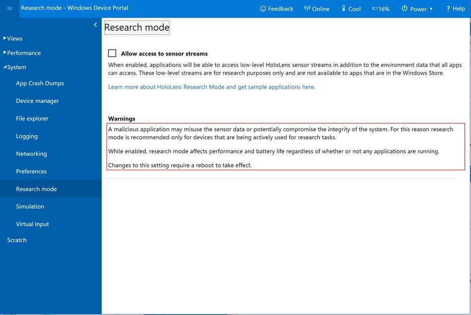

# HoloLens Research Mode

> [!NOTE]
> This feature was added as part of the Windows 10 RS4 update for HoloLens, and is not available on earlier releases. You can test it now by installing the [HoloLens RS4 Preview](hololens-rs4-preview.md). Make sure your application is targeting a version of the Windows SDK greater than or equal to 10.0.17125 on HoloLens. You can find the latest Windows SDK [here](https://developer.microsoft.com/en-US/windows/downloads/windows-10-sdk).

Research mode is a new capability of HoloLens that provides application access to the key sensors on the device. These include:
- The four environment tracking cameras used by the system for map building and head tracking.
- Two versions of the depth camera data – one for high-frequency (30 FPS) near-depth sensing, commonly used in hand tracking, and the other for lower-frequency (1 FPS) far-depth sensing, currently used by Spatial Mapping,
- Two versions of an IR-reflectivity stream, used by the HoloLens to compute depth, but valuable in its own right as these images are illuminated from the HoloLens and reasonably unaffected by ambient light.

Applications can access this data by opening Media Foundation streams in exactly the same way they access the Photo/Video camera stream.
All existing APIs are also available when in Research mode. In particular, the application can know precisely where the HoloLens is in 6DoF space at each sensor frame capture time.

 
*A mixed reality capture of a test application that displays the eight sensor streams available in research mode. Source code for sample applications are available on Github. See below.*

## What do I need to know before I use it?

Research mode is well named: it is intended for academic and industrial researchers trying out new ideas in the fields of Computer Vision and Robotics.  Research mode is not intended for applications that will be deployed across an enterprise or made available in the Windows Store. The reason for this is that research mode lowers the security of your device and consumes significantly more battery power than normal operation.  Also: Microsoft is not committing to supporting this mode on any future devices. So: use it to develop and test new ideas, but you will not be able to widely deploy applications that use it, or have any assurance that it will continue to work on future hardware.

## How do I enable it?

Research mode is a sub-mode of developer mode. You first need to enable developer mode in the Settings app (**Settings > Update and Security >For Developers**):

1. Set "Use Developer Feature" to **On**
2. Set "Enable Device Portal" to **On**

Then using a Web browser that is connected to the same WiFi network as your HoloLens, navigate to the IP address of your HoloLens (obtained through **Settings > Network and Internet > Hardware Properties**). This is the Device Portal, and you will find a Research Mode page in the System section of the portal:

 
*Please insert caption for photo*

After selecting **Allow access to sensor streams**, you will need to reboot the HoloLens. You can do this from the Device Portal under the Power menu item on the top strip.

Once your device has been rebooted, applications that have been loaded through the Device Portal should be able to access the research mode streams.

## How do I get sensor data into my apps?

Sample applications showing how you access the various research mode streams, how to use the intrinsics and extrinsics, and how to record streams are available on https://github.com/Microsoft/HoloLensForCV.

## Known issues

Problems with research mode or the sample code are discussed in the [issue tracker](https://github.com/Microsoft/HololensForCV/issues) for the above repository.

## See also

**Insert other relevant articles that will aid in understanding or execution, like Media Foundation articles from Windows dev docs, or other articles within this repo**
