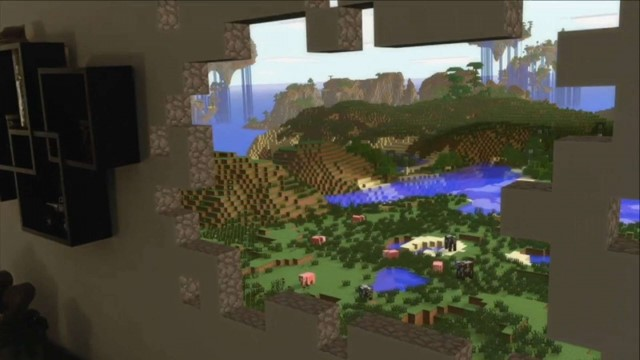

# Scale

A key to displaying content that looks realistic in holographic form is to mimic the visual statistics of the real world as closely as possible. This means incorporating as many of the visual cues as we can that help us (in the real world) understand where objects are, how big they are, and what they’re made of. The scale of an object is one of the most important of those visual cues, giving a viewer a sense of the size of an object as well as cues to its location (especially for objects which have a known size). Further, viewing objects at real scale has been seen as one of the key experience differentiators for mixed reality in general – something that hasn’t been possible on screen-based viewing previously.

## How to suggest the scale of objects and environments

There are many ways to suggest the scale of an object, some of which have possible effects on other perceptual factors. The key one is to simply display objects at a ‘real’ size, and maintain that realistic size as users move. This means holograms will take up a different amount of a user’s visual angle of a user as they come closer or further away, the same way that real objects do.

### Utilize the distance of objects as they are presented to the user

One common method is to utilize the distance of objects as they are presented to the user. For example, consider visualizing a large family car in front of the user. If the car were directly in front of them, within arm’s length, it would be too large to fit in the user’s field of view. This would require the user to move their head and body to understand the entirety of the object. If the car were placed further away (across the room), the user can establish a sense of scale by seeing the entirety of the object in their field of view, then moving themselves closer to it to inspect areas in detail.

[Volvo](https://www.youtube.com/watch?v=DilzwF90vec) used this technique to create a showroom experience for a new car, utilizing the scale of the holographic car in a way that felt realistic and intuitive to the user. The experience begins with a hologram of the car on a physical table, allowing the user to understand the total size and shape of the model. Later in the experience, the car expands to a larger scale (beyond the size of the device's field of view) but, since the user already acquired a frame of reference from the smaller model, they can adequately navigate around features of the car.

 
*Volvo Cars experience for HoloLens*

### Use holograms to modify the user's real space

Another method is to use holograms to modify the user's real space, replacing the existing walls or ceilings with environments or appending ‘holes’ or ‘windows’, allowing over-sized objects to seemingly 'break-through' the physical space. For example, a large tree might not fit in most users’ living rooms, but by putting a virtual sky on their ceiling, the physical space expands into the virtual. This allows the user to walk around the base of the virtual tree, and gather a sense of scale of how it would appear in real life, then look up to see it extend far beyond the physical space of the room.

[Minecraft](https://minecraft.net/) developed a concept experience using a similar technique. By adding a virtual window to a physical surface in a room, the existing objects in the room are placed in the context of a vastly larger environment, beyond the physical scale limitations of the room.

 
*Minecraft concept experience for HoloLens*

## Experimenting with scale

In some cases, designers have experimented with modifying the scale (by changing the displayed ‘real’ size of the object) while maintaining a single position of the object, to approximate an object getting closer or further to a viewer without any actual movement. This was tested in some cases as a way to simulate up-close viewing of items while still respecting potential comfort limitations of viewing virtual content closer than the “zone of comfort” would suggest.

This can create a few possible artifacts in the experience however:
* For virtual objects that represent some object with a ‘known’ size to the viewer, changing the scale without changing the position leads to conflicting visual cues – the eyes may still ‘see’ the object at some depth due to vergence cues (see the [Comfort](comfort.md) article for more on this), but the size acts as a monocular cue that the object might be getting closer. These conflicting cues lead to confused perceptions – viewers often see the object as staying in place (due to the constant depth cue) but growing rapidly.
* In some cases, change of scale is seen as a ‘looming’ cue instead, where the object may or may not be seen to change scale by a viewer, but does appear to be moving directly toward the viewer’s eyes (which can be an uncomfortable sensation).
* With comparison surfaces in the real world, such scaling changes are sometimes seen as changing position along multiple axes – objects may appear to drop lower instead of moving closer (similar in a 2D projection of 3D movement in some cases).
* Finally, for objects without a known ‘real world’ size (e.g. arbitrary shapes with arbitrary sizes, UI elements, etc.), changing scale may act functionally as a way to mimic changes in distance – viewers do not have as many preexisting top-down cues by which to understand the object’s true size or location, so the scale can be processed as a more important cue.

## See also
* [Color, light and materials](color,-light-and-materials.md)
* [Typography](typography.md)
* [Spatial sound design](spatial-sound-design.md)
