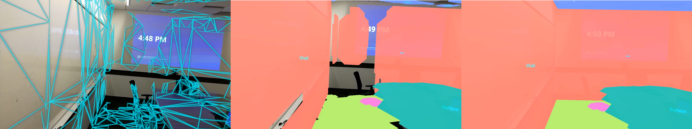
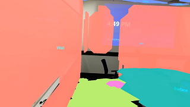
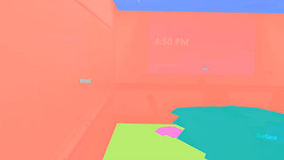

# Scene understanding

Scene understanding provides Mixed Reality developers with a structured, high-level environment representation designed to make developing for environmentally aware applications intuitive. Scene understanding does this by combining the power of existing mixed reality runtimes such as the highly accurate less structured [spatial mapping](spatial-mapping.md) and new AI driven runtimes. By combining these technologies, Scene understanding generates representations of 3D environments that are similar to those you may have used in frameworks such as Unity or ARKit/ARCore. The Scene understanding entry point begins with a Scene Observer which is called by your application to compute a new scene. Today the technology is capable of generating 3 distinct but related object categories: simplified watertight environment meshes that infer the planar room structure without clutter, plane regions for placement that we call Quads, and a snapshot of the [spatial mapping](spatial-mapping.md) mesh that aligns with the Quads/Watertight data that we surface.

This document is intended to provide a scenario overview and to clarify the relationship that Scene understanding and Spatial mapping share. For details on how Scene understanding works and how to develop for it, please see the [Scene understanding SDK overview](scene-understanding-SDK.md) documentation.

## Device support

<table>
    <colgroup>
    <col width="25%" />
    <col width="25%" />
    <col width="25%" />
    <col width="25%" />
    </colgroup>
    <tr>
        <td><strong>Feature</strong></td>
        <td><a href="hololens-hardware-details.md"><strong>HoloLens (1st gen)</strong></a></td>
        <td><strong>HoloLens 2</strong></td>
        <td><a href="immersive-headset-hardware-details.md"><strong>Immersive headsets</strong></a></td>
    </tr>
     <tr>
        <td>Scene understanding</td>
        <td>❌</td>
        <td>✔️</td>
        <td>❌</td>
    </tr>
</table>

## Common usage scenarios

 
*Common spatial mapping usage scenarios: placement, occlusion, physics and navigation.*

 

Many of the core scenarios for environment aware applications (placement, occlusion, physics, etc.) are addressable by both Spatial mapping and Scene understanding, this section highlights these differences. A core difference between Scene understanding and Spatial mapping is a tradeoff of maximal accuracy and latency to structure and simplicity. If your application requires the lowest-latency possible and requires mesh triangles only you will want to access Spatial Mapping directly, however if you are performing higher level processing you may consider switching to the Scene understanding model as it should provide you with a superset of functionality. Also note, that because Scene understanding provides the spatial mapping mesh as part of its representation, you will always have access to the most complete and accurate spatial mapping data possible.

 The following sections re-visit the core spatial mapping scenarios in the context of the new Scene understanding SDK.

### Placement

Scene understanding provides new constructs specifically designed to simplify placement scenarios. A scene can compute primitives called SceneQuads which describe flat surfaces on which holograms can be placed. SceneQuads have specifically been designed around placement and describe a 2D surface and provide an API for placement on that surface. Previously, when using the triangle mesh to perform placement, one had to scan all areas of the quad and perform hole filling/post-processing to identify good locations for object placement. This is not always necessary with Quads, as the Scene understanding runtime is capable of inferring which areas of the quad that were not scanned, and invalidate areas of the quad that are not part of the surface.

 
*[1] "SceneQuads with inference disabled, capturing placement areas for scanned regions."*

 

 
*[2] "Quads with inference enabled, placement is no longer limited to scanned areas."*

 

If your application intends to place 2D or 3D holograms on rigid structures of your environment, the simplicity and convenience of SceneQuads for placement is preferable to computing this information from the Surface mesh. For more details on this topic, please see the [Scene understanding SDK reference](scene-understanding-SDK.md)

**Note** For legacy code that depends on the surface mesh, a scene can be computed that contains spatial mapping output along with SceneQuads, ensuring that any legacy requirements for placement can be maintained. If Scene understanding mesh data does not satisfy your application's latency requirements, we recommend you continue to use the spatial mapping APIs documented here: [Spatial mapping placement](spatial-mapping.md#placement)

### Occlusion

[Spatial mapping occlusion](spatial-mapping.md#occlusion) remains the least latent way to capture the real-time state of the environment. Though this may be useful to provide occlusion in highly dynamic scenes, you may wish to consider Scene understanding for occlusion for several reasons. If you use the spatial mapping mesh generated by Scene Understanding you can request data from spatial mapping that would not be stored in the local cache and therefore not available to you from the perception APIs. Using Spatial Mapping for occlusion alongside watertight meshes will provide additional value, specifically completion of un-scanned room structure.

If your requirements can tolerate the increased latency of Scene understanding, application developers should consider using the Scene understanding watertight mesh, and presumably the spatial mapping mesh in unison with planar representations. This would provide a "best of both worlds" where simplified watertight occlusion is married with finer nonplanar geometry providing the most realistic occlusion maps possible.

### Physics

Scene understanding generates watertight meshes that decompose space with semantics specifically to address many limitations to physics that surface meshes impose. Watertight structures ensure physics ray casts always hit, and semantic decomposition allows for simpler generation of nav meshes for indoor navigation. As described in the section on [occlusion](#occlusion) creating a scene with EnableSceneObjectMeshes and EnableWorldMesh will produce the most physically complete mesh possible. The watertight property of the environment mesh will prevent hit tests from failing to hit surfaces and the mesh data will ensure that physics are interacting with all objects in the scene and not just the room structure.

### Navigation

Planar meshes decomposed by semantic class are ideal constructs for navigation and path planning, easing many of the issues described in the [Spatial mapping navigation](spatial-mapping.md#navigation) overview. The SceneMesh objects computed in the scene are already de-composed by surface type ensuring that nav-mesh generation is limited to surfaces that can be walked on. Due to the simplicity of the floor structure, dynamic nav-mesh generation in 3d engines such as Unity are attainable depending on real-time requirements.

Generating accurate nav-meshes currently still requires post-processing, namely applications must still project occluders on to the floor to ensure that navigation does not pass through clutter/tables etc... The most accurate way to accomplish this is to project the world mesh data which is provided if the scene is computed with the EnableWorldMesh flag.

### Visualization

While [spatial mapping visualization](spatial-mapping.md#visualization) can be used for real-time feedback of the environment, there are many scenarios where the simplicity of planar and watertight objects provides more performance or visual quality. Shadow projection and grounding techniques that are described using spatial mapping may be more pleasing if projected on the planar surfaces provided by Quads or the planar watertight mesh. This is especially true for environments/scenarios where through pre-scanning is not optimal due to the fact that the scene will infer, and complete environments and planar assumptions will minimize artifacts.

Additionally, the total number of surfaces returned by Spatial Mapping is limited by the internal spatial cache, while Scene understanding's version of the Spatial Mapping mesh is able to access spatial mapping data that is not cached. Because of this, Scene understanding is more suited to capturing mesh representations for larger spaces (for example, larger than a single room) for visualization or further mesh processing. The world mesh returned with EnableWorldMesh will have a consistent level of detail throughout, which may yield a more pleasing visualization if rendered as wireframe.

### See Also

* [Scene understanding SDK](scene-understanding-SDK.md)
* [Spatial mapping](spatial-mapping.md)
