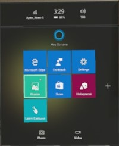
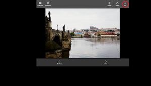

# See your photos

When you take [mixed reality photos and videos](mixed-reality-capture.md) on your HoloLens, they are saved to the Camera Roll folder. The built in Photos app can be used to view, manage, share, and upload photos and videos to OneDrive.

## Photos app

The Photos app is one of the default apps on the Start Menu.

### To see your photos and videos
1. [Bloom](gestures.md#bloom) to open the Start Menu
2. Gaze at the Photos  icon and [air-tap](gestures.md#air-tap).
3. Use gaze to position the Photos app, then air-tap or say “Place.”

### Navigating within the Photos app

There are three modes within the photos app: collection, one-up, and slideshow.

**Collection mode**

There are five options on the left navigation bar:
1. Collection shows all of the photos and videos within your combined Camera Roll.
2. Photos filters the view to only photos.
3. Videos filters the view to only videos.
4. Sync will force a manual synchronization with OneDrive.
5. Settings opens a flyout for customization.

Clicking on an individual photo/video will switch to one-up view.

**One-up mode**

In one-up mode you are able to:
* Play videos
* Share photos and videos
* Delete photos and videos
* Pin photos and videos to decorate your world
* Start a slideshow

You can press the collection button to return the collection mode.

**Slideshow**

In slideshow mode your photos and videos will automatically cycle in reverse chronological order.

### Sources supported

The Photos app shows you all of the photos and videos stored in:
* The device's Camera Roll folder
* OneDrive's Camera Roll special folder (if OneDrive is enabled)

**OneDrive for Business**

OneDrive for Business is not currently supported. The Photos app will prompt you for a Microsoft account to connect with the consumer OneDrive service.

**OneDrive synchronization**

OneDrive sync is enabled by default. To disable:
1. In the Photos app, go to collection mode
2. Gaze at the Settings button in the navigation pane and air-tap.
3. Gaze at the Back up & sync slider and air-tap to set it to 'Off'.

OneDrive synchronization only runs when OneDrive is enabled and while Photos is the active app. It does the following:
* Photos and videos within the device's Camera Roll folder will be automatically uploaded to OneDrive.
* To help preserve space on your HoloLens, OneDrive-backed files, older than two weeks, are automatically removed from the device's Camera Roll.

Any photos and videos uploaded will be available on all of your other OneDrive enabled devices. You’ll also see the photos and videos your other devices have added to OneDrive's Camera Roll special folder.

### To pin your photos and videos in the mixed world
1. From the Photos App, select a photo or video from your collection to enter One-up mode.
2. Gaze at the Pin button and air-tap.
3. Use gaze to position the photo or video, then air-tap or say “Place.”

Pin a photo or video in your physical environment

## OneDrive

With [OneDrive](https://onedrive.live.com/) you can access, manage, and share your photos and videos with any device and with any user. To access the photos and videos captured on HoloLens, first use the Photos app to upload your changes up to OneDrive.

## Windows Device Portal

If you have enabled the [Windows Device Portal](using-the-windows-device-portal.md#mixed-reality-capture), you can use it to browse, retrieve, and manage the photos and videos stored on your device.
