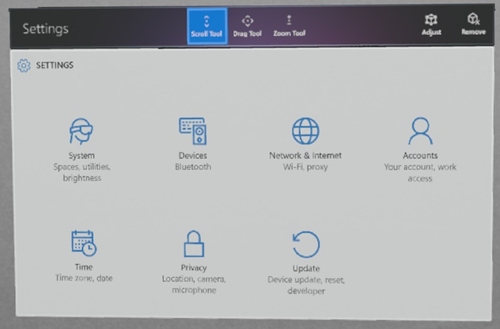
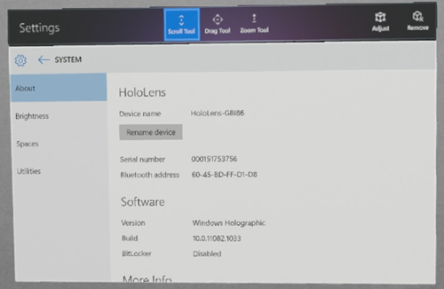
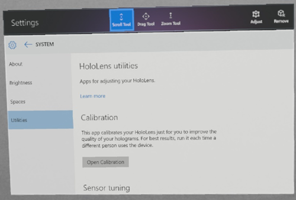
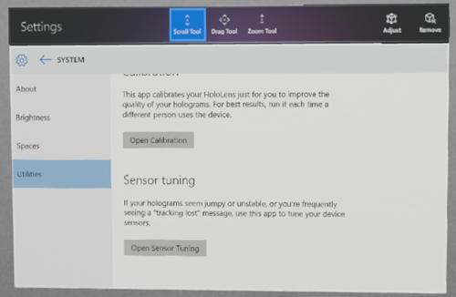

*This app is no longer available as of the April 2018 HoloLens update, since the sensors now recalibrate themselves automatically. 

# Sensor tuning

The sensor tuning utility allows HoloLens to update its sensor calibration information. Running this application can improve hologram quality.

1. Open Settings App

   
  
2. Select System

   
  
3. Select Utilities

   
  
4. Scroll down to Sensor Tuning

   
