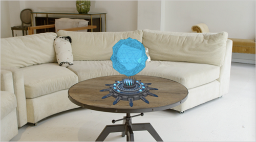
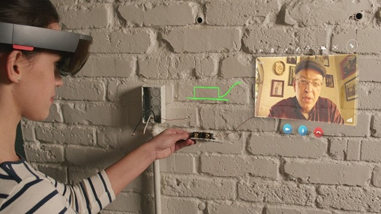

# Shared experiences in mixed reality

Holograms don't need to stay private to just one user. Holographic apps may share [spatial anchors](coordinate-systems.md) from one HoloLens, iOS or Android device to another, enabling users to render a hologram at the same place in the real world across multiple devices.

## Six questions to define shared scenarios

Before you begin designing for shared experiences, it’s important to define the target scenarios. These scenarios help clarify what you’re designing and establish a common vocabulary to help compare and contrast features required in your experience. Understanding the core problem, and the different avenues for solutions, is key to uncovering opportunities inherent in this new medium.

Through internal prototypes and explorations from our HoloLens partner agencies, we created six questions to help you define shared scenarios. These questions form a framework, not intended to be exhaustive, to help distill the important attributes of your scenarios.

### 1. How are they sharing?

A presentation might be led by a single virtual user, while multiple users can collaborate, or a teacher might provide guidance to virtual students working with virtual materials — the complexity of the experiences increases based on the level of agency a user has or can have in a scenario.

There are many ways to share, but we’ve found that most of them fall into three categories:
* **Presentation**: When the same content is being shown to several users. For example: A professor is giving out a lecture to several students using the same holographic material being presented to everyone. The professor however could have his/her own hints and notes that may not be visible to others.
* **Collaboration**: When people are working together to achieve some common goals. For example: The professor gave out a project to learn about performing a heart surgery. Students pair up and create a shared skills lab experience which allows medical students to collaborate on the heart model and learn.
* **Guidance**: When one person is helping someone to solve a problem in a more one-one style interaction. For example: The professor giving guidance to a student when he/she is performing the heart surgery skills lab in the shared experience.

### 2. What is the group size?

**One-to-one** sharing experiences can provide a strong baseline and ideally your proofs of concept can be created at this level. But be aware that sharing with large groups (beyond 6 people) can lead to difficulties from technical (data and networking) to social (the impact of being in a room with [several avatars](https://vimeo.com/160704056)). Complexity increases exponentially as you go from **small** to **large groups**.

We have found that the needs of groups can fall into three size categories:
* 1:1
* Small < 7
* Large >= 7

Group size makes for an important question because it influences:
* Representations of people in holographic space
* Scale of objects
* Scale of environment

### 3. Where is everyone?

The strength of mixed reality comes into play when a shared experience can take place in the same location. We call that **co-located**. Conversely, when the group is distributed and at least one participant is not in the same physical space (as is often the case with VR) we call that a remote experience. Often it’s the case that your group has **both** co-located and remote participants (e.g., two groups in conference rooms).

Following categories help convey where users are located:
* Co-located: All your users will be in the same physical space.
* Remote: All your users will be in separate physical spaces.
* Both: Your users will be a mix of co-located and remote spaces.

Some reasons why this question is crucial because it influences:
* How people communicate?
* For example: Whether they should have avatars?
* What objects they see. Are all objects shared?
* Whether we need to adapt to their environment?

### 4. When are they sharing?

We typically think of **synchronous** experiences when shared experiences come to mind: We’re all doing it together. But include a single, virtual element that was added by someone else and you have an **asynchronous** scenario. Imagine a note, or voice memo, left in a virtual environment. How do you handle 100 virtual memos left on your design? What if they’re from dozens of people with different levels of privacy?

Consider your experiences as one of these categories of time:
* **Synchronously**: Sharing the holographic experience at the same time. For example: Two students performing the skills lab at the same time.
* **Asynchronously**: Sharing the holographic experience at different times. For example: Two students performing the skills lab but working on separate sections at different times.
* **Both**: Your users will sometimes be sharing synchronously but other times asynchronously. For example: Professor grading the assignment performed by the students at a later time and leaving notes for student for the next day.

Some reasons why this question is important because it influences:
* Object and environment persistence. For example: Storing the states so they can be retrieved.
* User perspective. For example: Perhaps remembering what the user was looking at when leaving notes.

### 5. How similar are their physical environments?

The likelihood of two identical real-life environments, outside of co-located experiences, is slim unless those environments have been designed to be identical. You’re more likely to have **similar** environments. For example, conference rooms are similar — they typically have a centrally located table surrounded by chairs. Living rooms, on the other hand, are usually **dissimilar** and can include any number of pieces of furniture in an infinite array of layouts.

Consider your sharing experiences fitting into one of these two categories:
* **Similar**: Environments that tend to have similar furniture, ambient light and sound, physical room size. For example: Professor is in lecture hall A and students are in lecture hall B. Lecture hall A might have fewer chairs than B but they both may have a physical desk to place holograms on.
* **Dissimilar**: Environments that are quite different in furniture settings, room sizes, light and sound considerations. For example: Professor is in a focus room whereas students are in a large lecture hall filled with students and teachers.

It's important to think about the environment as it will influence:
* How will people experience these objects. For example: If your experience works best on a table and the user has no table? Or on a flat floor surface but the user has a cluttered space.
* Scale of the objects. For example: Placing a 6 feet human model on a table could be challenging but a heart model would work great.

### 6. What devices are they using?

Today you’re often likely to see shared experiences between two **immersive devices** (those devices might differ slightly in terms of buttons and relative capability, but not greatly) or two **holographic devices** given the solutions being targeted at these devices. But consider that **2D devices** (a mobile/desktop participant or observer) will be a necessary consideration, especially in situations of **mixed 2D and 3D devices**. Understanding the types of devices your participants will be using is important, not only because they come with different fidelity and data constraints and opportunities, but because users have unique expectations for each platform.

## Exploring the potential of shared experiences

Answers to the questions above can be combined to better understand your shared scenario, crystallizing the challenges as you expand the experience. For the team at Microsoft, this helped establish a road map for improving the experiences we use today, understanding the nuance of these complex problems and how to take advantage of shared experiences in mixed reality.

For example, consider one of Skype’s scenarios from the HoloLens launch: a user worked through [how to fix a broken light switch](https://www.youtube.com/watch?v=iBfzs3G8BEA) with help from a remotely-located expert.

<i>An expert provides <b>1:1</b> guidance from his <b>2D</b>, desktop computer to a user of a <b>3D, mixed-reality</b> device. The <b>guidance</b> is <b>synchronous</b> and the physical environments are <b>dissimilar</b>.</i>

An experience like this is a step-change from our current experience — applying the paradigm of video and voice to a new medium. But as we look to the future, we must better define the opportunity of our scenarios and build experiences that reflect the strength of mixed reality.

Consider the [OnSight collaboration tool](https://www.youtube.com/watch?v=ZOWQp0-Bkkw) developed by NASA’s Jet Propulsion Laboratory. Scientists working on data from the Mars rover missions can collaborate with colleagues in real-time within the data from the Martian landscape.

<i>A scientist explores an environment using a <b>3D, mixed-reality</b> device with a <b>small</b> group of <b>remote</b> colleagues using <b>3D and 2D</b> devices. The <b>collaboration</b> is <b>synchronous</b> (but can be revisited asynchronously) and the physical environments are (virtually) <b>similar</b>.</i>

Experiences like OnSight present new opportunities to collaborate. From physically pointing out elements in the virtual environment to standing next to a colleague and sharing their perspective as they explain their findings. OnSight uses the lens of immersion and presence to rethink sharing experiences in mixed reality.

Intuitive collaboration is the bedrock of conversation and working together and understanding how we can apply this intuition to the complexity of mixed reality is crucial. If we can not only recreate sharing experiences in mixed reality but supercharge them, it will be a paradigm shift for the future of work. Designing for shared experiences in mixed reality is new and exciting space — and we’re only at the beginning.

## Get started sharing experiences

Depending on your application and scenario, there will be various requirements to achieve your desired experience. Some of these include
* Match-making: Ability to create sessions, advertise session, and discover and invite specific people, both locally and remotely to join your session.
* Anchor sharing: Ability to align coordinates across multiple devices in a common local space, so holograms appear in the same place for all people.
* Networking: Ability to have positions, interactions, and movements of people and holograms synchronized in real-time across all participants.
* State storage: Ability to store hologram characteristics and locations in space for mid-session join, recall at a later time, and robustness against network issues.

The key to shared experiences is multiple users seeing the same holograms in the world on their own device, frequently done by sharing anchors to align coordinates across devices.
To share anchors, use the <a href="https://docs.microsoft.com/azure/spatial-anchors" target="_blank">Azure Spatial Anchors</a>:
* First the user places the hologram.
* App creates a [spatial anchor](coordinate-systems.md) to pin that hologram precisely in the world.
* The anchors can be shared to HoloLens, iOS and Android devices via the <a href="https://docs.microsoft.com/azure/spatial-anchors" target="_blank">Azure Spatial Anchors</a>. 

With a shared spatial anchor, the app on each device now has a common coordinate system in which they can place content. Now the app can ensure to position and orient the hologram at the same location.
On HoloLens devices, you can also share anchors offline from one device to another.  Use the links below to decide what's best for your application.

## See also
* <a href="https://docs.microsoft.com/azure/spatial-anchors" target="_blank">Azure Spatial Anchors</a>
* [Shared spatial anchors in DirectX](shared-spatial-anchors-in-directx.md)
* [Shared experiences in Unity](shared-experiences-in-unity.md)
* [Spectator view](spectator-view.md)