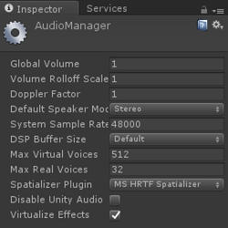
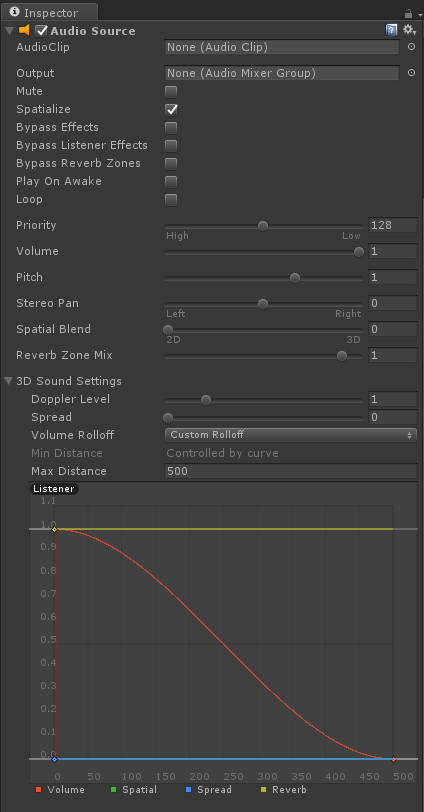

# Spatial sound in Unity

This topic describes how to use Spatial Sound in your Unity projects. It covers the required plugin files as well as the Unity components and properties that enable Spatial Sound.

## Enabling Spatial Sound in Unity

Spatial Sound, in Unity, is enabled using an audio spatializer plugin. The plugin files are bundled directly into Unity so enabling spatial sound is as easy as going to **Edit > Project Settings > Audio** and changing the **Spatializer Plugin** in the Inspector to the **MS HRTF Spatializer**. Since the Microsoft spatializer only supports 48000Hz currently, you should also set your System Sample Rate to 48000 to prevent an HRTF failure in the rare case that your system output device is not set to 48000 already:

<br>
*Inspector for AudioManager*

Your Unity project is now configured to use Spatial Sound.

>[!NOTE]
>If you aren't using a Windows 10 PC for development, you won't get Spatial Sound in the editor nor on the device (even if you're using the Windows 10 SDK).

## Using Spatial Sound in Unity

Spatial Sound is used in your Unity project by adjusting three settings on your Audio Source components. The following steps will configure your Audio Source components for Spatial Sound.
* In the **Hierarchy** panel, select the game object that has an attached **Audio Source**.
* In the **Inspector** panel, under the **Audio Source** component
    * Check the **Spatialize** option.
    * Set **Spatial Blend** to **3D** (numeric value 1).
    * For best results, expand **3D Sound Settings** and set **Volume Rolloff** to **Custom Rolloff**.

<br>
*Inspector panel in Unity showing the Audio Source*

Your sounds now realistically exist inside your project's environment!

It is strongly recommended that you become familiar with the [Spatial Sound design guidelines](spatial-sound-design.md). These guidelines help to integrate your audio seamlessly into your project and to further immerse your users into the experience you have created.

## Setting Spatial Sound Settings

The Microsoft Spatial Sound plugin provides an additional parameter that can be set, on a per Audio Source basis, to allow additional control of the audio simulation. This parameter is the size of the simulated room.

### Room Size

The size of room that is being simulated by Spatial Sound. The approximate sizes of the rooms are; small (an office to a small conference room), medium (a large conference room) and large (an auditorium). You can also specify a room size of none to simulate an outdoor environment. The default room size is small.

### Example

The MixedRealityToolkit for Unity provides a static class that makes setting the Spatial Sound settings easy. This class can be found in the [MixedRealityToolkit\SpatialSound folder](https://github.com/Microsoft/MixedRealityToolkit-Unity/tree/master/Assets/HoloToolkit/SpatialSound) and can be called from any script in your project. It is recommended that you set these parameters on each Audio Source component in your project. The following example shows selecting the medium room size for an attached Audio Source.

```cs
AudioSource audioSource = gameObject.GetComponent<AudioSource>()

if (audioSource != null) {
    SpatialSoundSettings.SetRoomSize(audioSource, SpatialMappingRoomSizes.Medium);
}
```

### Directly Accessing Parameters from Unity

If you don't want to use the excellent Audio tools in the MixedRealityToolkit, here is how you would change HRTF Parameters. You can copy/paste this into a script called *SetHRTF.cs* that you will want to attach to every HRTF AudioSource. It lets you change parameters important to HRTF.

```cs
using UnityEngine;
   using System.Collections;
   public class SetHRTF : MonoBehaviour    {
       public enum ROOMSIZE { Small, Medium, Large, None };
       public ROOMSIZE room = ROOMSIZE.Small;  // Small is regarded as the "most average"
       // defaults and docs from MSDN
       // https://msdn.microsoft.com/library/windows/desktop/mt186602(v=vs.85).aspx
       AudioSource audiosource;
       void Awake()
       {
           audiosource = this.gameObject.GetComponent<AudioSource>();
           if (audiosource == null)
           {
               print("SetHRTFParams needs an audio source to do anything.");
               return;
           }
           audiosource.spatialize = 1; // we DO want spatialized audio
           audiosource.spread = 0; // we dont want to reduce our angle of hearing
           audiosource.spatialBlend = 1;   // we do want to hear spatialized audio
           audiosource.SetSpatializerFloat(1, (float)room);    // 1 is the roomsize param
       }
   }
```
### Spatial Sound in Mixed Reality Toolkit
- [HoloToolkit-Examples/SpatialSound/Scenes/UAudioManagerTest.unity](https://github.com/Microsoft/MixedRealityToolkit-Unity/blob/master/Assets/HoloToolkit-Examples/SpatialSound/Scenes/UAudioManagerTest.unity)

The following examples from the Mixed Reality Toolkit are general audio effect examples that demonstrate ways to make your experiences more immersive by using sound.
- [HoloToolkit-Examples/SpatialSound/Scenes/AudioLoFiTest.unity](https://github.com/Microsoft/MixedRealityToolkit-Unity/blob/master/Assets/HoloToolkit-Examples/SpatialSound/Scenes/AudioLoFiTest.unity)
- [HoloToolkit-Examples/SpatialSound/Scenes/AudioOcclusionTest.unity](https://github.com/Microsoft/MixedRealityToolkit-Unity/blob/master/Assets/HoloToolkit-Examples/SpatialSound/Scenes/AudioOcclusionTest.unity)

## See also
* [Spatial sound](spatial-sound.md)
* [Spatial sound design](spatial-sound-design.md)
