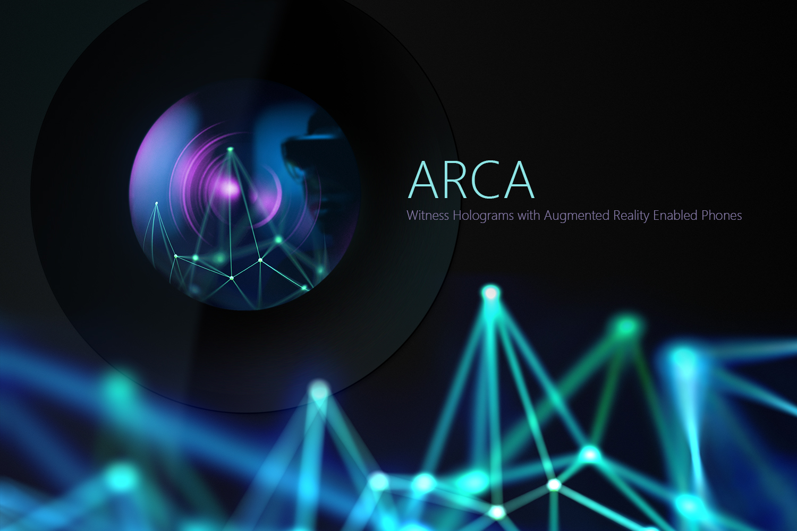
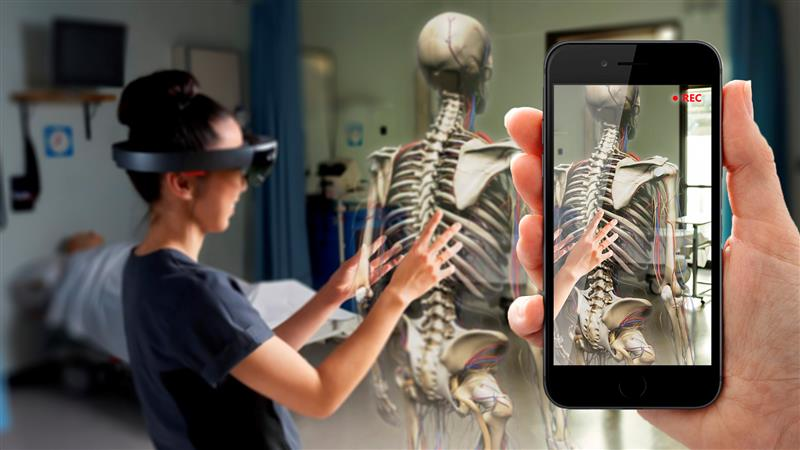

# Spectator View for HoloLens and HoloLens 2

## Overview

When wearing a HoloLens, we often forget that a person who does not have it on is unable to experience the wonders that we can. Spectator View allows others to see on a 2D screen what a HoloLens user sees in their world.
Spectator View offers a fast and affordable approach to recording holograms in HD with mobile devices. It also offers a professional quality recording of holograms with video cameras.

## Key Resources

* [**Spectator View on GitHub**](https://github.com/microsoft/MixedReality-SpectatorView)
* [**Spectator View Documentation**](https://microsoft.github.io/MixedReality-SpectatorView/README.html)
* [**Spectator View Samples**](https://github.com/microsoft/MixedReality-SpectatorView/tree/master/samples)

## Use Cases
* You can record a mixed reality experience using an iPhone or Android device. Record in full HD and apply anti-aliasing to holograms and even shadows. It is a cost-effective and quick way to capture video of holograms.
* Stream live mixed reality experiences to an Apple TV directly from your iPhone or iPad, lag-free!
* Share the experience with guests: Let non-HoloLens users experience holograms directly from their phones or tablets.

## Current Features

* Spatial synchronization of Holograms, so everyone sees holograms in the exact same place.
* iOS (ARKit-enabled devices) and Android (ARCore-enabled devices) support.
Multiple iOS guests.
Recording of video + holograms + ambient sound + hologram sound.
Share sheet so you can save video, email it, or share with other supporting apps.

 

The following table shows different Spectator View functionality and their capabilities. Choose the option that best fits your video recording needs:

|                                      | Mobile                  |                    Video Camera              |
|--------------------------------------|:-----------------------:|:-------------------------------------------:|
| HD quality                           |         Full HD         |        Professional quality filming (as determined by video camera)      |
| Easy camera movement                 |            ✔            |                      ✔                      |
| Third-person view                    |            ✔            |                      ✔                      |
| Can be streamed to screens           |            ✔            |                      ✔                      |
| Portable                             |            ✔            |                                             |
| Wireless                             |            ✔            |                                             |
| Additional required hardware         |     Android phone, iPhone    | HoloLens + Rig + Tripod + Video Camera + PC + Unity |
| Hardware investment                  |           Low            |                     High                    |
| Cross-platform                       |           Android, iOS   |                                             |
| Synchronized content                 |            ✔            |                      ✔                      |
| Runtime setup duration               |         Instant          |                     Slow                    |
## See also

* [Mixed reality capture](mixed-reality-capture.md) 
* [Mixed reality capture for developers](mixed-reality-capture-for-developers.md)
* [Shared experiences in mixed reality](shared-experiences-in-mixed-reality.md)
