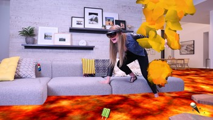
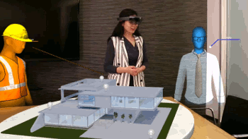
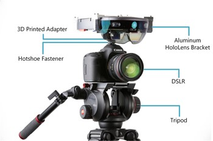
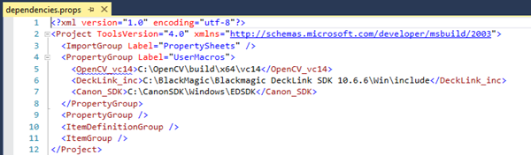
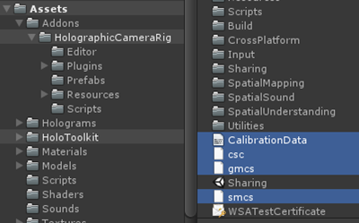
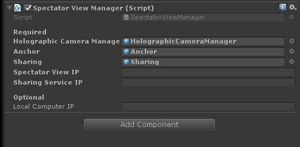
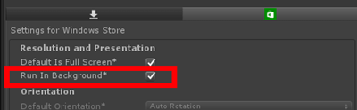
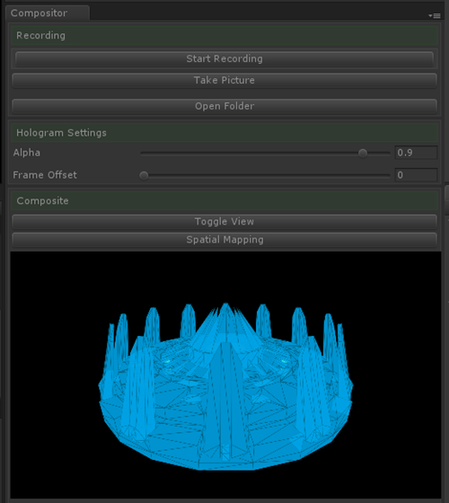

# Spectator view

**Spectator view setup**

When wearing a mixed reality headset, we often forget that a person who does not have it on is unable to experience the wonders that we can. Spectator view allows others to see on a 2D screen what a HoloLens user sees in their world. Using spectator view involves these four components:
1. An app built specifically to enable spectator view, which is based on [shared experiences in mixed reality](shared-experiences-in-mixed-reality.md).
2. A user wearing HoloLens using the app.
3. A spectator view camera rig providing a third-person perspective video.
4. A desktop PC running the shared experience app and compositing the holograms into a spectator view video.

 

## Use cases

>[!VIDEO https://www.youtube.com/embed/DgIHjxoPy_c]

**Spectator view photo capture scenario example**

**Spectator view video capture scenario example**

 

There are three key scenarios that work well with this technology:
1. **Photo capture**
Using this technology, you can capture high resolution images of your holograms. These images can be used to showcase content at marketing events, send to your potential clients, or even submit your application to the Windows Store. You get to decide which photo camera you would like to use to capture these images, as such you may prefer a quality DSLR camera.
2. **Live demonstrations**
Spectator view is a preferred approach for live demonstrations as the camera position remains steady or controlled. Because you can use a high-quality video camera, you can also produce high-quality images meant for a big screen. This is also appropriate for streaming live demos on a screen, possibly to eager participants waiting in line for their turn.
3. **Video capture**
Videos are the best story telling mechanism for sharing a holographic app experience with many people. Spectator view lets you choose the camera, lens, and framing that best suits how you want to showcase your app. It puts you in control of the video quality based on the video hardware you have available.

## Comparing video capture techniques

[Mixed reality capture](mixed-reality-capture.md) (MRC) provides a video composite of what the HoloLens user is seeing from a first person point-of-view. Spectator view produces a video from a third-person perspective, allowing the video observer to see the environment with holograms and the user wearing a HoloLens device. Because you have a choice of camera, spectator views can also produce higher resolution and better quality images than the built-in HoloLens camera used for MRC images. For this reason, spectator view is better suited for app images in the Windows Store, marketing videos, or for projecting a live view for an audience.

**Spectator view professional camera used in Microsoft keynote presentations**

Spectator view has been an essential piece of how Microsoft HoloLens has presented experiences to audiences since the very beginning when the product was announced in January 2015. The professional setup used had high demands and an expensive price tag to go with it. For example, the camera uses a genlock signal to ensure precise timing that coordinates with the HoloLens tracking system. In this setup, moving the spectator view camera was possible while keeping holograms stable to match the experience of someone who is seeing the experience directly in HoloLens.

The open-source version of spectator view trades off the ability to move the camera rig in order to dramatically lower the cost of the overall setup. This project uses an external camera rigidly mounted to a HoloLens to take high-definition pictures and video of your holographic Unity project. **During live demonstrations, the camera should remain in a fixed position.** Movement of the camera can lead to hologram jitter or drift. This is because the timing of the video frame and the rendering of holograms on the PC may not be precisely synchronized. Therefore, keeping the camera steady or limiting movement will produce a result close to what the person wearing a HoloLens can see.

To make your app ready for spectator view, you'll need to build a [shared experience](holograms-240.md) app and ensure the app can run on both HoloLens as well as desktop in the Unity editor. The desktop version of the app will have additional components built in that composite the video feed with the rendered holograms.

## Hardware shopping list

**Spectator View Rig**

Below is a recommended list of hardware, but you can experiment with other compatible units too. 

|  Hardware component  |  Recommendation | 
| --- | --- |
|  A PC configuration that works for holographic development with the HoloLens emulator.  |  | 
|  Camera with HDMI out or photo capture SDK. | For photo and video capture, we have tested the [Canon EOS 5D Mark III](https://www.amazon.com/Canon-Frame-Full-HD-Digital-Camera/dp/B007FGYZFI/ref=sr_1_3?s=photo&ie=UTF8&qid=1480537693&sr=1-3&keywords=Canon+5D+Mark+III) camera. For live demonstrations, we have tested the [Blackmagic Design Production Camera 4K](https://www.amazon.com/Blackmagic-Design-Production-Camera-Mount/dp/B00CWLSHYG/ref=sr_1_1?s=photo&ie=UTF8&qid=1480537790&sr=1-1&keywords=blackmagic+design+production+camera+4k). Note, any camera with HDMI out (e.g. GoPro) should work. Many of our videos use the [Canon EF 14mm f/2.8L II USM Ultra-Wide Angle Fixed Lens](https://www.amazon.com/Canon-Ultra-Wide-Angle-Digital-Cameras/dp/B000V5P94Q), but you should choose a camera lens that meets your needs. | 
|  Capture card for your PC to get color frames from your camera to calibrate your rig and preview your composite scene. |  We have tested the [Blackmagic Design Intensity Pro 4K capture card](https://www.amazon.com/dp/B00U3QNP7Q). | 
|  Cables |  [HDMI to Mini HDMI](https://www.amazon.com/AmazonBasics-High-Speed-Mini-HDMI-HDMI-Cable/dp/B014I8UHXE?ie=UTF8&psc=1&redirect=true&ref_=oh_aui_detailpage_o03_s00) for attaching your camera to your capture card. Ensure you purchase an HDMI form factor that fits your camera. (GoPro, for instance, outputs over [Micro HDMI](https://www.amazon.com/dp/B014I8U33I/ref=twister_B0198TA40O?_encoding=UTF8&psc=1).) \
[HDMI cable](https://www.amazon.com/dp/B014I8TC4E/ref=twister_B016I3XG0S?_encoding=UTF8&th=1) for viewing the composite feed on a preview monitor or television. | 
|  Machined aluminum bracket to connect your HoloLens to the camera. More details can be found in the OSS project README. |  | 
|  3D printed adapter to connect the HoloLens mount to the camera hotshoe. More details can be found in the OSS project README. |  | 
|  Hotshoe fastener to mount the hotshoe adapter.  |  [Hotshoe Fastener](https://www.amazon.com/Fotasy-SCX2-Adapter-Premier-Cleaning/dp/B00HPAPFNU/ref=redir_mobile_desktop?ie=UTF8&psc=1&ref_=yo_ii_img) | 
|  Assorted nuts, bolts, and tools. |  [1/4-20" Nuts](https://www.amazon.com/Hillman-Group-150003-20-Inch-100-Pack/dp/B000BPEPNW/ref=redir_mobile_desktop?ie=UTF8&psc=1&ref_=yo_ii_img) \
[1/4-20" x 3/4" Bolts](https://www.amazon.com/Hard-Find-Fastener-014973100032-4-20-Inch/dp/B004S6RZPK/ref=redir_mobile_desktop?ie=UTF8&psc=1&ref_=yo_ii_img) \
[7/16 Nut Driver](https://www.amazon.com/Klein-Tools-630-7-Cushion-Grip-Hollow-Shank/dp/B000BPG4CW/ref=sr_1_1?ie=UTF8&qid=1479853212&sr=8-1) \
[T15 Torx](https://www.amazon.com/Stanley-60-011-Standard-Torx-Screwdriver/dp/B000KFXDWW/ref=sr_1_1?ie=UTF8&qid=1479853303&sr=8-1) \
[T7 Torx](https://www.amazon.com/SE-7542ST-6-Piece-Professional-Screwdriver/dp/B000ST3K3W/ref=sr_1_1?ie=UTF8&qid=1479853479&sr=8-1) | 

## Software components
1. Software downloaded from the [GitHub project for spectator view](https://github.com/Microsoft/HoloLensCompanionKit/tree/master/SpectatorView).
2. [Blackmagic Capture Card SDK](https://www.blackmagicdesign.com/support).\
 Search for Desktop Video Developer SDK in "Latest Downloads".
3. [Blackmagic Desktop Video Runtime](https://www.blackmagicdesign.com/support).\
 Search for Desktop Video Software Update in "Latest Downloads".\
 Ensure the version number matches the SDK version.
4. [OpenCV 3.1](https://opencv.org/releases.html) For calibration or video capture without the Blackmagic capture card.
5. [Canon SDK](https://www.usa.canon.com/internet/portal/us/home/explore/solutions-services/digital-camera-sdk-information) (Optional).\
 If you are using a Canon camera and have access to the Canon SDK, you can tether your camera to your PC to take higher resolution images.
6. Unity for your holographic app development.\
 Supported version can be found in the OSS project.
7. Visual Studio 2015 with latest updates.

## Building your own spectator view camera

**NOTICE & DISCLAIMER:** When making modifications to your HoloLens hardware (including, but not limited to, setting up your HoloLens for "spectator view") basic safety precautions should always be observed. Read all instructions and manuals before making any modifications. It is your responsibility to follow all instructions and use tools as directed. You may have purchased or licensed your HoloLens with a limited warranty or no warranty. Please read your applicable [HoloLens License Agreement or Terms of Use and Sale](http://microsoft.com/microsoft-hololens/en-us/order-now) to understand your warranty options.

>[!VIDEO https://www.youtube.com/embed/aKX8UMejtWc]

### Rig Assembly

**Assembled spectator view rig with HoloLens and DSLR camera**

* Use a T7 screwdriver to remove the headband from the HoloLens. Once the screws are loose, poke them out with a paperclip from the other side.
* Remove the screw cap on the inside front of the HoloLens visor with a small flat head screwdriver.
* Use a T15 screwdriver to remove the small torx bolts from the HoloLens bracket to remove the U and Hook-shaped attachments.
* Place the HoloLens on the bracket, lining up the exposed hole on the inside of the visor with the extrusion on the front of the bracket. The HoloLens' arms should be kept in place by the pins on the bottom of the bracket.
* Reattach the U and Hook-shaped attachments to secure the HoloLens to the bracket.
* Attach the hotshoe fastener to the hotshoe of your camera.
* Attach the mount adapter to the hotshoe fastener.
* Rotate the adapter so the narrow side is facing forward and parallel to the camera's lens.
* Secure the adapter in place with a 1/4" nut using the 7/16 nut driver.
* Position the bracket against the adapter so the front of the HoloLens' visor is as close as possible to the front of the camera's lens.
* Attach the bracket with 4 1/4" nuts and bolts using the 7/16 nut driver.

### PC Setup
* Install the software from the software components section.
* Add the capture card to an open PCIe slot on your motherboard.
* Plug an HDMI cable from your camera to the outer HDMI slot (HDMI-In) on the capture card.
* Plug an HDMI cable from the center HDMI slot (HDMI-Out) on the capture card to an optional preview monitor.

### Camera Setup
* Change your camera to Video Mode so it outputs at the full 1920x1080 resolution rather than a cropped 3:4 photo resolution.
* Find your camera's HDMI settings and enable **Mirroring** or **Dual Monitor**.
* Set the output resolution to 1080P.
* Turn off **Live View On Screen Display** so any screen overlays do not appear in the composite feed.
* Turn on your camera's **Live View**.
* If using the **Canon SDK** and would like to use a flash unit, disable **Silent LV Shoot**.
* Plug an HDMI cable from the camera to the outer HDMI slot (HDMI-In) on the capture card.

## Calibration

After setting up your spectator view rig, you must calibrate in order to get the position and rotation offset of your camera to your HoloLens.
* Open the Calibration Visual Studio solution under Calibration\Calibration.sln.
* In this solution, you will find the file dependencies.props which creates macros for the inc locations of the 3rd party sources.
* Update this file with the location you installed OpenCV 3.1, the Blackmagic SDK, and the Canon SDK (if applicable)

**Dependency locations snapshot in Visual Studio**

* Print out the calibration pattern Calibration\CalibrationPatterns\2_66_grid_FULL.png on a flat, rigid surface.
* Plug your HoloLens into your PC over USB.
* Update the preprocessor definitions **HOLOLENS_USER** and **HOLOLENS_PW** in **stdafx.h** with your HoloLens' device portal credentials.
* Attach your camera to your capture card over HDMI and turn it on.
* Run the Calibration solution.
* Move the checkerboard pattern around the view like this:!

**Calibrating the spectator view rig**

[Calibrating the spectator view rig](images/calibration.gif)

* A picture will automatically be taken when a checkerboard is in view. Look for the white light on the HoloLens' visor before advancing to the next pose.
* When finished, press **Enter** with the Calibration app in focus to create a **CalibrationData.txt** file.
* This file will be saved to **Documents\CalibrationFiles\CalibrationData.txt**
* Inspect this file to see if your calibration data is accurate:
   * **DSLR RMS** should be close to 0.
   * **HoloLens RMS** should be close to 0.
   * **Stereo RMS** may be 20-50, this is acceptable since the field of view between the two cameras may be different.
   * **Translation** is the distance from the HoloLens' camera to the attached camera's lens. This is in meters.
   * **Rotation** should be close to identity.
   * **DSLR_fov** y value should be close to the vertical field of view expected from your lens' focal length and any camera body crop factor.
* If any of the above values do not appear to make sense, recalibrate.
* Copy this file to the **Assets** directory in your Unity project.

## Compositor

The compositor is a Unity extension that runs as a window in the Unity editor. To enable this, the Compositor Visual Studio solution first needs to be built.
* Open the Compositor Visual Studio solution under Compositor\Compositor.sln
* Update dependencies.props with the same criteria from the Calibration solution above. If you followed the calibration steps, this file will already have been updated.
* Build the entire solution as Release and the architecture that matches your Unity version's architecture. If in doubt, build both x86 and x64.
* If you built the solution for x64, also build the SpatialPerceptionHelper project as x86 since it will run on the HoloLens.
* Close Unity if it is running your application. Unity needs to be relaunched if DLLs are changed at runtime.
* Run Compositor\CopyDLL.cmd to copy the DLLs built from this solution to your Unity project. This script will copy the DLLs to the included sample project. Once you have your own project set up, you can run CopyDLL with a command line argument pointing to your project's Assets directory to copy there as well.
* Launch the sample Unity app.

## Unity App

The compositor runs as a window in the Unity Editor. The included sample project has everything set up to work with spectator view once the compositor DLLs are copied.

Spectator view requires the application to be run as a [shared experience](holograms-240.md). This means that any application state changes that happen on the HoloLens need to be networked to update the app running in Unity too.

If starting from a new Unity project, you will need to do some setup first:
* Copy **Assets/Addons/HolographicCameraRig** from the sample project to your project.
* Add the latest MixedRealityToolkit to your project, including **Sharing**, **csc.rsp**, **gmcs.rsp**, and **smcs.rsp**.
* Add your **CalibrationData.txt** file to your Assets directory.

* Add the **HolographicCameraRig\Prefabs\SpectatorViewManager** prefab to your scene and fill in the fields:
   * **HolographicCameraManager** should be populated with the HolographicCameraManager prefab from the HolographicCameraRig prefab directory.
   * **Anchor** should be populated with the Anchor prefab from the HolographicCameraRig prefab directory.
   * **Sharing** should be populated with the Sharing prefab from the MixedRealityToolkit.
   * Note: If any of these prefabs already exist in your project hierarchy, the existing prefabs will be used instead of these ones.
   * **Spectator View IP** should be the IP of your HoloLens attached to your spectator view rig.
   * **Sharing Service IP** should be the IP of the PC running the MixedRealityToolkit SharingService.
   * Optional: If you have multiple spectator view rigs attached to multiple PC's, **Local Computer IP** should be set with the PC the spectator view rig will communicate with.

* Start the MixedRealityToolkit **Sharing Service**
* Build and deploy the app as a D3D UWP to the HoloLens attached to the spectator view rig.
* Deploy the app to any other HoloLens devices in the experience.
* Check the **Run In Background** checkbox under **edit/project settings/player**.

* Launch the compositor window under **Spectator View/Compositor**

* This window allows you to:
   * Start recording video
   * Take a picture
   * Change hologram opacity
   * Change the frame offset (which adjusts the color timestamp to account for capture card latency)
   * Open the directory the captures are saved to
   * Request spatial mapping data from the spectator view camera (if a SpatialMappingManager exists in your project)
   * Visualize the scene's composite view as well as color, holograms, and alpha channel individually.
   * Turn your camera on.
   * Press play in Unity.
   * When the camera is moved, holograms in Unity should be where they are in the real world relative to your camera color feed.

## See also

* [Mixed reality capture](mixed-reality-capture.md)
* [Mixed reality capture for developers](mixed-reality-capture-for-developers.md)
* [Shared experiences in mixed reality](shared-experiences-in-mixed-reality.md)
* [MR Sharing 240](holograms-240.md)
* [Spectator view code on GitHub](https://github.com/Microsoft/HoloLensCompanionKit/tree/master/SpectatorView)
