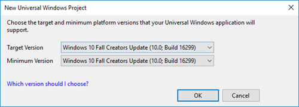
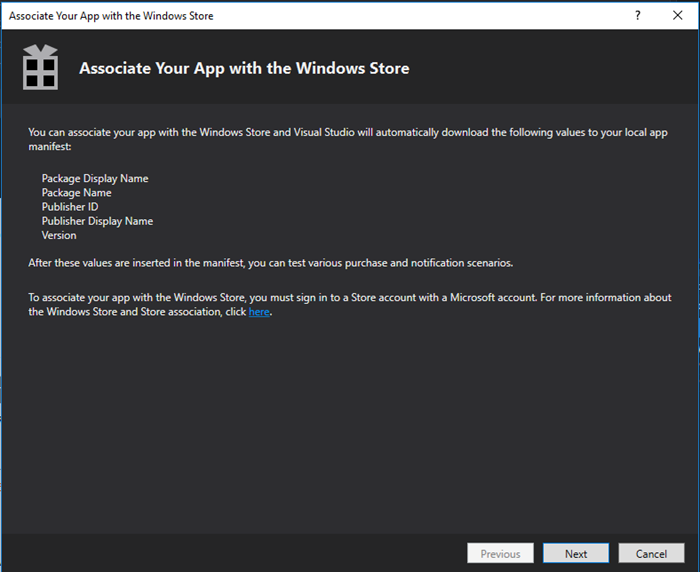

# Submitting an app to the Microsoft Store

Both [HoloLens](hololens-hardware-details.md) and the Windows 10 PC powering your [immersive headset](immersive-headset-hardware-details.md) run Universal Windows Platform apps. Whether you're submitting an app that supports HoloLens or PC (or both), you'll submit your app to the Microsoft Store through the [Windows Dev Center dashboard](https://developer.microsoft.com/en-us/dashboard/windows/overview).

If you don't already have a Windows Dev Center account, you can [sign up today](https://developer.microsoft.com/en-us/store/register).

## Packaging a mixed reality app

### Prepare image assets included in the appx

There are several image assets required by the appx building tools to build your application into an appx package to submit to the Store. You can learn more about [guidelines for tile and icon assets](https://msdn.microsoft.com/library/windows/apps/mt412102.aspx) on MSDN.

| Required Asset | Recommended Scale | Image Format | Where is this displayed? | 
|----------|----------|----------|------------------|
| Square 71x71 Logo | Any |  PNG | N/A | 
| Square 150x150 Logo | 150x150 (100% scale) or 225x225 (150% scale) | PNG | Start pins and All Apps (if 310x310 isn't provided), Store Search Suggestions, Store Listing Page, Store Browse, Store Search | 
|  Wide 310x150 Logo |  Any  |  PNG  |  N/A | 
|  Store Logo |  75x75 (150% scale)  |  PNG  |  Dev Center, Report App, Write a Review, My Library | 
|  Splash Screen |  930x450 (150% scale)  |  PNG  |  2D app launcher (slate) | 

There are also some recommended assets which HoloLens can take advantage of.

| Recommended Assets | Recommended Scale | Where is this displayed? | 
|----------|----------|----------|
|  Square 310x310 Logo |  310x310 (150% scale) |  Start pins and All Apps | 

### Live Tile requirements

The Start menu on HoloLens will use the largest included square tile image.

You may see that some apps published by Microsoft have a 3D launcher for their application. Developers can add a 3D launcher for their app using [these instructions](implementing-3d-app-launchers.md).

### Specifying target and minimum version of Windows

If your mixed reality app includes features that are specific to a certain version of Windows, it's important to specify the target and minimum platform versions that your Universal Windows application will support.

**This is especially true for apps targeting [Windows Mixed Reality immersive headsets](immersive-headset-hardware-details.md), which require at least the Windows 10 Fall Creators Update (10.0; Build 16299) to function properly.**

You will be prompted to set target and minimum version of Windows when you create a new Universal Windows Project in Visual Studio. You can also change this setting for an existing project in the "Project" menu, then "<Your app name's> Properties" at the bottom of the drop-down menu.

<br>
Set minimum and target platform versions in Visual Studio

### Specifying target device families

Windows Mixed Reality applications (for both [HoloLens](hololens-hardware-details.md) and [immersive headsets](immersive-headset-hardware-details.md)) are part of the Universal Windows Platform, so any app package with a [target device family](https://msdn.microsoft.com/library/windows/apps/dn986903.aspx) of "Windows.Universal" is capable of running on HoloLens or Windows 10 PCs with immersive headsets. That being said, if you do not specify a target device family in your app manifest you may inadvertently open your app up to unintended Windows 10 devices. Follow the steps below to specify the intended Windows 10 device family, and then [double-check that the correct device families are selected when you upload your app package in Dev Center to submit to the Store.](submitting-an-app-to-the-microsoft-store.md#submitting-your-mixed-reality-app-to-the-store)

To set this field in Visual Studio, right click on the Package.appxmanifest and select "View Code" then find the TargetDeviceFamily Name field. By default, it might look like the following:

```
<Dependencies>
   <TargetDeviceFamily Name="Windows.Universal" MinVersion="10.0.10240.0" MaxVersionTested="10.0.10586.0" />
</Dependencies>
```

If your app is created for **HoloLens**, then you can ensure that it is only installed on HoloLens by specifying a target device family of "Windows.Holographic". 

```
<Dependencies>
   <TargetDeviceFamily Name="Windows.Holographic" MinVersion="10.0.10240.0" MaxVersionTested="10.0.10586.0" />
</Dependencies>
```

If your app is created for **Windows Mixed Reality immersive headsets**, then you can ensure that it is only installed on Windows 10 PCs with the Windows 10 Fall Creators Update (necessary for Windows Mixed Reality) by specifying a target device family of "Windows.Desktop" and MinVersion of "10.0.16299.0".

```
<Dependencies>
   <TargetDeviceFamily Name="Windows.Desktop" MinVersion="10.0.16299.0" MaxVersionTested="10.0.16299.0" />
</Dependencies>
```

Finally, if your app is intended to run on both **HoloLens and Windows Mixed Reality immersive headsets**, you can ensure the app is only made available to those two device families and simultaneously ensure each targets the correct minimum Windows version by including a line for each target device family with its respective MinVersion.

```
<Dependencies>
   <TargetDeviceFamily Name="Windows.Desktop" MinVersion="10.0.16299.0" MaxVersionTested="10.0.16299.0" />
   <TargetDeviceFamily Name="Windows.Holographic" MinVersion="10.0.10240.0" MaxVersionTested="10.0.10586.0" />
</Dependencies>
```

You can learn more about targeting device families by reading the [TargetDeviceFamily UWP documentation](https://docs.microsoft.com/uwp/schemas/appxpackage/uapmanifestschema/element-targetdevicefamily).

### Associate app with the Store

From the Project menu in your Visual Studio solution, choose "Store > Associate App with the Store". If you do this, you can test purchase and notification scenarios in your app. When you associate your app with the Store, these values are downloaded to the app manifest file for the current project on your local machine:
* Package Display Name
* Package Name
* Publisher ID
* Publisher Display Name
* Version

If you override the default package.appxmanifest file by creating a custom .xml file for the manifest, you can’t associate your app with the Store. If you try to associate a custom manifest file with the Store, you will see an error message.

### Creating an upload package

Follow guidelines at [Packaging Universal Windows apps for Windows 10](https://msdn.microsoft.com/library/hh454036.aspx#Anchor_2).

The final step of creating an upload package is validating the package using the [Windows App Certification Kit](#windows-app-certification-kit).

If you'll be adding a package specifically for HoloLens to an existing product that is available on other Windows 10 device families, you will also want to learn about [how version numbers may impact which packages are delivered to specific customers](https://msdn.microsoft.com/library/windows/apps/mt188602.aspx), and [how packages are distributed to different operating systems](https://msdn.microsoft.com/library/windows/apps/mt188601.aspx).

The general guidance is that the highest version number package that is applicable to a device will be the one distributed by the Store.

If there is a Windows.Universal package and a Windows.Holographic package and the Windows.Universal package has a higher version number, a HoloLens user will download the higher version number Windows.Universal package instead of the Windows.Holographic package. There are several solutions to this problem:
1. Ensure your platform specific packages such as Windows.Holographic always have a higher version number than your platform agnostic packages such as Windows.Universal
2. Do not package apps as Windows.Universal if you also have platform specific packages - instead package the Windows.Universal package for the specific platforms you want it available on

>[!NOTE]
> You can declare a single package to be applicable to multiple target device families

3. Create a single Windows.Universal package that works across all platforms. Support for this isn't great right now so the above solutions are recommended.

## Testing your app

### Windows App Certification Kit

When you create app packages to submit to the Windows Dev Center through Visual Studio, the Create App Packages wizard will prompt you to run the Windows App Certification Kit against the packages that get created. In order to have a smooth submission process to the Store, it's best to verify that the [Windows App Certification Kit tests](https://msdn.microsoft.com/library/windows/apps/jj657973.aspx) pass against your app on your local machine before submitting them to the Store. Running the Windows App Certification Kit on a remote HoloLens is not currently supported.

### Run on all targeted device families

The Windows Universal Platform allows you to create a single application that runs across all of the Windows 10 device families. However, it doesn't guarantee that Universal Windows apps will just work on all device families. Before you choose to make your app available on HoloLens or any other Windows 10 target device family, it's important that you [test the app](testing-your-app-on-hololens.md) on each of those device families to ensure a good experience.

## Submitting your mixed reality app to the Store

If you are submitting a mixed reality app that is based on a Unity project, please see this [video](https://channel9.msdn.com/Blogs/One-Dev-Minute/How-to-publish-your-Unity-game-as-a-UWP-app) first.

In general, submitting a Windows Mixed Reality app that works on HoloLens and/or immersive headsets is just like submitting any UWP app to the Microsoft Store. Once you've [created your app by reserving its name](https://docs.microsoft.com/windows/uwp/publish/create-your-app-by-reserving-a-name), you should follow the [UWP submission checklist](https://docs.microsoft.com/windows/uwp/publish/app-submissions).

One of the first things you'll do is [select a category and sub-category](https://docs.microsoft.com/windows/uwp/publish/category-and-subcategory-table) for your mixed reality experience. It's important that you **choose the most accurate category for your app** so that we can merchandise your application in the right Store categories and ensure it shows up using relevant search queries. **Listing your VR title as a game will not result in better exposure for your app,** and may prevent it from showing up in categories that are more fitting and less crowded.

However, there are four key areas in the submission process where you'll want to make mixed reality-specific selections:
1. In the **[Product declarations](submitting-an-app-to-the-microsoft-store.md#mixed-reality-product-declarations)** section under [Properties](https://docs.microsoft.com/windows/uwp/publish/enter-app-properties).
2. In the **[System requirements](submitting-an-app-to-the-microsoft-store.md#mixed-reality-system-requirements)** section under [Properties](https://docs.microsoft.com/windows/uwp/publish/enter-app-properties).
3. In the **[Device family availability](submitting-an-app-to-the-microsoft-store.md#device-family-availability)** section under [Packages](https://docs.microsoft.com/windows/uwp/publish/upload-app-packages).
4. In several of the **[Store listing page](submitting-an-app-to-the-microsoft-store.md#store-listing-page)** fields.

### Mixed reality product declarations

On the **[Properties](https://docs.microsoft.com/windows/uwp/publish/enter-app-properties)** page of the app submission process, you'll find several options related to mixed reality in the **[Product declarations](https://docs.microsoft.com/windows/uwp/publish/app-declarations)** section.

<br>
Mixed reality product declarations

First, you'll want to identify the device types for which your app offers a mixed reality experience. This ensures that your app is included in Windows Mixed Reality collections in the Store, and that it's surfaced to users browsing the Store after connecting an immersive headset (or when browsing the Store on HoloLens).

Next to "This experience is designed for Windows Mixed Reality on:"
* Check the **PC** box only if your app offers a VR experience when an immersive headset is connected to the user's PC. You should check this box whether your app is designed exclusively to run on an immersive headset or if it is a standard PC game/app that offers a mixed reality mode and/or bonus content when a headset is connected.
* Check the **HoloLens** box only if your app offers a holographic experience when it's run on HoloLens.
* Check **both** boxes if your app offers a mixed reality experience on both device types, like the [Mixed Reality Academy "Project Island" app](mixed-reality-250.md) from Build 2017.

If you selected "PC" above, you'll want to set the "mixed reality setup" (activity level). This only applies to mixed reality experiences that run on PCs connected to immersive headsets, as mixed reality apps on HoloLens are world-scale and the user doesn't define a boundary during setup.
* Choose **Seated + standing** if your app is designed with the intention that the user stays in one position (an example would be a game where you're seated in a cockpit of an aircraft).
* Choose **All experiences** if your app is designed with the intention that the user walks around within the boundary he or she defined during setup (an example might be a game where you side-step and duck to dodge attacks).

### Mixed reality system requirements

On the **[Properties](https://docs.microsoft.com/windows/uwp/publish/enter-app-properties)** page of the app submission process, you'll find several options related to mixed reality in the **[System requirements](https://docs.microsoft.com/windows/uwp/publish/enter-app-properties#system-requirements)** section.

<br>
System requirements

In this section, you'll identify minimum (required) hardware and recommended (optional) hardware for your mixed reality app.

**Input hardware:**

Use the checkboxes to tell potential customers if your app supports **microphone** (for [voice input](voice-input.md)), **[Xbox controller or gamepad](hardware-accessories.md#bluetooth-gamepads)**, and/or **[Windows Mixed Reality motion controllers](motion-controllers.md)**. This information will be surfaced on your app's product detail page in the Store and will help your app get included in the appropriate app/game collections (for example, a collection may exist for all games that support motion controllers).

Be thoughtful about selecting checkboxes for "minimum hardware" or "recommended hardware" for input types. 

For example: 
* If your game requires motion controllers, but accepts voice input via microphone, select the "minimum hardware" checkbox next to "Windows Mixed Reality motion controllers," but the "recommended hardware" checkbox next to "Microphone." 
* If your game can be played with either an Xbox controller/gamepad or motion controllers, you might select the "minimum hardware" checkbox next to "Xbox controller or gamepad" and select the "recommended hardware" checkbox next to "Windows Mixed Reality motion controllers" as motion controllers will likely offer a step-up in experience from the gamepad.

**Windows Mixed Reality immersive headset:**

Indicating whether an immersive headset is required to use your app, or is optional, is critical to customer satisfaction and education.

If your app can *only* be used through an immersive headset, select the "minimum hardware" checkbox next to "Windows Mixed Reality immersive headset." This will be surfaced on your app's product detail page in Store as a warning above the purchase button so customers don't think they're purchasing an app that will function on their PC like a traditional desktop app.

If your app runs on the desktop like a traditional PC app, but offers a VR experience when an immersive headset is connected (whether the full content of your app is available, or only a portion), select the "recommended hardware" checkbox next to "Windows Mixed Reality immersive headset." No warning will be surfaced above the purchase button on your app's product detail page if your app functions as a traditional desktop app without an immersive headset connected.

**PC specifications:**

If you want your app to reach as many Windows Mixed Reality immersive headset users as possible, you'll want to [target](performance-recommendations-for-immersive-headset-apps.md) the PC specifications for [Windows Mixed Reality PCs with integrated graphics](https://docs.microsoft.com/windows/mixed-reality/enthusiast-guide/windows-mixed-reality-minimum-pc-hardware-compatibility-guidelines).

Whether your mixed reality app targets the minimum Windows Mixed Reality PC requirements, or requires a specific PC configuration (like the dedicated GPU of a [Windows Mixed Reality Ultra PC](https://docs.microsoft.com/windows/mixed-reality/enthusiast-guide/windows-mixed-reality-minimum-pc-hardware-compatibility-guidelines)), you should indicate that with the relevant PC specifications in the "minimum hardware" column.

If your mixed reality app is designed to perform better, or offer higher-resolution graphics, on a particular PC configuration or graphics card, you should indicate that with the relevant PC specifications in the "recommended hardware" column.

This only applies if your mixed reality app uses an immersive headset connected to a PC. If your mixed reality app only runs on HoloLens, you won't need to indicate PC specifications as HoloLens has only one hardware configuration.

### Device family availability

If you've [packaged your app correctly](https://docs.microsoft.com/windows/uwp/publish/app-package-requirements) in Visual Studio, uploading it on the Packages page of the app submission process should produce a table identifying which device families your app will be available to.

<br>
Device family availability table

If your mixed reality app works on immersive headsets, then at least "Windows 10 Desktop" should be selected in the table. If your mixed reality app works on HoloLens, then at least "Windows 10 Holographic" should be selected. If your app runs on both Windows Mixed Reality headset types, like the [Mixed Reality Academy "Project Island" app](mixed-reality-250.md), both "Windows 10 Desktop" and "Windows 10 Holographic" should be selected.

>[!TIP]
>Many developers run into errors when uploading their app's package related to mismatches between the package manifest and your app/publisher account information in Dev Center. These errors can often be avoided by signing into Visual Studio with the same account associated with your Windows developer account (the one you use to sign into Windows Dev Center). If you use the same account, you'll be able to associate your app with its identity in the Microsoft Store before you package it.

<br>
Associate your app with the Microsoft Store in Visual Studio

### Store listing page

On the [Store listing](https://docs.microsoft.com/windows/uwp/publish/create-app-store-listings) page of the app submission process, there are several places you can add useful information about your mixed reality app.

>[!IMPORTANT]
>To ensure your app is correctly categorized by the Store and made discoverable to Windows Mixed Reality customers, you should add **"Windows Mixed Reality"** as one of your "Search terms" for the app (you can find search terms by expanding the "Shared fields" section).

<br>
Add "Windows Mixed Reality" to search terms

## Offering a free trial for your game or app

Many consumers will have limited to no experience with virtual reality before buying a Windows Mixed Reality immersive headset. They may not know what to expect from intense games, and may not be familiar with their own comfort threshold in immersive experiences. Many customers may also try a Windows Mixed Reality immersive headset on PCs that aren't badged as [Windows Mixed Reality PCs](https://docs.microsoft.com/windows/mixed-reality/enthusiast-guide/windows-mixed-reality-minimum-pc-hardware-compatibility-guidelines). Because of these considerations, we strongly recommend you consider offering a [free trial](https://docs.microsoft.com/windows/uwp/publish/set-app-pricing-and-availability#free-trial) for your paid mixed reality app or game.

## See also
* [Mixed reality](mixed-reality.md)
* [Development overview](development-overview.md)
* [App views](app-views.md)
* [Performance recommendations for immersive headset apps](performance-recommendations-for-immersive-headset-apps.md)
* [Testing your app on HoloLens](testing-your-app-on-hololens.md)
* [Windows Mixed Reality minimum PC hardware compatibility guidelines](https://docs.microsoft.com/windows/mixed-reality/enthusiast-guide/windows-mixed-reality-minimum-pc-hardware-compatibility-guidelines)
