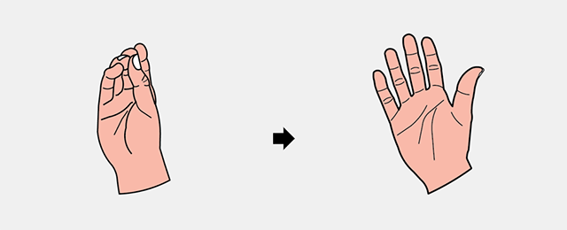
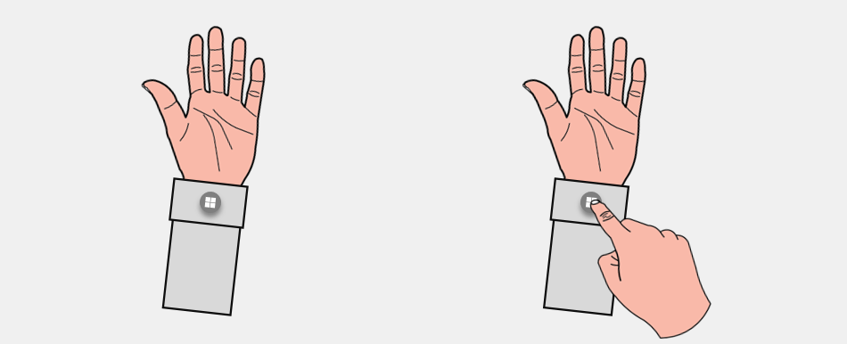
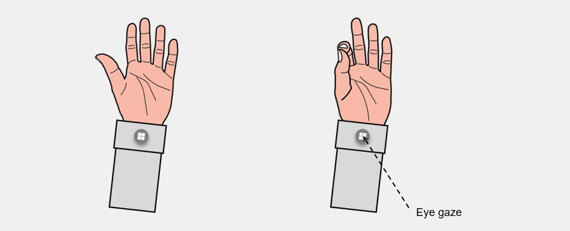

# System gesture

System gesture is a hand gesture to invoke the Start Menu. It is equivalent to pressing the Windows key on the keyboard or the Xbox button on an Xbox controller or the Windows button on the 6 DoF controller of Windows Mixed Reality. It will be important for developers to understand preserved system gestures for different version of Mixed Reality devices to prevent conflicts.

<table>
    <colgroup>
    <col width="25%" />
    <col width="25%" />
    <col width="25%" />
    <col width="25%" />
    </colgroup>
    <tr>
        <td><strong>Feature</strong></td>
        <td><a href="hololens-hardware-details.md"><strong>HoloLens (1st gen)</strong></a></td>
        <td><strong>HoloLens 2</strong></td>
        <td><a href="immersive-headset-hardware-details.md"><strong>Immersive headsets</strong></a></td>
    </tr>
     <tr>
        <td>Bloom</td>
        <td>✔️</td>
        <td>✔️</td>
        <td>❌</td>
    </tr>
     <tr>
        <td>Wrist button</td>
        <td>❌</td>
        <td>✔️</td>
        <td>❌</td>
    </tr>
    <tr>
        <td>Eye gaze and palm up pinch</td>
        <td>❌</td>
        <td>✔️</td>
        <td>❌</td>
    </tr>
</table>

# Bloom
In HoloLens, we design the “Bloom” gesture, which is a symbolic gesture mimicking the flower blossom, for the ease of perform and recall. To do the bloom gesture on HoloLens, hold out your hand , palm up, with your fingertips together. Then open your hand. 
 

# Wrist button
In HoloLens 2, we replace the Bloom gesture with a wrist button, which follows our Instinctual Interaction design principles. By showing users the button on the button of wrist will they have the intuition to press it with another hand. No more training is needed. 
 

# Eye gaze and palm up pinch
For accessibility purpose, we also have a 1 handed solution, which only requires users to eye gaze at the button, then use the same hand to perfomr palm up pinch. 
 

