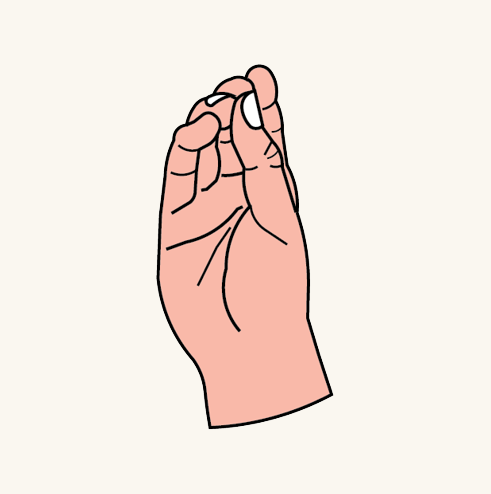
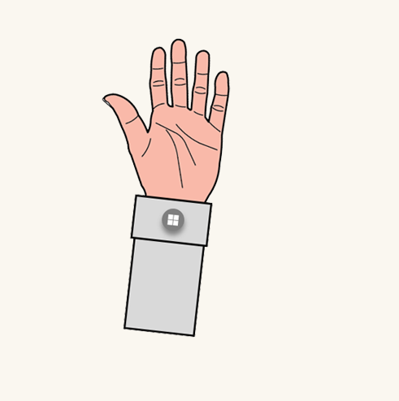

# System gesture

The system gesture is a hand gesture used to invoke the Start Menu. It is the equivalent of pressing the Windows key on the keyboard, the Xbox button on an Xbox controller, or the Windows button on the immersive headset motion controller. It's important to understand which gestures are reserved for the system on each Mixed Reality device to prevent conflicts.

## Device support

<table>
    <colgroup>
    <col width="25%" />
    <col width="25%" />
    <col width="25%" />
    <col width="25%" />
    </colgroup>
    <tr>
        <td><strong>Feature</strong></td>
        <td><a href="hololens-hardware-details.md"><strong>HoloLens (1st gen)</strong></a></td>
        <td><strong>HoloLens 2</strong></td>
        <td><a href="immersive-headset-hardware-details.md"><strong>Immersive headsets</strong></a></td>
    </tr>
     <tr>
        <td>Bloom</td>
        <td>✔️</td>
        <td>❌</td>
        <td>❌</td>
    </tr>
     <tr>
        <td>Wrist button</td>
        <td>❌</td>
        <td>✔️</td>
        <td>❌</td>
    </tr>
    <tr>
        <td>Eye gaze and palm up pinch</td>
        <td>❌</td>
        <td>✔️</td>
        <td>❌</td>
    </tr>
</table>

## Bloom
To bring up the start menu in HoloLens (1st gen), we designed “Bloom”, which is a symbolic gesture mimicking the flower blossom. It's distinctive for surefooted interaction, easy to perform, and quick to recall. To do the bloom gesture on HoloLens (1st gen), hold out your hand with your palm up and fingertips together, then open your hand by spreading your fingers.

:::row:::
    :::column:::
         
        **Palm up with fingertips together** 
    :::column-end:::
    :::column:::
         
        **Palm up with fingertips spreaded** 
    :::column-end:::
:::row-end:::

 

---

## Wrist button
In HoloLens 2, we replaced the Bloom gesture with a virtual wrist button that allows for more instinctual interactions that require no additional teaching. By showing users the button on the wrist, they can intuitively reach out and press it with their other hand.

:::row:::
    :::column:::
         
        **Palm up to show the wrist button** 
    :::column-end:::
    :::column:::
         
        **Press the wrist button** 
    :::column-end:::
:::row-end:::

 

---

## Eye-gaze and palm up pinch
We have also designed a one-handed solution for ease of access in HoloLens 2. This gesture requires users to eye gaze at the wrist button, then use the same hand to perform a palm up pinch using their thumb and index finger. 
:::row:::
    :::column:::
         
        **Palm up to show the wrist button** 
    :::column-end:::
    :::column:::
         
        **Eye gaze at the button then pinch** 
    :::column-end:::
:::row-end:::

 

---

## See also

* [Instinctual interactions](interaction-fundamentals.md)
* [Eye-gaze](eye-tracking.md)
* [Voice input](voice-input.md)
