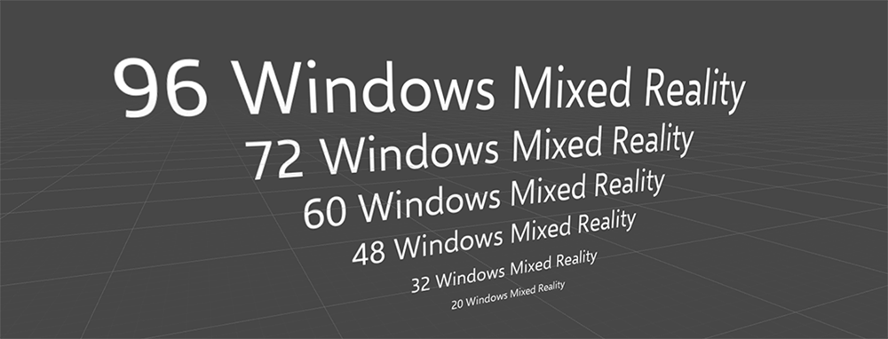

# Text in Unity

Text is one of the most important components in holographic apps. To display text in Unity, there are two types of text components you can use — UI Text and 3D Text Mesh. By default they appear blurry and are too big. You need to tweak a few variables to get sharp, high-quality text that has a manageable size in HoloLens. By applying scaling factor to get proper dimensions when using the UI Text and 3D Text Mesh components, you can achieve better rendering quality.

 
*Blurry default text in Unity*

## Working with fonts in Unity

Unity assumes all new elements added to a scene are 1 Unity Unit in size, or 100% transform scale, which translates to about 1 meter on HoloLens. In the case of fonts, the bounding box for a 3D TextMesh comes in by default at about 1 meter in height.

 
*Default Unity text occupies 1 Unity Unit which is 1 meter*

 
Most visual designers use points to define font sizes in the real world. There are about 2835 (2,834.645666399962) points in 1 meter. Based on the point system conversion to 1 meter and Unity's default Text Mesh font size of 13, the simple math of 13 divided by 2835 equals 0.0046 (0.004586111116 to be exact) provides a good standard scale to start with (some may wish to round to 0.005). Scaling the text object or container to these values will not only allow for the 1:1 conversion of font sizes in a design program, but also provides a standard so you can maintain consistency throughout your application or game.

 
*Unity 3D Text Mesh with optimized values*

 
When adding a UI or canvas based text element to a scene, the size disparity is greater still. The differences in the two sizes is about 1000%, which would bring the scale factor for UI based text components to 0.00046 (0.0004586111116 to be exact) or 0.0005 for the rounded value.

 
*Unity UI Text with optimized values*

 

>[!NOTE]
>The default value of any font may be affected by the texture size of that font or how the font was imported into Unity. These tests were performed based on the default Arial font in Unity, as well as one other imported font.

## Sharp text rendering quality with proper dimension

Based on these scaling factors, we have created [two prefabs - UI Text and 3D Text Mesh](https://github.com/Microsoft/HoloToolkit-Unity/tree/master/Assets/HoloToolkit/UI/Prefabs). Developers can use these prefabs to get sharp text and consistent font size.

 
*Sharp text rendering quality with proper dimension*

## Shader with occlusion support

Unity's default font material does not support occlusion. Because of this, you will see the text behind the objects by default. We have included a simple [shader that supports the occlusion](https://github.com/Microsoft/MixedRealityToolkit-Unity/tree/master/Assets/HoloToolkit/UX/Shaders). The image below shows the text with default font material (left) and the text with proper occlusion (right).

 
*Shader with occlusion support*

## Recommended type size

As you can expect, type sizes that we use on a PC or a tablet device (typically between 12–32pt) look quite small at a distance of 2 meters. It depends on the characteristics of each font, but in general the recommended minimum type size for legibility without stroke vibration is around 30pt, based on the scaling factor introduced above. If your app is supposed to be used at a closer distance, smaller type sizes could be used. For the font selection, Segoe UI (the default font for Windows) works well in most cases. However, avoid using light or semi light fonts for type sizes under 42pt since thin vertical strokes will vibrate and it will degrade the legibility. Modern fonts with enough stroke thickness work well. For example, Helvetica and Arial look gorgeous and are very legible in HoloLens with regular or bold weights.

 
*Type ramp example*

## See also
* [Text Prefab in the MixedRealityToolkit](https://github.com/Microsoft/MixedRealityToolkit-Unity/tree/master/Assets/HoloToolkit/UX/Prefabs)
* [Sample text layout prefab and scene](https://github.com/Microsoft/MixedRealityToolkit-Unity/tree/master/Assets/HoloToolkit-Examples/UX/Scenes)
* [Typography](typography.md)

 
