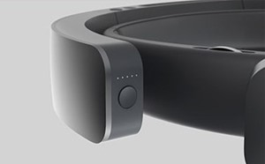

---
title: Turn HoloLens off and on
description: 
author: 
ms.author: mazeller
ms.date: 2/28/2018
ms.topic: article
keywords: 
---

# Turn HoloLens off and on

HoloLens charges over USB and has the same power states you'd expect from a smart phone: on, standby, and shutdown.

## Turning your HoloLens on

 To turn on your HoloLens, press and hold the power button for 1 second until the white battery status LEDs turn on. When connected to a computer or other power source over USB, your HoloLens will turn on automatically. When the HoloLens has turned on, the battery Status LEDs above the power button will light up. The LEDs indicate the current battery level of your HoloLens. Full battery is indicated by all 5 LEDs being illuminated. With use, the power level will decrease and the remaining charge will be indicated by a decreasing number of lit LEDs.

If you don't see the LEDs light up, it's possible that the battery has drained completely. In that case, connect your HoloLens to the provided USB charger and wait approximately 30 minutes for the battery to charge enough for the system to power on automatically.

## Entering standby

You can think of standby as similar to locking your smartphone. While in standby your HoloLens will not play audio, connect to WiFi or Bluetooth, or give you notifications. While in standby and connected to a USB power source, HoloLens may still download and install system and app updates and connect to WiFi or Bluetooth.

To put your HoloLens in standby, tap the power button once. The battery status LEDs will all fade off simultaneously.

HoloLens will automatically enter standby if it is left stationary for 3 minutes without any interaction. To wake it from standby, tap the power button again.

After 4 hours of standby, your HoloLens will automatically turn off to preserve battery power.

## Turning your HoloLens off

To turn off your HoloLens, press and hold the power button for 4 seconds. The battery status LEDs will fade off one by one.

Alternatively, you can say "Hey Cortana, turn off." Cortana will ask, "Are you sure you want to shut down?" and then you can reply, "Yes."

HoloLens will also turn off automatically when remaining battery drops below 2%. If your HoloLens has a single LED illuminated above the power button, your HoloLens is running low on battery. It is recommended that you recharge at this point.

## Charging the Battery

To charge your HoloLens, can use any micro-USB cable to charge your HoloLens. However, the AC Adapter (wall charger) provided with your HoloLens will provide the best charging experience. If you are working with your HoloLens connected to your computer, please follow these guidelines:
* If you are connecting your HoloLens directly to your computer's USB port, try to use a USB port intended for fast charging (markings vary by manufacturer) if one is available.
* If you are connecting your HoloLens to your computer via a USB port, try to use a powered USB hub rated at 1.5 or 2.0A or advertised for fast device charging - the [FosPower 4-port USB 3.0 powered hub](http://www.fospower.com/shop/usb-hubs/4-port-usb-3-0-hub-with-battery-charging-1-2/) is recommended.

If you are not able to follow the above recommendations, and need to connect your HoloLens directly to a regular USB 2.0 or 3.0 port while in heavy use, your device may actually lose battery power as opposed to charging, as HoloLens consumes more power than most USB ports can provide. Do not ever attempt to attach your HoloLens to a USB power source rated higher than what is on the original AC adapter provided with your HoloLens, as this can permanently damage your HoloLens and make your HoloLens warm to the touch.

HoloLens charges much more efficiently when in standby mode, which is entered automatically after 3 minutes of inactivity (or can be [manually entered](#entering-standby)). It is not necessary to force HoloLens to shutdown in order to charge overnight.