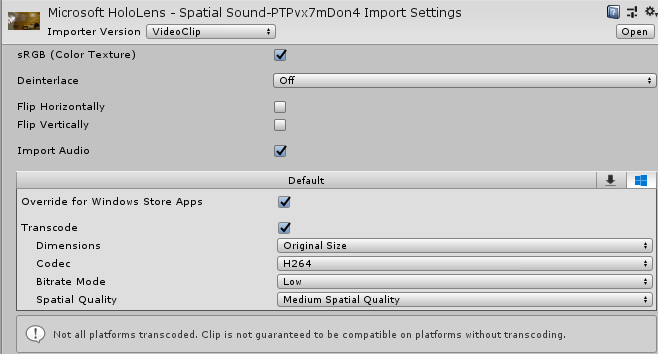
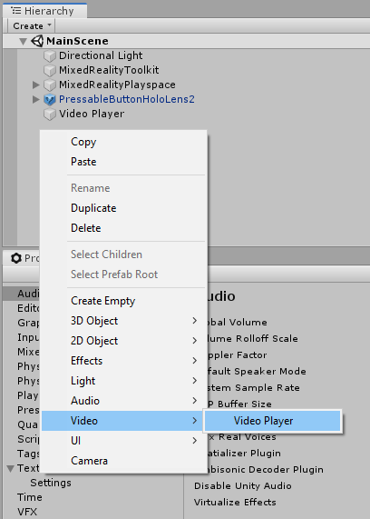
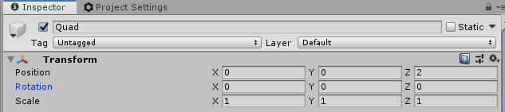
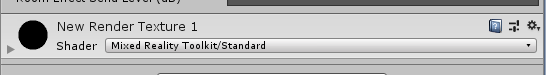

# Spatializing audio from a video
In this second chapter of the spatial audio module of the HoloLens 2 Unity tutorials, you'll:
* Import a video and add a Video Player
* Play the video onto a quadrangle
* Route audio from the video to the quadrangle, and spatialize the audio

## Import a video and add a Video Player

> [!NOTE]
> TODO: Change the video link below to the public link before publishing this page

Drag a video file into the **Project** pane in your Unity project. You can use [this video](https://microsoft.visualstudio.com/Analog/_git/mixedreality.spatialaudio.unity?path=%2FSamples%2FMicrosoftSpatializerSample%2FAssets%2FMicrosoft%20HoloLens%20-%20Spatial%20Sound-PTPvx7mDon4.mp4&version=GBdevelop) from the spatial audio sample project.

We recommend adjusting the quality settings on the video clip to ensure smooth playback on HoloLens2. Click on the video file in the **Project** pane. Then in the **Inspector** pane for the video file, override the settings for Windows Store Apps, and:
* Enable **Transcode**
* Set **Codec** to H264
* Set **Bitrate Mode** to Low
* Set **Spatial Quality** to Medium Spatial Quality

After these adjustments, the **Inspector** pane for the video file will look like this:

Next, add a **Video Player** object to the **Hierarchy** by right-clicking on the **Hierarchy** pane and choosing **Video -> Video Player**:

## Play video onto a quadrangle
The **Video Player** object needs a textured game object on which to render the video. First, add a **Quad** to your **Hierarchy** by right-clicking on the **Hierarchy** pane and choosing **3D Object -> Quad**:

To ensure the **Quad** appears in front of the user when the application starts, set the **Position** property of the **Quad** to (0,0,2), and the **Scale** property to (1.28, 0.72, 1). After these changes, the **Transform** component on the **Inspector** pane for the **Quad** will look like this:

To texture the **Quad** with video, create a new **Render Texture**. In the **Project** pane, right-click and choose **Create -> Render Texture**:

On the **Inspector** pane of the **Render Texture**, set the **Size** property to match the video's native resolution of 1280x720. Then, to ensure good rendering performance on HoloLens2, set the **Depth Buffer** property to **At least 16 bits depth**. After these settings, the **Inspector** pane for the **Render Texture** will look like this:

Next, use your new **Render Texture** as the texture for the **Quad**:
1. Drag the **Render Texture** from the **Project** pane onto the **Quad** in the **Hierarchy**
2. To ensure good performance on HoloLens2, on the **Inspector** pane for the **Quad**, select the **Mixed Reality Toolkit Standard Shader**.

With these settings, the **Texture** component on the **Inspector** pane for the **Quad** will look like this:

Next, use this **Video Player** to play your video clip. On the **Inspector** pane for the **Video Player**:
* Set the **Video Clip** property to your video file
* Check the **Loop** checkbox
* Set **Target Texture** to your new render texture

The **Inspector** pane for the **Video Player** will now look like this:

## Route audio from the video to the quadrangle, and spatialize the audio
The **Audio Mixer** pane is where you'll define destinations, called **Mixer Groups**, for audio playback from **Audio Source** components. Open the **Audio Mixer** pane using **Window -> Audio -> Audio Mixer**. Then create a **Mixer** by clicking the '+' next to **Mixers**. The new mixer will include a default **Group** called **Master**. Your **Mixer** pane will now look like this:

Then, create an **Audio Source**, to which you'll route the audio from the video. On the **Inspector** pane for the **Quad**:
* Click **Add Component** at the bottom of the pane
* Add an **Audio Source**

Then, on the **Audio Source**:
* Set **Output** to your mixer
* Check the **Spatialize** box
* Move the **Spatial Blend** slider to 1 (3D)

After these changes, the **Audio Source** component on the **Inspector** pane for the **Quad** will look like this:

> [!NOTE]
> In versions of Unity prior to 2019, the 'Spatialize' checkbox is at the bottom of the **Inspector** pane for the **Audio Source**.

> [!NOTE]
> You must both modify the **Spatial Blend** parameter **and** check the **Spatialize** checkbox. If you move **Spatial Blend** to 1 (3D) without checking the **Spatialize** checkbox, Unity will use its internal panning spatializer, instead the Microsoft Spatializer with HRTFs.

Finally, set the **Video Player** to route its audio to the **Audio Source** on the **Quad**. On the **Inspector** pane for the **Video Player**:
* Set the **Audio Output Mode** to 'Audio Source'
* Set the **Audio Source** property to your Quad

After these changes, the **Inspector** pane for the **Video Player** will look like this:

## Next steps
Try out your app on a HoloLens2 or in the Unity editor. Then, continue to [Chapter 3](unity-spatial-audio-ch3.md) to add a button, and use it to enable and disable spatialization at run time.

