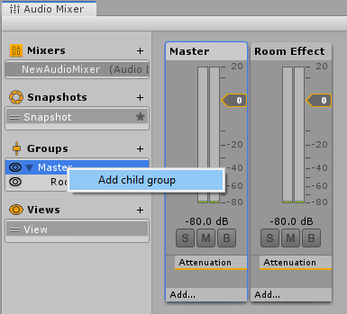
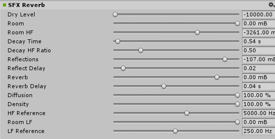
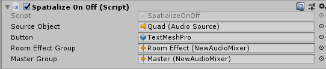

# Using reverb to add distance to spatial audio

## Objectives
In previous chapters, we added spatialization to sounds to give them a sense of direction. In this 4th chapter, we'll add a reverb effect to give sounds a sense of distance. This is useful for holograms, such as the video playback, that are meant to be out in the listener's world. Our objectives are to:
* Improve perceived distance of sound sources by adding reverb
* Control perceived distance of the sound using the listener's distance to the hologram

## Add a mixer group and a reverb effect
In Chapter 2, we added a mixer. The mixer includes one **Group** by default called **Master**. Because we'll only want to apply a reverb effect to some sounds, let's add a second **Group** for those sounds. To add a **Group**, right click on the **Master** group in the **Audio Mixer** and choose **Add child group**:



In this example, we've named the new group "Room Effect".

Each **Group** has its own set of effects. Add a reverb effect to the new group by clicking **Add...** on the new group, and choosing **SFX Reverb**:


In audio terminology, the original, unreverberated audio is called the _dry path_ and the audio after filtering with the reverb filter is called the _wet path_. Both paths are sent to the audio output, and their relative strengths in this mixture is called the _wet/dry mix_. The wet/dry mix strongly affects the sense of distance.

The **SFX Reverb** includes controls to adjust the wet/dry mix within the effect. Because the **Microsoft Spatializer** plugin handles the dry path, we'll be using the **SFX Reverb** only for the wet path. On the **Inspector** pane of your **SFX Reverb**:
* Set the Dry Level to the lowest setting (-10000 mB)
* Set the wet level (Room) to the highest setting (0 mB)

After these changes, the **Inspector** pane of the **SFX Reverb** will look like this:



The other settings control how the reverb sounds. In particular, **Decay Time** is related to perceived room size. 

## Enable reverb on the video playback
There are two steps to enable reverb on an audio source:
* Route the **Audio Source** to the appropriate **Group**
* Set the **Microsoft Spatializer** plugin to pass audio into the **Group** for processing

> [!NOTE]
> By default, the Microsoft Spatializer plugin takes audio out of the Unity audio engine and routes it directly the Windows spatialization API. To apply effects on the audio using the Unity audio engine, you must enable the plugin feature that routes audio back into the Unity audio engine.

On the **Inspector** pane for the **Quad**, click **Add Component** and add the **Room Effect Send Level** script:


The **Room Effect Send Level** component includes a graph control that sets the level of the audio sent to the Unity audio engine for reverb processing. Set the level to about -30dB:


Next, uncomment the 4 commented lines in the **SpatializeOnOff** script. The script will now look like this:
```c#
using System.Collections;
using System.Collections.Generic;
using UnityEngine;
using UnityEngine.Audio;

public class SpatializeOnOff : MonoBehaviour
{
    public AudioSource SourceObject;
    public GameObject Button;
    public AudioMixerGroup RoomEffectGroup;
    public AudioMixerGroup MasterGroup;

    private bool m_IsSpatialized;
    private TMPro.TextMeshPro m_TextMeshPro;

    public void Start()
    {
        m_TextMeshPro = Button.GetComponent<TMPro.TextMeshPro>();
        SetSpatialized();
    }

    public void SwapSpatialization()
    {
        if (m_IsSpatialized)
        {
            SetStereo();
        }
        else
        {
            SetSpatialized();
        }
    }

    private void SetSpatialized()
    {
        m_IsSpatialized = true;
        SourceObject.spatialBlend = 1;
        m_TextMeshPro.SetText("Set Stereo");
        SourceObject.outputAudioMixerGroup = RoomEffectGroup;
    }

    private void SetStereo()
    {
        m_IsSpatialized = false;
        SourceObject.spatialBlend = 0;
        m_TextMeshPro.SetText("Set Spatialized");
        SourceObject.outputAudioMixerGroup = MasterGroup;
    }

}
```

Uncommenting these lines adds two variables to the **Inspector** pane for the script. On the **Inspector** pane of the **Spatialize On Off** component of the **Quad**, set the new **Room Effect Group** and **Master Group** variables to the appropriate mixer groups. After these changes, the component properties will look like this:



## Next steps

Try out your app on a HoloLens2 or in the Unity editor. Now, when touching the button in the app to activate spatialization, the script will route the video's audio to the Room Effect Group to add reverb. When switching to stereo, it will route the audio to the Master group, and avoid adding reverb.

You've completed the HoloLens2 spatial audio tutorials for Unity. Congratulations!

