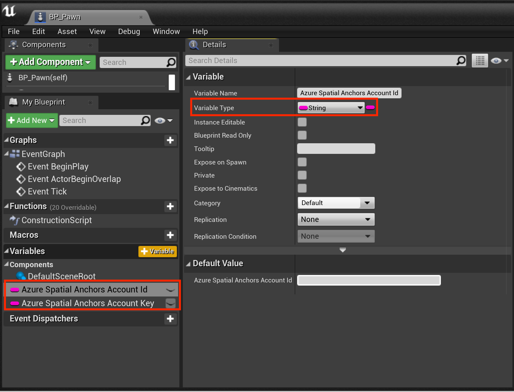
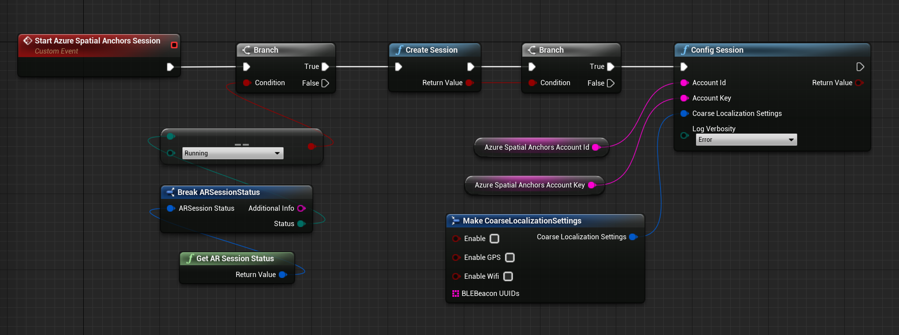
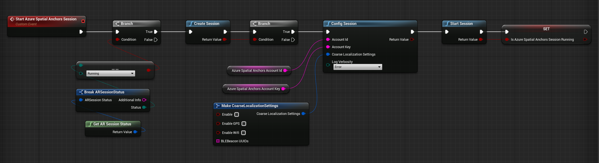
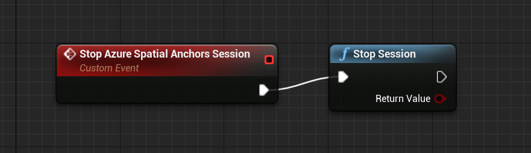
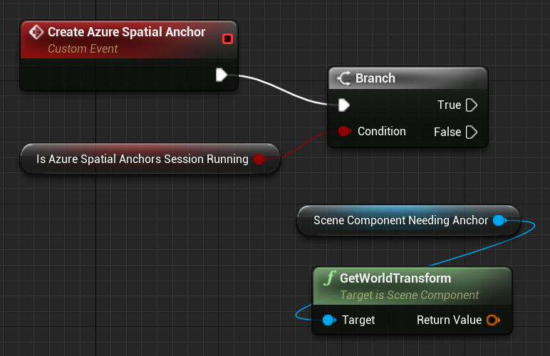
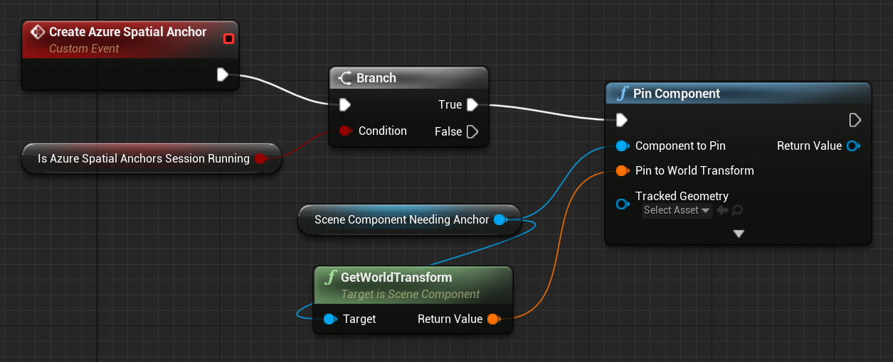
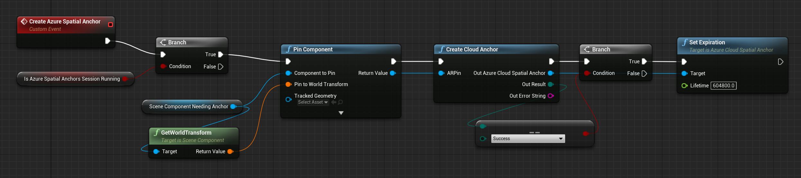
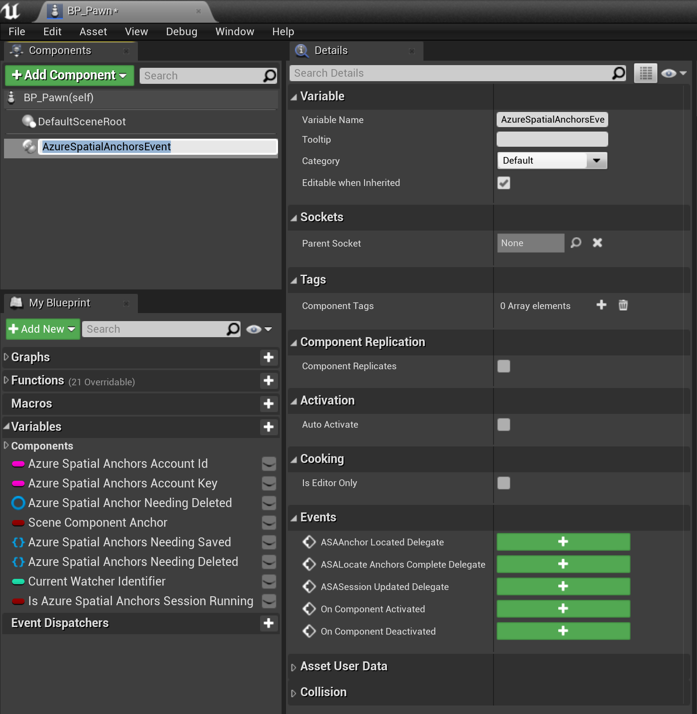
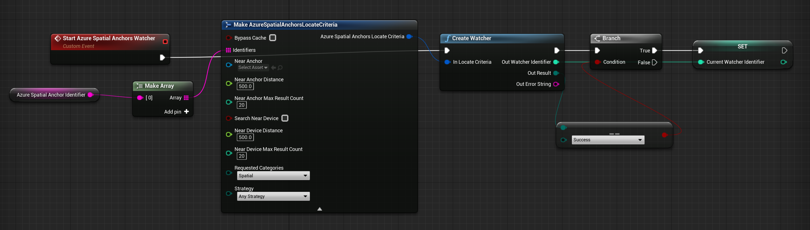

# Azure Spatial Anchors in Unreal

## Overview

Azure Spatial Anchors is a Microsoft Mixed Reality service, allowing augmented reality devices to discover, share, and persist anchor points in the physical world. Documentation below provides instructions for integrating the Azure Spatial Anchors service into an Unreal project. If you're looking for more information, check out the [Azure Spatial Anchors service](https://azure.microsoft.com/services/spatial-anchors/).

[!IMPORTANT]
> Local anchors are stored on device, while Azure Spatial Anchors are stored in the cloud. If you're looking to store your anchors locally on a device, we have a [Local Spatial Anchors](unreal-spatial-anchors.md) document that can walk you through the process. Note that you can have local and Azure anchors in the same project without conflict.

## Prerequisites

To complete this guide, make sure you have:

- Installed [Unreal version 4.25](https://www.unrealengine.com/get-now) or later
- A [HoloLens 2 project](unreal-uxt-ch1) setup in Unreal 
- Read through the [Azure Spatial Anchors overview](https://docs.microsoft.com/azure/spatial-anchors/overview)
- Basic knowledge on C++ and Unreal

## Getting Azure Spatial Anchors account info

Before using Azure Spatial Anchors in your project, you need to:
* [Create a spatial anchors resource](https://docs.microsoft.com/azure/spatial-anchors/quickstarts/get-started-hololens#create-a-spatial-anchors-resource) and copy the account fields listed below. These values are used to authenticate users with your application's account:
    * **Account ID**
    * **Account Key**

Check out the [Azure Spatial Anchors authentication](https://docs.microsoft.com/azure/spatial-anchors/concepts/authentication?tabs=csharp) docs for more information.

> [!NOTE]
> Azure Spatial Anchors in Unreal 4.25 does not support Azure AD authentication tokens, but support for this functionality will be coming in a later release.

## Adding Azure Spatial Anchors plugins

Enable the Azure Spatial Anchors plugins in the Unreal editor by:
1. Clicking **Edit > Plugins** and searching for **AzureSpatialAnchors** and **AzureSpatialAnchorsForWMR**.
2. Select the **Enabled** checkbox in both plugins to allow access to the Azure Spatial Anchors blueprint libraries in your application.

Once that's done, restart the Unreal Editor for the plugin changes to take effect. The project is now ready to use Azure Spatial Anchors.

## Starting a Spatial Anchors session
An Azure Spatial Anchors session allows client applications to communicate with the Azure Spatial Anchors service. You'll need to create and start an Azure Spatial Anchors session to create, persist, and share Azure Spatial Anchors:

1. Open the blueprint for the Pawn you're using in the application.
2. Add two string variables for the **Account ID** and **Account Key**, then assign the corresponding values from your Azure Spatial Anchors account to authenticate the session.

Start an Azure Spatial Anchors session by:
1. Checking that an **AR Session** is running in the HoloLens application, as the Azure Spatial Anchors session can't start until an AR Session is running. If you don't have one setup, [create an AR Session asset](https://docs.microsoft.com/windows/mixed-reality/unreal-uxt-ch3#adding-the-session-asset).
2. Adding the **Start Azure Spatial Anchors Session** custom event and configure it as shown in the screenshot below.
    * Creating a session doesn't start the session by default, which allows the developer to configure the session for authentication with the Azure Spatial Anchors service.

3. Configure the Azure Spatial Anchors session to provide the **Account ID** and **Account Key**.

4. Start the Azure Spatial Anchors session, allowing the application to create and locate Azure Spatial Anchors.

It's good practice to clean up Azure Spatial Anchors resources in your Event Graph blueprint when you're no longer using the service:

1. Stop the Azure Spatial Anchors session. The session will no longer be running, but its associated resources will still exist in the Azure Spatial Anchors plugin.

2. Destroy the Azure Spatial Anchors session to clean up any Azure Spatial Anchors session resources still known to the Azure Spatial Anchors plugin.

Your Event Graph blueprint should look like the screenshot below:

## Creating an anchor
An Azure Spatial Anchor represents a physical world pose in the augmented reality application space, which locks augmented reality content to locations in the physical world. Azure Spatial Anchors can also be shared among different users. This sharing allows augmented reality content drawn on different devices to be positioned in the same location in the physical world. 

To create a new Azure Spatial Anchor:
1. Check that an Azure Spatial Anchors session is running. The application can't create or persist an Azure Spatial Anchor when no Azure Spatial Anchors session is running.

2. Create or obtain an Unreal **[Scene Component](https://docs.unrealengine.com/API/Runtime/Engine/Components/USceneComponent/index.html)** that should have its location persisted. 
    * In the below image, the **Scene Component Needing Anchor** component is used as a variable. An Unreal Scene Component is needed to establish an application world transform for an [AR Pin](https://docs.unrealengine.com/BlueprintAPI/HoloLensAR/ARPin/index.html) and Azure Spatial Anchor.

To construct and save an Azure Spatial Anchor for an Unreal Scene Component:
1. Call the [Pin Component](https://docs.unrealengine.com/BlueprintAPI/ARAugmentedReality/Pin/PinComponent/index.html) for the Unreal Scene Component and specify the Scene Component's **World Transform** as the World Transform used for the AR Pin.
    * Unreal tracks AR points in the application space using AR Pins, which are used to create an Azure Spatial Anchor. In Unreal, an AR Pin is analogous to a SpatialAnchor on HoloLens.

2. Call **Create Cloud Anchor** using the newly created AR Pin.
    * Create Cloud Anchor creates an Azure Spatial Anchor locally but not in the Azure Spatial Anchor service. Parameters for the Azure Spatial Anchor, such as an expiration date, can be set before creating the Azure Spatial Anchor with the service.

3. Set the Azure Spatial Anchor expiration. This function's Lifetime parameter allows the developer to specify in seconds how long the anchor should be maintained by the service.
    * For example, a week long expiration would take a value of 60 seconds x 60 minutes x 24 hours x seven days = 604,800 seconds.

After setting anchor parameters, declare the anchor as ready to save. In the example below, the newly created Azure Spatial Anchor is added to a set of Azure Spatial Anchors needing saving. This set is declared as a variable for the Pawn blueprint.

## Saving an Anchor

After configuring the Azure Spatial Anchor with your parameters, call **Save Cloud Anchor**. Save Cloud Anchor declares the anchor to the Azure Spatial Anchors service. When the call to Save Cloud Anchor succeeds, the Azure Spatial Anchor is available to other users of the Azure Spatial Anchor service.  

> [!NOTE]
> Save Cloud Anchor is an asynchronous function and can only be called on a game thread event such as **EventTick**. Save Cloud Anchor may not appear as an available blueprint function in custom blueprint Functions. However, it should be available in the Pawn Event Graph blueprint editor.

In the example below, the Azure Spatial Anchor is stored in a set during an input event callback. The anchor is then saved on the EventTick. Saving an Azure Spatial Anchor may take multiple attempts depending on the amount of spatial data that your Azure Spatial Anchors session has created. That's why it's a good idea to check whether the save call succeeded.

If the anchor doesn't save, re-add it to the set of anchors still needing to be saved. Future EventTicks will try to save the anchor until it's successfully stored in the Azure Spatial Anchor service.

Once the anchor saves, you can use the AR Pins' transform as a reference transform for placing content in the application. Other users can detect this anchor and align AR content for different devices in the physical world.

## Deleting an Anchor

You can delete anchors from the Azure Spatial Anchor service by calling **Delete Cloud Anchor**.

> [!NOTE]
> Delete Cloud Anchor is a latent function and can only be called on a game thread event, such as EventTick. Delete Cloud Anchor may not appear as an available blueprint function in custom blueprint Functions. It should however be available in the Pawn Event Graph blueprint editor.

In the example below, the anchor is flagged for deletion on a custom input event. The deletion is then attempted on the EventTick. If the anchor deletion fails, add the Azure Spatial Anchor to the set of anchors flagged for deletion and tries again on later EventTicks.

Your Event Graph blueprint should now look like the screenshot below:

## Locating pre-existing anchors

In addition to creating Azure Spatial Anchors, you can detect anchors created by peers with the Azure Spatial Anchors service:

1. Obtain an Azure Spatial Anchor identifier for the anchor that you would like to detect.
    * An anchor identifier can be obtained for an anchor created by the same device in a previous Azure Spatial Anchors session. It can also be created and shared by peer devices interacting with the Azure Spatial Anchors service.

2. Add an **AzureSpatialAnchorsEvent** component to your Pawn blueprint.
    * This component allows you to subscribe to various Azure Spatial Anchors events, such as events called when Azure Spatial Anchors are located.

3. Subscribe to the **ASAAnchor Located Delegate** for the **AzureSpatialAnchorsEvent** component.
    * The delegate lets the application know when new anchors associated with the Azure Spatial Anchors account have been located.
    * With the event callback, Azure Spatial Anchors created by peers using the Azure Spatial Anchors session won't have AR Pins created by default. To create an AR Pin for the detected Azure Spatial Anchor, developers can call **Create ARPin Around Azure Cloud Spatial Anchor**.

In order to locate Azure Spatial Anchors created by peers using the Azure Spatial Anchor service, the application will have to create an **Azure Spatial Anchors Watcher**:
1. Check that an Azure Spatial Anchors session is running.
2. Create an **AzureSpatialAnchorsLocateCriteria**.
    * You can specify various location parameters like distance from the user or distance from another anchor.
3. Declare your desired Azure Spatial Anchor identifier in the **AzureSpatialAnchorsLocateCritieria**.
4. Call **Create Watcher**.

The application now begins looking for Azure Spatial Anchors known to the Azure Spatial Anchors service, meaning that users can locate Azure Spatial Anchors created by their peers.

After locating the Azure Spatial Anchor, call **Stop Watcher** to stop the Azure Spatial Anchors Watcher and clean up watcher resources.

Your final Event Graph blueprint should now look like the screenshot below:

## Next steps
* [Local Spatial Anchors](unreal-spatial-anchors.md)
* [Spatial Anchors documentation](https://docs.microsoft.com/azure/spatial-anchors/)
* [Spatial Anchor features](https://azure.microsoft.com/services/spatial-anchors/#features)
* [Effective anchor experience guidelines](https://docs.microsoft.com/azure/spatial-anchors/concepts/guidelines-effective-anchor-experiences)