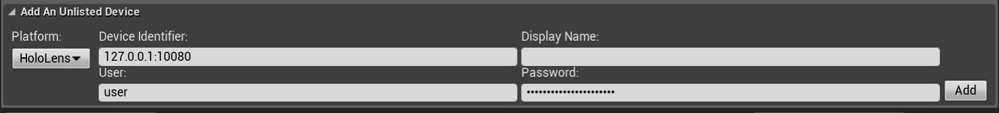

# Deploy to device in Unreal

## Overview
There are two ways to deploy an Unreal application to HoloLens 2: 
* Directly from the Unreal editor
* As a package uploaded via the device portal

Both options require you to set up your HoloLens to use the [device portal](using-the-windows-device-portal.md) for development. 

## Deploying to device from the Unreal editor

1. Click the dropdown arrow next to the "Launch" button. Initially the HoloLens device option will be grayed out.

2. Open the **Device Manager**.

3. Your HoloLens will not appear in the device list automatically. Expand the **Add An Unlisted Device** section.

4. Select "HoloLens" as your **Platform**.

5. Enter the IP address and port of the device as the device identifier, e.g. "127.0.0.1:10080" (when connected via USB). Use the same user name and password as used by the Device Portal. 

6. Hit **Add** and close the device manager. 
    * In the case of an error (such as wrong address, user name or password), an error message will be printed to the Output Log.

7. Click the dropdown arrow next to the "Launch" button again- this time you should see the HoloLens device you just added. Select the HoloLens device to build and deploy to your HoloLens. 

>[!NOTE]
>Building for the device may involve recompiling shaders (especially on the first run)- this can take a while. Don't let the device go to sleep until the app is running (you may have to wear it). Otherwise shader compilation will fail!

## Deploying to device via device portal

You can find detailed instructions on [packaging and deploying an app](unreal-uxt-ch6.md#packaging-and-deploying-the-app) in the last section of the Getting Started with Unreal tutorial series.
