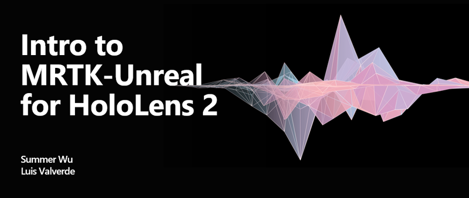

# Unreal Development Overview

Getting started with <a href="https://docs.microsoft.com/windows/mixed-reality" target="_blank" title="Mixed Reality Docs"> mixed reality applications</a> is a big task. New concepts, platforms, and cutting edge hardware can seem like barriers. However, if you're an Unreal developer you're in luck. Support for <a href="https://www.microsoft.com/windows/windows-mixed-reality" target="_blank" title="Windows Mixed Reality Docs">Windows Mixed Reality</a> (VR) and <a href="https://www.microsoft.com/hololens/hardware" target="_blank" title="HoloLens 2 Docs">HoloLens 2</a> (AR) is now included in Unreal Engine's newest <a href="https://docs.unrealengine.com/Support/Builds/ReleaseNotes/4_25/index.html" target="_blank" title="Unreal Engine 4.25 release notes">release</a>. This update includes:
* Mixed Reality UX Tools plugin support
* OpenXR support
* App Remoting from a desktop app
* Better performance
* Mixed reality capture
* Initial support for Azure Spatial Anchors

If you're new to Unreal development don't jump in blind. Explore the Unreal <a href="https://docs.unrealengine.com/GettingStarted/index.html" target="_blank">tutorial series</a> to get up to speed and look for assets and support in the Unreal <a href="https://www.unrealengine.com/marketplace/store" target="_blank">marketplace</a> and mixed reality <a href="https://forums.unrealengine.com/development-discussion/vr-ar-development" target="_blank">forums</a>. These resources are your links to the community of builders and problem solvers in todays mixed reality market.

## Development checkpoints

Use the following checkpoints to bring your Unreal games and applications into the world of mixed reality.

### 1. Getting started

The [Mixed Reality Toolkit for Unreal](https://github.com/microsoft/MixedRealityToolkit-Unreal) is a set of components designed to speed up your development in Unreal. Each component includes plugins, samples, and documentation for setting up immersive experiences.

* [UX Tools for Unreal](https://github.com/microsoft/MixedReality-UXTools-Unreal) is the first component to be released and is currently only supported on HoloLens 2. The component plugin includes code, blueprints, and example assets of common UX features for input simulation, hand interaction actors, press-able button components, manipulator components and follow behavior components.

By the end of this section, you'll have a basic understanding of the Mixed Reality Toolkit, a properly configured development environment for Mixed Reality apps, and a working MRTK project in Unreal.

|  Checkpoint  |  Outcome  |
| --- | --- |
| [What is MRTK?](mrtk-getting-started.md) | Begin your journey by getting acquainted with the Mixed Reality Toolkit and what it has to offer |
| [Install the latest tools](install-the-tools.md) | Download and install the latest Unity package and setup your project for mixed reality |
| [HoloLens 2 tutorial series](unreal-uxt-ch1.md) | Dive into beginner level MRTK tutorials for HoloLens 2 hardware |

### 2. Core building blocks

There are several key features of mixed reality development that our tutorial series doesn't cover. These building blocks are available as standalone features and through the Mixed Reality Toolkit. You might not need all of them at once, but we recommend exploring early on. After diving into the core building blocks listed below, you'll have a toolbox full of features you can integrate into your Mixed Reality projects.

[!INCLUDE]

> [!NOTE]
> You can dive into the **[UX Tools for Unreal GitHub](https://github.com/microsoft/MixedReality-UXTools-Unreal)** repository for more details.

### 3. Platform capabilities and APIs

Other key features that play a role in mixed reality applications are available without any extra packages or setup. These features can be added to Unreal projects with or without MRTK installed. After diving into these more advanced capabilities, you'll be able to build more complex Mixed Reality apps.

|  Feature  |  Capabilities  |
| --- | --- |
| [HoloLens camera](unreal-hololens-camera.md) | Capture Mixed Reality and real-world visual content from your app running on a HoloLens device |
| [QR codes](unreal-qr-codes.md) | Render QR codes as holograms using a coordinate system at each code's real-world position |
| [WinRT](unreal-winrt.md) | Create a separate binary with WinRT code that can be consumed by Unreal’s build system |

### 4. Deploying to a device

If this is your first time creating or deploying an Unreal app for HoloLens, you'll need to [download supporting files](unreal-uxt-ch6.md#packaging-and-deploying-the-app-via-device-portal) from the Epic Launcher. Once you have those files installed, you're ready to deploy from either the [Unreal editor](unreal-deploying.md) or the [Device Portal](unreal-uxt-ch6.md#packaging-and-deploying-the-app-via-device-portal).

## What's next?

A developers job is never done, especially when learning a new tool or SDK. The following sections can take you into areas beyond the beginner level material you've already completed, along with helpful resources if you get stuck. Note that these topics and resources are not in any sequential order, so feel free to jump around and explore!

### Session videos from Mixed Reality Dev Days 2020
This talk gives an overview of the features provided in Unreal Engine 4 and MRTK for Unreal, and how to use them to build epic experiences for HoloLens 2.

### Streaming & Debugging

If you want to test out your application on a HoloLens device while still in development, you can [stream it directly from your PC](unreal-streaming.md) by using either the Unreal editor or a packaged Windows executable file.

If you're looking to debug the application with Visual Studio, follow these [instructions](https://docs.microsoft.com/visualstudio/debugger/debug-installed-app-package?view=vs-2019#remote).

### Performance

Developing for mixed reality comes with performance checkpoints that depend on the platform. A HoloLens 2 app must run at 60 frames per second for holograms to appear stable and responsive. Luckily, we have [performance recommendations](performance-recommendations-for-unreal.md) for achieving this in your Unreal applications.

## Supported Features

| HoloLens 2 Feature | Earliest Supported Unreal Engine Version |
| ----------- | ----------- |
| ARM64 support | 4.23 |
| Streaming from a PC | 4.23 |
| Spatial mapping | 4.23 |
| Hand and joint tracking | 4.23 |
| Eye tracking | 4.23 |
| Voice input | 4.23 |
| Spatial anchors | 4.23 |
| Camera access | 4.23 |
| QR codes | 4.23 |
| Spatial audio | 4.23 |
| Spectator Screen support for streaming | 4.24 |
| Planar LSR over streaming | 4.24 |
| Sample apps ([HoloLens2Example](https://github.com/microsoft/MixedReality-Unreal-Samples) and [Mission AR](https://docs.unrealengine.com/Resources/Showcases/MissionAR/index.html)) | 4.24 |
| Mobile multi-View: Performance hits 60 fps | 4.25 |
| 3rd camera render | 4.25 |
| Streaming from a packaged desktop app | 4.25.1 |
| Azure Spatial Anchors for HoloLens 2 (beta) | 4.25 |
| OpenXR support (beta) | 4.25 |
| UX Tools support (0.8) | 4.25 |
| Developer docs & tutorials | 4.25 |

> [!div class="nextstepaction"]
> [Explore MRTK](mrtk-getting-started.md)

## See also
* <a href="https://docs.unrealengine.com/Platforms/AR/HoloLens2/index.html" target="_blank">Unreal docs for streaming, deploying to emulator and device</a>
* <a href="https://docs.unrealengine.com/Platforms/Mobile/Performance/index.html" target="_blank">Unreal performance guidelines for mobile devices</a>
