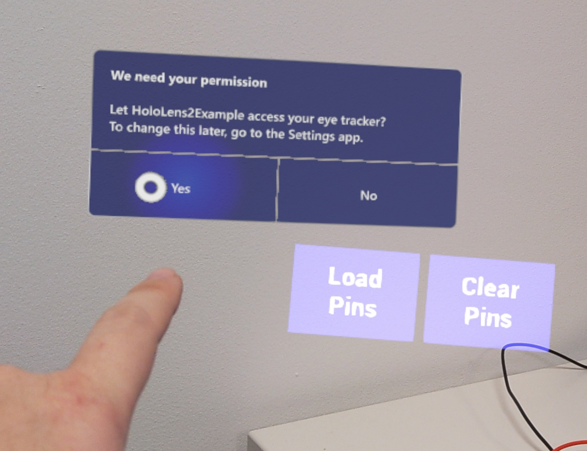

# Gaze Input

The Windows Mixed Reality plugin doesn’t provide any special functions for the gaze input. Everything works though the standard Unreal API.

[Head gaze API](https://docs.unrealengine.com/en-US/BlueprintAPI/Input/HeadMountedDisplay/index.html)

## Eye tracking

To use the eye tracking API, developers should enable the “Gaze Input” capability in their HoloLens project settings. When the application starts, user will see the following consent prompt

 
If the user gives their permission, the application will get eye gaze input. 

Unreal’s eye tracking API is documented is [here](https://docs.unrealengine.com/en-US/BlueprintAPI/EyeTracking/index.html)

The technical details of eye tracking are [here](eye-tracking.md)

Note that specifically for Unreal, HoloLens eye tracking has a single gaze ray for both eyes. HoloLens doesn’t provide stereoscopic eye tracking.
