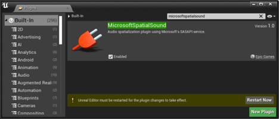
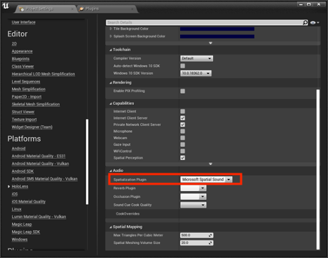
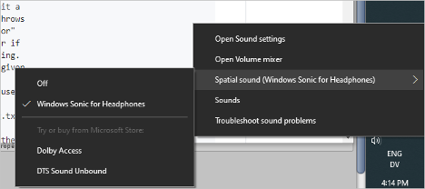

# Spatial audio in Unreal

## Overview

Using spatial sound in your applications enhances the level of immersion a user experiences in mixed reality.  Unlike vision, a human can hear sounds from all around and spatial sound emulates how human hearing works to provide the cues to identify the location of sound objects. 

High quality spatial sound processing is complex, so HoloLens 2 has hardware dedicated for processing spatial sound objects.  To access this hardware processing support, the Unreal Engine includes a plugin called MicrosoftSpatialSound to access this dedicated hardware. This article illustrates how to install and configure this plugin. 

## Installing Microsoft Spatial Sound plugin 

The first step for adding spatial sound to your Unreal-based project is installing the Microsoft Spatial Sound plugin. You can find the plug-in by: 

* Selecting Edit > Plugins, typing “MicrosoftSpatialSound” in the search box. 
* Enabling the MicrosoftSpatialSound plugin by selecting the Enabled checkbox. 
* Ensuring that Microsoft Windows Mixed Reality and HoloLens plugins are enabled if not already enabled 
* Restarting the Unreal Editor by selecting the Restart Now button. 
    + [Need to check if Mixed Reality and HoloLens plugins need to be installed as well] 

## Setting spatialization plugin for HoloLens 2 platform
Selecting the spatialization plugin is done on a per platform basis.  You can enable the Microsoft Spatial Sound plugin for the HoloLens 2 platform by:
1. Selecting Edit > Project Settings… and scrolling down to Platforms
2. Selecting the HoloLens platform in the left column and scrolling down in the list of options to find the Audio properties section
3. Selecting the Microsoft Spatial Sound plugin in the Spatialization Plugin option

Example docs on adding spatialization from Unreal and Google…
Enabling Spatialization from Unreal docs
https://docs.unrealengine.com/en-US/Engine/Audio/DistanceModelAttenuation/index.html
Spatialize sounds with the Resonance Audio plugin
https://resonance-audio.github.io/resonance-audio/develop/unreal/getting-started#spatialize-sounds-with-the-resonance-audio-plugin

## Enabling spatial audio on your workstation
On desktop versions of Windows, spatial audio is disabled by default. Enable it by right-clicking on the volume icon in the task bar. To get the best representation of what you'll hear on HoloLens 2, choose Spatial sound -> Windows Sonic for Headphones.

> [!NOTE]
>This setting is only required if you plan to test your project in the Unreal editor.

## See also
* [Spatial Sound](https://docs.microsoft.com/windows/mixed-reality/spatial-sound)
* [Spatial Sound Design](https://docs.microsoft.com/windows/mixed-reality/spatial-sound-design)
* [MR Spatial 220: Spatial sound](https://docs.microsoft.com/windows/mixed-reality/holograms-220)

