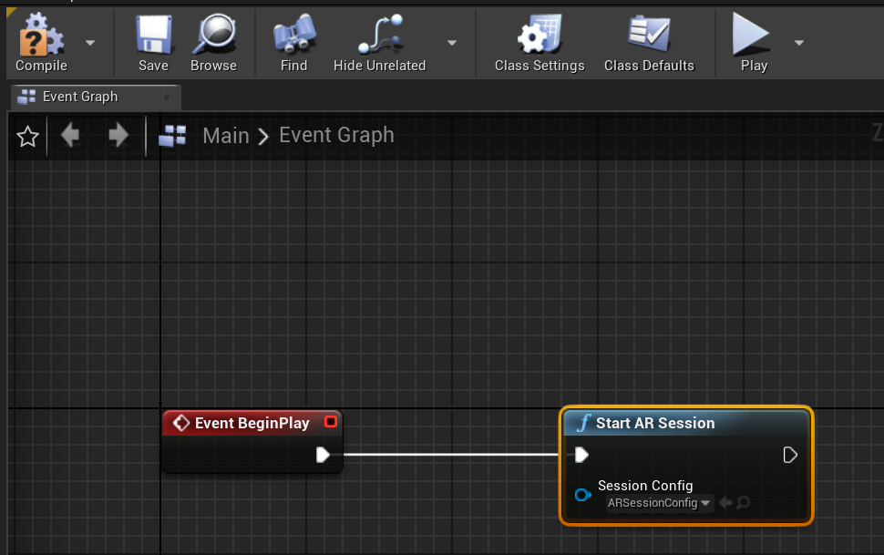
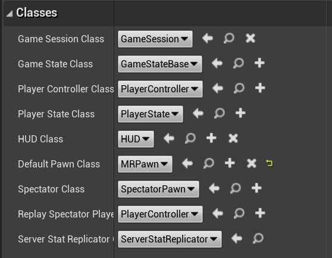

# 3. Setting up your project for mixed reality

This section walks you through the process of configuring your app for mixed reality development. 

## Objectives

* Understand how to set up a mixed reality project with ARSessionConfig, Pawn, and GameMode

## Configure the Session

1. In the Content Browser, navigate back to the **Content** folder. Click **Add New > Miscellaneous > Data Asset**. 

2. Pick **ARSessionConfig** as the class and click **Select**. Name the asset “ARSessionConfig”.

3. Double click ARSessionConfig to open it. An ARSessionConfig data asset contains a number of useful AR settings including spatial mapping and occlusion. For more details on ARSessionConfig, take a look at Unreal Engine’s documentation on [UARSessionConfig](https://docs.unrealengine.com/en-US/API/Runtime/AugmentedReality/UARSessionConfig/index.html). For our chess app, we won’t need to modify any settings, so just hit **Save** and return to the Main window. 

4. On the toolbar above the viewport, click **Blueprints > Open Level Blueprint**. The Level Blueprint is a special Blueprint that acts as a level-wide global event graph. We’re going to start an AR session here, so that our AR session configuration is applied at the start of the level.  

5. Drag the execution node off **Event BeginPlay** and release. Search for the **Start AR Session** node. Click on **Session Config** and select your newly created **ARSessionConfig** asset. Hit **Compile**, then **Save**. Return to the Main window.

## Create a Pawn

1.	In the Content folder, create a new Blueprint that inherits from **DefaultPawn**. In Unreal, a Pawn represents the user in the game, or in this case, the HoloLens 2 experience. Rename your new Pawn “MRPawn” and double click on MRPawn to open it. 

2.	By default, the Pawn has a mesh component and a collision component, since in most Unreal projects, Pawns controlled by the user are solid objects that collides with other components. In this situation, since the user is the Pawn, we want to be able to pass through holograms without generating collisions. In the Components panel, select the **CollisionComponent**. In the Details panel, scroll down to the Collision section and click the dropdown next to Collision Presets. Change this from Pawn to **NoCollision**. Do the same for the **MeshComponent**. **Compile**, then **Save** the Blueprint. Return to the Main window. 

## Create a Game Mode

1.	In the Content folder in the Content Browser, create a new Blueprint with the parent **Game Mode Base**. Name it MRGameMode and double click to open. In Unreal, the Game Mode determines a number of settings for the game or experience, including the default pawn to use. 

2.	In the Details panel, locate the Classes section. Change the Default Pawn Class from DefaultPawn to the **MRPawn** you just created. Hit **Compile**, then **Save**. Return to the Main window. 

3.	The last step in setting up your project is to tell Unreal to default to MRGameMode. Go to **Edit > Projects Settings > Maps & Modes** (in the Projects) section. In the Default Modes section, click the dropdown and choose **MRGameMode**. In the Default Maps section right below, change both the **EditorStartupMap** and the **GameDefaultMap** to **Main**. This way when you close the editor and reopen it, the Main map will be selected by default. Similarly, when you play the game, the Main map will be the level that is started. 

[Next Section: 4. Making your scene interactive](unreal-uxt-ch4.md)