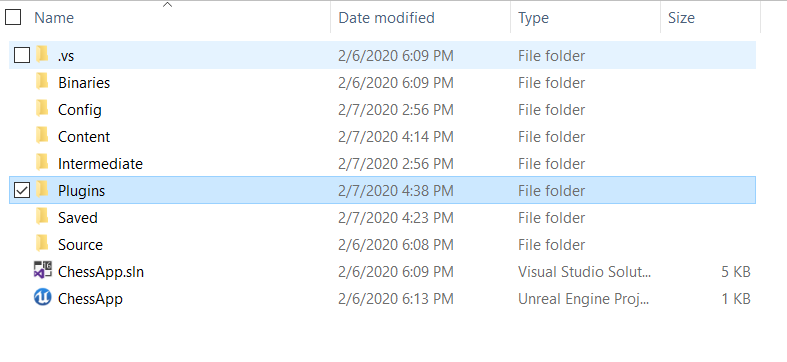
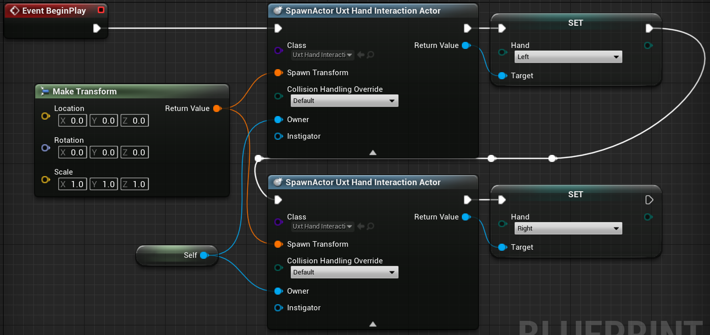
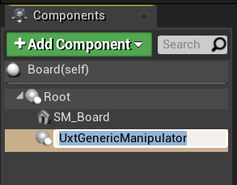
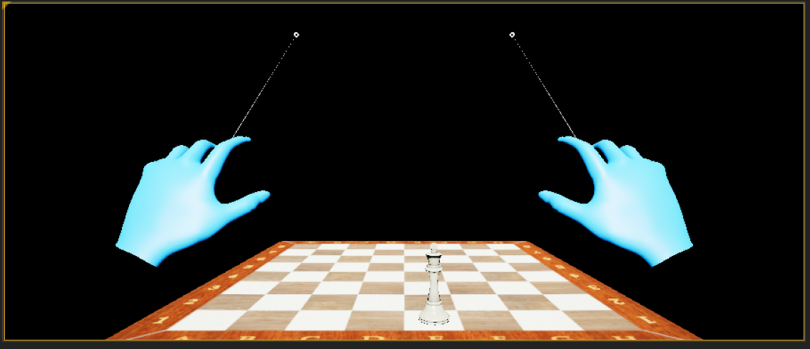

# 3. Making your scene interactive

This section introduces you to the open source Mixed Reality Toolkit UX Tools plugin, which provides a set of tools to easily make your scene interactive. By the end of this section, your chess pieces will respond to user input. 

## Objectives

* Include the Mixed Reality Toolkit UX Tools plugin in your project
* Add Hand Interaction Actors to your fingertips
* Create and attach Manipulators to your chess board and pieces 
* Use input simulation to validate your project

## Download the Mixed Reality Toolkit UX Tools plugin

1.	Clone or download and unzip the latest release of the MRTK UX Tools plugin from the [UX Tools GitHub repository](https://github.com/microsoft/MixedReality-UXTools-Unreal/releases)

2.	In your chess project root folder, create a new folder called “Plugins”. Copy /UXToolsGame/Plugins/UXTools/ from the MixedReality-UXTools-Unreal repository into this folder. Restart the Unreal editor. 

3.	After restarting, if you don’t see UXTools plugin content in your sources panel, you may need to click on **View Options > Show Plugin Content**. You’ll see that the UXTools plugin provides a Content folder with Pointers, Input Simulation, and a Simple Button, as well as a C++ Classes folder with subfolders separated by function.  

## Spawn Hand Interaction Actors

1.	Let’s start by spawning Hand Interaction Actors from our MRPawn so that 1) we can visualize MRPawn with a cursor on the tips of the Pawn’s index fingers, 2) we can provide articulated hand input events (and thus, directly manipulate actors) through the Pawn, and 3) we can provide far interaction input events through hand rays extending from our palms. Open the **MRPawn** Blueprint and navigate to the **Event Graph**. 

2.	Drag the execution pin from Event BeginPlay and release to place a new node. Select the **Spawn Actor from Class** node. Click the dropdown next to the **Class** pin and search for **Uxt Hand Interaction Actor**. Drag the execution pin from the SpawnActor Uxt Hand Interaction node, release, and search for the **Set Hand** function contained in the Uxt Hand Interaction Actor class. Connect the SpawnActor node’s Return Value to the Target pin of the Set Hand node to set the hand of the Hand Interaction Actor to **Left**. Spawn a second **Uxt Hand Interaction Actor**, this time setting the hand to **Right**, so that when the event begins, a Uxt Hand Interaction Actor will be spawned on each hand. 

3.	Next, we need to provide our Uxt Hand Interaction Actors with an initial transform at which to spawn, and an owner. Drag the pin off one of the **Spawn Transform** pins and release to place a new node. Search for the **Make Transform** node. The initial transform really doesn’t matter since the Hand Interaction Actors will jump to our hands as soon as they are visible (code that’s already written for us in the UX Tools plugin), otherwise, they’ll disappear. However, the SpawnActor function requires a Transform as input to avoid a compiler error, so we’ll just leave the default values in Make Transform as is. Drag Make Transform’s **Return Value** to the other hand’s Interaction Actor Spawn Transform as well. 

4.	Click the **down arrow** at the bottom of both SpawnActor nodes to reveal the **Owner** pin. Drag the pin off one of the **Owner** pins and release to place a new node. Search for “self” and select the **Get a reference to self** variable. Create a link between the Self object reference node and the other Hand Interaction Actor’s Owner pin as well. Feel free to drag around nodes to make your Blueprint more readable. **Compile**, **save**, and return to the Main window. 

For more information about the Hand Interaction Actor provided in the MRTK UX Tools plugin, check out the official [documentation](https://microsoft.github.io/MixedReality-UXTools-Unreal/version/public/0.8.x/Docs/HandInteraction.html).

## Attach Manipulators

1.	Next, we’ll attach Manipulators to our chess board and king Actors. A Manipulator is a component that responds to articulated hand input and can be grabbed, rotated, and translated; by applying the Manipulator’s transform to that of an Actor, Actors can be directly manipulated. 

2.	Open your Board Blueprint. In the **Components** panel, click **Add Component** and search for **Uxt Generic Manipulator**. In the Details panel, you’ll find a section titled **Generic Manipulator** where you can set whether you want to enable one-handed or two-handed manipulation, the rotation mode, and smoothing. Feel free to select whichever modes you wish, then **Compile** and **Save** Board. 

3.	Repeat the steps above for the WhiteKing Actor.

For more information about the Manipulator Components provided in the MRTK UX Tools plugin, visit the official [documentation](https://microsoft.github.io/MixedReality-UXTools-Unreal/version/public/0.8.x/Docs/Manipulator.html).

## Test out your scene with simulated hands

1.	In the Main window, press **Play**. You should see two mesh hands provided by the MRTK UX Tools plugin, with hand rays extending from each hand’s palm! 

2.	To control the **right hand**, hold down the **left Alt** button. Move your mouse to move the hand. Scroll with your **mouse wheel** to move the hand **forwards** or **backwards**. Click your left mouse to **pinch**, click the middle mouse button to **poke**.

3.	To control the **left hand**, hold down the **left Shift** button. The controls for moving the left hand are the same as those for the right hand. 

4.	Now try using the simulated hands to pick up, move, and set down the white chess king. You can also manipulate the board! Experiment with both near and far interaction- notice that when your hands get close enough to grab the board and king directly, the hand ray disappears and is replaced with a finger cursor on the index tip. 

For more information about the simulated hands feature provided by the MRTK UX Tools plugin, visit the official [documentation](https://microsoft.github.io/MixedReality-UXTools-Unreal/version/public/0.8.x/Docs/InputSimulation.html).

[Next Section: 5. Adding a button & resetting piece locations](unreal-uxt-ch5.md)