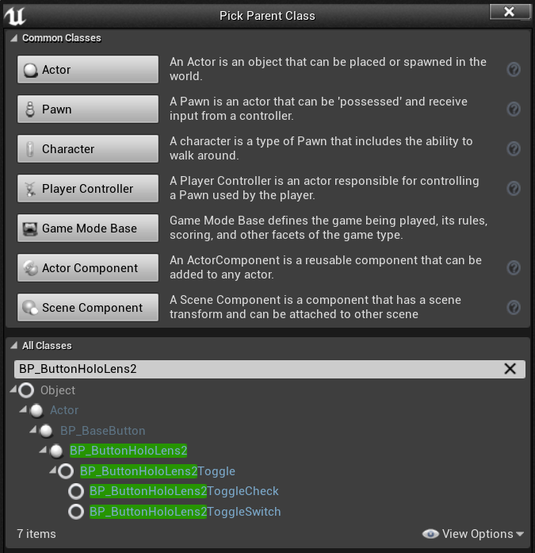
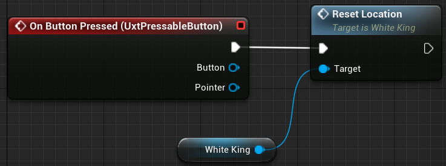
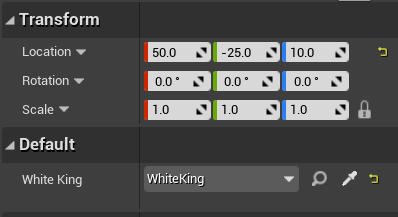
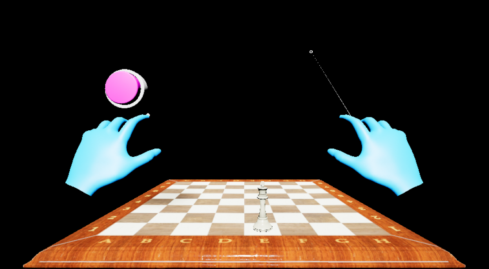

# 5. Adding a button & resetting piece locations

This section continues demonstrating the capabilities of the Mixed Reality Toolkit UX Tools plugin and building out the features of your chess app. You’ll create a new function and learn how to get references to Actors from your Level into a Blueprint.

## Objectives

* Add a button to your project
* Create a new “Reset Location” function that sends a piece back to its original location
* Hook the button up to trigger the newly created function when pressed

## Create a function to reset location

1.	Open **WhiteKing**. In the **My Blueprint** panel, click the “+” button next to the **Functions** section to create a new function. Name this function “Reset Location”. 

2.	In your newly created **Reset Location** Blueprint, drag the execution pin and release anywhere on the Blueprint grid to call a **SetActorRelativeTransform** node. This function sets the transform (location, rotation, and scale) of an actor relative to its parent. We’ll use this function to reset the king’s position on the board, even if the board has been moved from its original position. Create a **Make Transform** node with Location X = -26, Y = 4, Z = 0, and connect it to the New Relative Transform input. 

3.	Compile and Save **WhiteKing**. Return to the Main window. 

## Add a button

1.	In your **Blueprints** folder, create a new Blueprint that subclasses SimpleButton. SimpleButton is a 3D button Blueprint Actor that is provided as part of the UX Tools plugin. Name this button “ResetButton” and double click to open the Blueprint. 

2.	In the **Components** panel, click on **PressableButton (Inherited)**. In the Details panel, scroll until you see the **Events** section. Click the green plus button next to **On Button Pressed**- this will add an **On Button Pressed** event to the Event Graph, which will be called when the button is pressed. From here, we’ll want to call our WhiteKing’s Reset Location function. To do this, we’ll first need to get a reference to the WhiteKing Actor in our Level. 

3.	In the **My Blueprint** panel, find the **Variables** section and click the **+** button to add a new variable. Name this variable “WhiteKing”. In the Details panel, select the dropdown next to **Variable Type**, search for “WhiteKing”, and select the **Object Reference**. Finally, check the box next to **Instance Editable**. This will allow the variable to be set from the Main Level. 

4.	Drag the WhiteKing variable from **My Blueprint > Variables** onto the Simple Button Event Graph. Choose **Get WhiteKing**. 

5.	Drag the WhiteKing output pin and release to place a new node. Select the **Reset Location** function. Finally, drag the outgoing execution pin from **On Button Pressed** to the incoming execution pin on **Reset Location**. **Compile** and **Save** the ResetButton Blueprint, then return to the Main window. 

6.	Drag **SimpleButton** into the viewport and set its location to X = 50, Y = -25, Z = 10. Under **Default**, set the value of the WhiteKing variable to **WhiteKing**.

You now have a mixed reality app with a grabbable chess piece and board, as well as a fully functioning button that will reset the piece’s location when pressed. The completed app up to this point can be found on [GitHub](https://github.com/microsoft/MixedReality-Unreal-Samples/tree/master/ChessApp). Feel free to go beyond this tutorial and set up the remainder of the chess pieces, so that the entire board is reset when the user presses the button.

[Next Section: 6. Packaging & deploying to device or emulator](unreal-uxt-ch6.md)