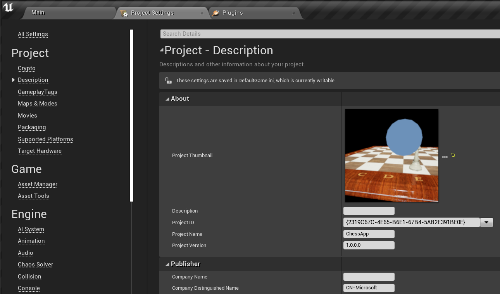
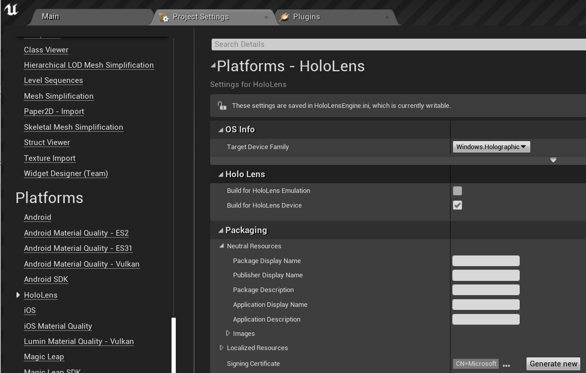

# 6. Packaging & deploying to device or emulator

## Overview

In the previous tutorial, you added a simple button that resets the chess piece to its original position. In this final section, you'll get the app ready to run on a HoloLens 2 or an Emulator. If you have a HoloLens 2, you can either stream from your computer or package the app to run directly on the device. If you don't have a device, you'll be packaging the app to run on the Emulator. By the end of this section, you'll have a deployed mixed reality app that you can play, complete with interactions and UI.

## Objectives

* [Device only] Streaming to HoloLens 2 with holographic app remoting
* Packaging and deploying the app to a HoloLens 2 device or emulator

## [Device Only] Streaming
[Holographic Remoting](https://docs.microsoft.com/windows/mixed-reality/add-holographic-remoting) in this case means streaming data from a PC or standalone UWP device to the HoloLens 2, not switching the channel. The way this works is a remoting host app receives an input data stream from a HoloLens, renders content in a virtual immersive view, and streams content frames back to HoloLens over Wi-Fi. Streaming allows you to add remote immersive views into existing desktop PC software and has access to more system resources. 

If you're going this route with the chess app, you'll need a few things:

1.	Install the **Holographic Remoting Player** from the Microsoft Store on your HoloLens 2 and run the app.

2.	Go to **Edit > Project Settings** and check **enable remoting** in the **Holographic Remoting** section.

3.	Restart the editor, [find your device's IP address](https://docs.microsoft.com/windows/uwp/debug-test-perf/device-portal-hololens#connect-over-wi-fi) and enter it, then click **Connect**.

Once you’re connected, click the drop-down arrow to the right of the **Play** button and select **VR Preview**. This will run the app in the VR Preview Window, which is streamed to the HoloLens headset. 

## Packaging and deploying the app 

>[!NOTE]
>If this is your first time packaging an Unreal app for HoloLens, you'll need to download supporting files from the Epic Launcher. 
>- Go to the **Library** tab in the Epic Games Launcher, select the dropdown arrow next to **Launch** >and click **Options**. 
>- Under **Target Platforms**, select **HoloLens 2** and click **Apply**. 
>

1.	Go to **Edit > Project Settings**. 
    * Add a project name under **Project > Description > About > Project Name**. 
    * Add **CN=YourCompanyName** under **Project > Description > Publisher > Company Distinguished Name**.

> [!IMPORTANT]
> Leaving either of these fields blank will result in an error when you try and generate a new certificate in step 3. 

> [!IMPORTANT]
> The publisher's name must be in in [LADPv3 Distinguished Names Format](https://www.ietf.org/rfc/rfc2253.txt). A malformed publisher's name leads to the "Signing key not found. The app could not be digitally signed." error on packaging stage.

2.	Enable **Build for HoloLens Emulation** and/or **Build for HoloLens Device** under **Platforms > HoloLens**.

3.	Click **Generate new** in the **Packaging** section (next to **Signing Certificate**).

> [!IMPORTANT]
> If you use an already generated certificate, then the certificate's publisher name must be same as the application's publisher name. Otherwise it leads to "Signing key not found. The app could not be digitally signed." error.

4. Click **None** for testing purposes when you're prompted to create a Private Key Password.

5. Go to **File > Package Project** and select **HoloLens**. 
    * Create a new folder to save your package in and click **Select Folder**. 

6.	Open the [Windows Device Portal](https://docs.microsoft.com/windows/mixed-reality/using-the-windows-device-portal) once the app is packaged, go to **Views > Apps** and find the **Deploy apps** section.

7.	Click **Browse...**, go to your **ChessApp.appxbundle** file and click **Open**. 

    * Check the box next to **Allow me to select framework packages** if this is the first time you're installing the app on your device. 
    * In the next dialogue, include the appropriate **VCLibs** and **appx** files (arm64 for device, x64 for emulator). You can find these under **HoloLens** inside the folder where you saved your package.

8.	Click **Install**
    * You can now go to **All Apps** and tap the the newly installed app to run it, or you can start the app directly from the **Windows Device Portal**. 

Congratulations! Your HoloLens mixed reality application is finished and ready to go. However, this isn't the end of the road. MRTK has lots of standalone features that you can add to your projects, including spatial mapping, gaze and voice input, and even QR codes. More information on these features can be found in the [Unreal development overview](https://docs.microsoft.com/windows/mixed-reality/unreal-development-overview).
