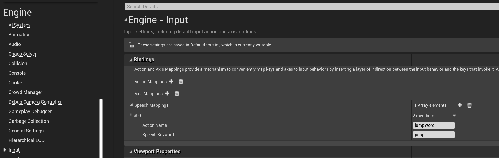
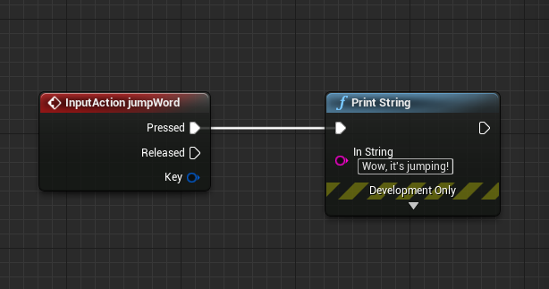

# Voice Input in Unreal

## Overview
Voice input allows you to interact with a hologram without having to use hand gestures and is supported on HoloLens (1st Gen) and HoloLens 2. It's powered by the same engine that supports speech in all other Universal Windows Apps and can add a natural feeling to the way you interact in mixed reality. 

Supported voice features include:
- The [Select command](https://docs.microsoft.com/windows/mixed-reality/voice-input#the-select-command)
- [Hey, Cortana](https://docs.microsoft.com/windows/mixed-reality/voice-input#hey-cortana)
- "See it, say it" for button and label interaction
- Dictation

For more information, check out the main [Voice Input](voice-input.md) documentation.

## Enabling Speech Recognition

To enable speech recognition on HoloLens:
1. Select **Project Settings > Platform > HoloLens > Capabilities** and enable **Microphone**. 
2. Enabled speech recogniztion in **Settings > Privacy > Speech** and select **English**.

> [!NOTE]
> Speech recognition always functions in the Windows display language configured in the **Settings** app. It’s recommended that you also enable **Online speech recognition** for the best service quality.

3. A dialog will show up when the application first starts to ask if you want to enable the microphone. Selecting **Yes** starts voice input in the app.

Voice input doesn’t require any special Windows Mixed Reality APIs; it's built on the existing Unreal Engine 4 [Input](https://docs.unrealengine.com/Gameplay/Input/index.html) mapping API. 

## Adding Speech Mappings
Connecting speech to action is an important step when using voice input. These mappings monitor the app for speech keywords that a user might say, then fire off a linked action. You can find Speech Mappings by:
1. Selecting **Edit > Project Settings**, scrolling to the **Engine** section, and clicking **Input**.

To add a new Speech Mapping for a jump command:
1. Click the **+** icon next to **Array elements** and fill out the following values:
    * **jumpWord** for **Action Name**
    * **jump** for **Speech Keyword**

> [!NOTE]
> Any English word(s) or short sentence(s) can be used as a keyword. 

Speech Mappings can be used as Input components like Action or Axis Mappings or as blueprint nodes in the Event Graph. For example, you could link the jump command to print out two different logs depending on when the word is spoken:

1. Double-click a blueprint to open it in the **Event Graph**.
2. **Right-click** and search for the **Action Name** of your speech mapping (in this case **jumpWord**), then hit **Enter**. This adds an **Input Action** node to the graph.
3. Drag and drop the **Pressed** pin to **Print String** node as shown in the image below. You can leave the **Released** pin empty, it won't execute anything for speech mappings.
 

4. Play the app, say the word **jump** and watch the console print out the logs!

That's all the setup you'll need to start adding voice input to your HoloLens apps in Unreal. You can find more information on speech and interactivity can be found at the links below, and be sure to think about the experience you're creating for your users.

## See also
* [Gaze and commit](gaze-and-commit.md)
* [Instinctual interactions](interaction-fundamentals.md)
* [MR Input 212: Voice](holograms-212.md)
