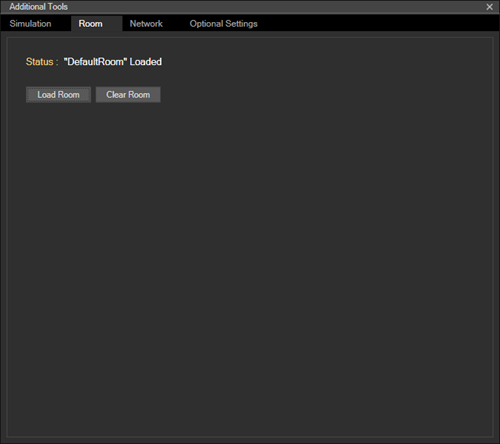

# Using the HoloLens emulator

The HoloLens emulator allows you to test holographic apps on your PC without a physical HoloLens and comes with the HoloLens development toolset. The emulator uses a Hyper-V virtual machine. The human and environmental inputs that would usually be read by the sensors on the HoloLens are instead simulated using your keyboard, mouse, or Xbox controller. Apps don't need to be modified to run on the emulator and don't know that they aren't running on a real HoloLens.

If you're looking to develop Windows Mixed Reality immersive (VR) headset apps or games for desktop PCs, check out the [Windows Mixed Reality simulator](using-the-windows-mixed-reality-simulator.md), which lets you simulate desktop headsets instead.

## Installing the HoloLens emulator

[Click here to download the latest build of the HoloLens emulator](https://go.microsoft.com/fwlink/?linkid=874531)

You can find older builds of the HoloLens emulator on the [HoloLens emulator archive](hololens-emulator-archive.md) page.

### HoloLens emulator system requirements

The HoloLens emulator is based on Hyper-V and uses RemoteFx for hardware accelerated graphics. To use the emulator, make sure your PC meets these hardware requirements:
* 64-bit Windows 10 Pro, Enterprise, or Education 
    >[!NOTE]
    >Windows 10 Home edition does not support Hyper-V or the HoloLens emulator
* 64-bit CPU
* CPU with 4 cores (or multiple CPUs with a total of 4 cores)
* 8 GB of RAM or more
* In the BIOS, the following features must be [supported and enabled](http://blogs.technet.com/b/iftekhar/archive/2010/08/09/enable-hardware-settings-in-bios-to-run-hyper-v.aspx):
   * Hardware-assisted virtualization
   * Second Level Address Translation (SLAT)
   * Hardware-based Data Execution Prevention (DEP)
* GPU requirements (the emulator might work with an unsupported GPU, but will be significantly slower)
   * DirectX 11.0 or later
   * WDDM 1.2 driver or later

If your system meets the above requirements, **please ensure that the "Hyper-V" feature has been enabled on your system** through Control Panel -> Programs -> Programs and Features -> Turn Windows Features on or off -> ensure that "Hyper-V" is selected for the Emulator installation to be successful.

### Installation troubleshooting

You may see an error while installing the emulator that you need *"Visual Studio 2015 Update 1 and UWP tools version 1.2"*. There are three possible causes of this error:
* You do not have a recent enough version of Visual Studio (Visual Studio 2017 or Visual Studio 2015 Update 1 or later). To correct this, install the latest release of Visual Studio.
* You have a recent enough version of Visual Studio, but you do not have the Universal Windows Platform (UWP) tools installed. This is an optional feature for Visual Studio.

You may also see an error installing the emulator on a non-PRO/Enterprise/Education SKU of Windows or if you do not have Hyper-V feature enabled.
* Please read the [system requirements](#hololens-emulator-system-requirements) section above for a complete set of requirements.
* Please also ensure that Hyper-V feature has been enabled on your system.

## Deploying apps to the HoloLens emulator

1. Load your app solution in Visual Studio 2015.
    >[!NOTE]
    >When using Unity, build your project from Unity and then load the built solution into Visual Studio as usual.
2. Ensure the Platform is set to **x86**.
3. Select the **HoloLens Emulator** as the target device for debugging.
4. Go to **Debug > Start Debugging** or press **F5** to launch the emulator and deploy your app for debugging.

The emulator may take a minute or more to boot when you first start it. We recommend that you keep the emulator open during your debugging session so you can quickly deploy apps to the running emulator.

## Basic emulator input

Controlling the emulator is very similar to many common 3D video games. There are input options available using the keyboard, mouse, or Xbox controller. You control the emulator by directing the actions of a simulated user wearing a HoloLens. Your actions move that simulated user around and apps running in the emulator respond like they would on a real device.
* **Walk forward, back, left, and right** - Use the W,A,S, and D keys on your keyboard, or the left stick on an Xbox controller.
* **Look up, down, left, and right** - Click and drag the mouse, use the arrow keys on your keyboard, or the right stick on an Xbox controller.
* **Air tap gesture** - Right-click the mouse, press the Enter key on your keyboard, or use the A button on an Xbox controller.
* **Bloom gesture** - Press the Windows key or F2 key on your keyboard, or press the B button on an Xbox controller.
* **Hand movement for scrolling** - Hold the Alt key, hold the right mouse button, and drag the mouse up / down, or in an Xbox controller hold the right trigger and A button down and move the right stick up and down.

## Anatomy of the HoloLens emulator

### Main window

When the emulator launches, you will see a window which displays the HoloLens OS.

### Toolbar

To the right of the main window, you will find the emulator toolbar. The toolbar contains the following buttons:
*  **Close**: Closes the emulator.
*  **Minimize**: Minimizes the emulator window.
*  **Human Input**: Mouse and Keyboard are used to simulate human [input to the emulator](#basic-emulator-input).
*  **Keyboard and Mouse Input**: Keyboard and mouse input are passed directly to the HoloLens OS as keyboard and mouse events as if you connected a Bluetooth keyboard and mouse.
*  **Fit to Screen**: Fits the emulator to screen.
*  **Zoom**: Make the emulator larger and smaller.
*  **Help**: Open emulator help.
*  **Open Device Portal**: Open the Windows Device Portal for the HoloLens OS in the emulator.
*  **Tools**: Open the **Additional Tools** pane.

### Simulation tab

The default tab within the **Additional Tools** pane is the **Simulation** tab.

The Simulation tab shows the current state of the simulated sensors used to drive the HoloLens OS within the emulator. Hovering over any value in the Simulation tab will provide a tooltip describing how to control that value.

### Room tab

The emulator simulates world input in the form of the spatial mapping mesh from simulated "rooms". This tab lets you pick which room to load instead of the default room.

Simulated rooms are useful for testing your app in multiple environments. Several rooms are shipped with the emulator and once you install the emulation, you will find them in %ProgramFiles(x86)%\Program Files (x86)\Microsoft XDE\10.0.11082.0\Plugins\Rooms. All of these rooms were captured in real environments using a HoloLens:
* **DefaultRoom.xef** - A small living room with a TV, coffee table, and two sofas. Loaded by default when you start the emulator.
* **Bedroom1.xef** - A small bedroom with a desk.
* **Bedroom2.xef** - A bedroom with a queen size bed, dresser, nightstands, and walk-in closet.
* **GreatRoom.xef** - A large open space great room with living room, dining table, and kitchen.
* **LivingRoom.xef** - A living room with a fireplace, sofa, armchairs, and a coffee table with a vase.

You can also record your own rooms to use in the emulator using the Simulation page of the [Windows Device Portal](using-the-windows-device-portal.md) on your HoloLens.

On the emulator, you will only see holograms that you render and you will not see the simulated room behind the holograms. This is in contrast to the real HoloLens where you see both blended together. If you want to see the simulated room in the HoloLens emulator, you will need to update your app to render the spatial mapping mesh in the scene.

### Account Tab

The Account tab allows you to configure the emulator to sign-in with a Microsoft Account. This is useful for testing API's that require the user to be signed-in with an account. After checking the box on this page, subsequent launches of the emulator will ask you to sign-in, just like a user would the first time the HoloLens is started.

## See also
* [Advanced HoloLens Emulator and Mixed Reality Simulator input](advanced-hololens-emulator-and-mixed-reality-simulator-input.md)
* [HoloLens emulator software history](hololens-emulator-archive.md)
* [Spatial mapping in Unity](spatial-mapping-in-unity.md)
* [Spatial mapping in DirectX](spatial-mapping-in-directx.md)
