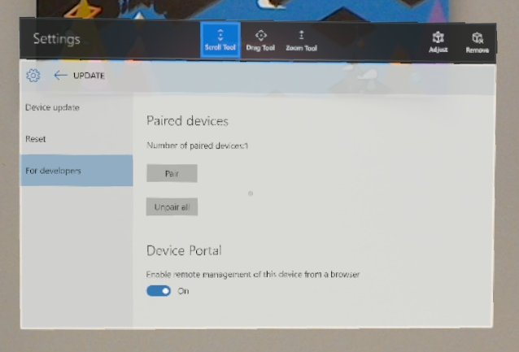
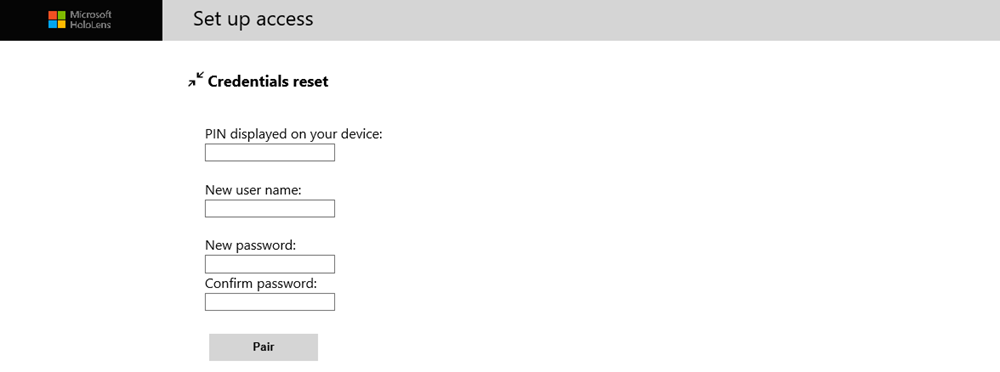
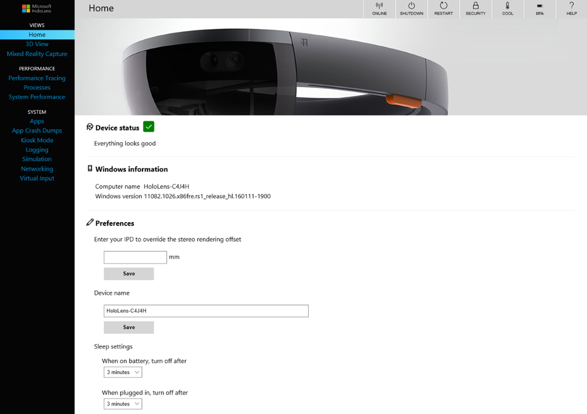
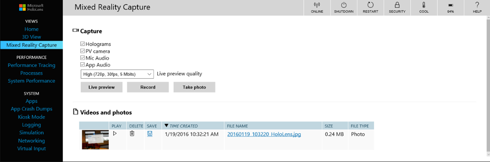
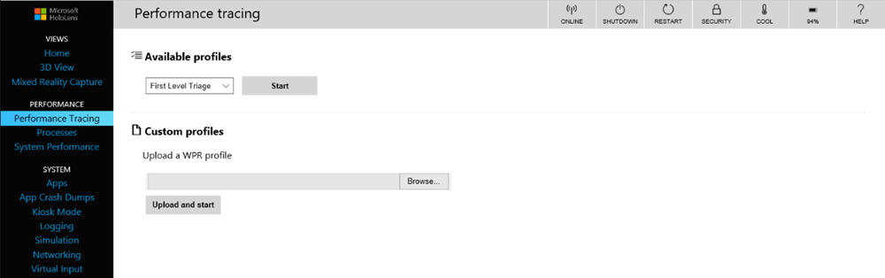
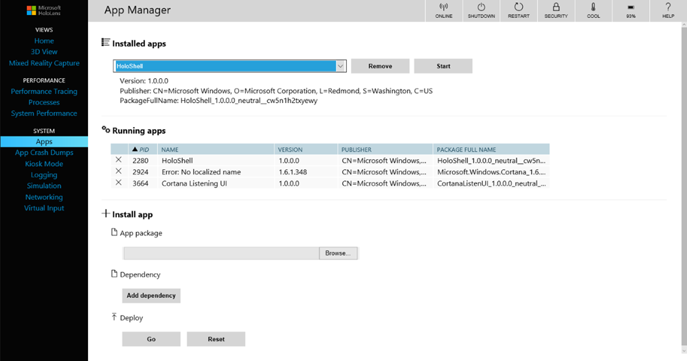
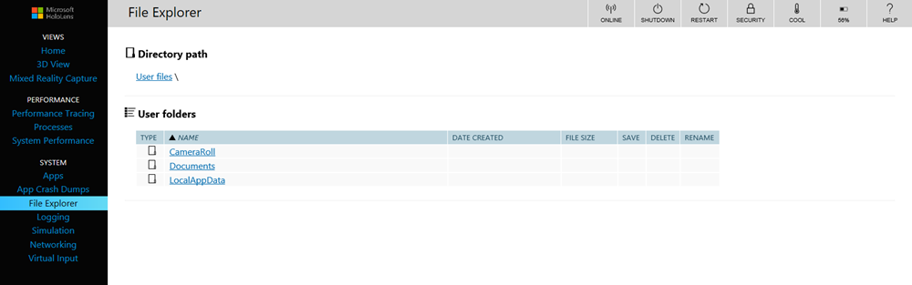
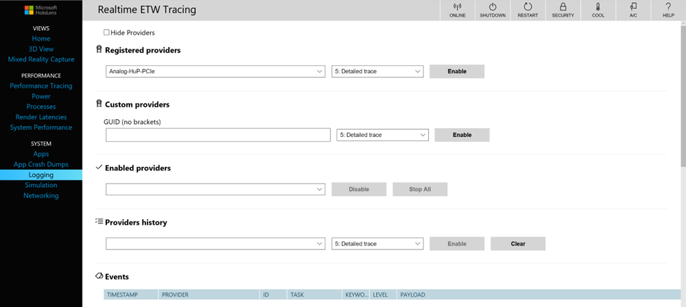
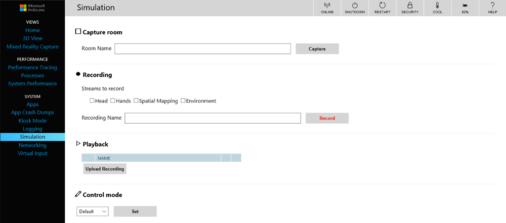

# Using the Windows Device Portal

<table>
<tr>
<th>Feature</th><th style="width:150px"> <a href="hololens-hardware-details.md">HoloLens</a></th><th style="width:150px"> <a href="immersive-headset-hardware-details.md">Immersive headsets</a></th>
</tr><tr>
<td> Windows Device Portal</td><td style="text-align: center;"> ✔️</td><td style="text-align: center;"></td>
</tr>
</table>

The Windows Device Portal for HoloLens lets you configure and manage your device remotely over Wi-Fi or USB. The Device Portal is a web server on your HoloLens that you can connect to from a web browser on your PC. The Device Portal includes many tools that will help you manage your HoloLens and debug and optimize your apps.

This documentation is specifically about the Windows Device Portal for HoloLens. To use the Windows Device portal for desktop (including for Windows Mixed Reality), see [Windows Device Portal overview](https://docs.microsoft.com/windows/uwp/debug-test-perf/device-portal)

## Setting up HoloLens to use Windows Device Portal

1. Power on your HoloLens and put on the device.
2. Perform the [bloom](gestures.md#bloom) gesture to launch the main menu.
3. Gaze at the **Settings** tile and perform the [air-tap](gestures.md#air-tap) gesture. Perform a second air-tap to place the app in your environment. The Settings app will launch after you place it.
4. Select the **Update** menu item.
5. Select the **For developers** menu item.
6. Enable **Developer Mode**.
7. [Scroll down](gestures.md#composite-gestures) and enable **Device Portal**.
8. If you are setting up Windows Device Portal so you can deploy apps to this HoloLens over USB or Wi-Fi, click **Pair** to [generate a pairing PIN](using-visual-studio.md#pairing-your-device-hololens). Leave the Settings app at the PIN popup until you enter the PIN into Visual Studio during your first deployment.

   

## Connecting over Wi-Fi

1. [Connect your HoloLens to Wi-Fi](connecting-to-wi-fi-on-hololens.md).
2. Look up your device's IP address.
   * Find the IP address on the device under **Settings > Network & Internet > Wi-Fi > Advanced Options**.
3. From a web browser on your PC, go to https://<YOUR_HOLOLENS_IP_ADDRESS>
   * The browser will display the following message: "There’s a problem with this website’s security certificate". This happens because the certificate which is issued to the Device Portal is a test certificate. You can ignore this certificate error for now and proceed.

## Connecting over USB

1. [Install the tools](install-the-tools.md) to make sure you have Visual Studio Update 1 with the Windows 10 developer tools installed on your PC. This enables USB connectivity.
2. Connect your HoloLens to your PC with a micro-USB cable.
3. From a web browser on your PC, go to http://127.0.0.1:10080.

## Connecting to an emulator

You can also use the Device Portal with your emulator. To connect to the Device Portal, use the [toolbar](using-the-hololens-emulator.md#anatomy-of-the-hololens-emulator). Click on this icon:
 **Open Device Portal**: Open the Windows Device Portal for the HoloLens OS in the emulator.

## Creating a Username and Password

 
*Set up access to Windows Device Portal*

The first time you connect to the Device Portal on your HoloLens, you will need to create a username and password.
1. In a web browser on your PC, enter the IP address of the HoloLens. The Set up access page opens.
2. Click or tap **Request pin** and look at the HoloLens display to get the generated PIN.
3. Enter the PIN in the **PIN displayed on your device** textbox.
4. Enter the user name you will use to connect to the Device Portal. It doesn't need to be a Microsoft Account (MSA) name or a domain name.
5. Enter a password and confirm it. The password must be at least seven characters in length. It doesn't need to be an MSA or domain password.
6. Click **Pair** to connect to Windows Device Portal on the HoloLens.

If you wish to change this username or password at any time, you can repeat this process by visiting the device security page by either clicking the **Security** link along the top right, or navigating to: https://<YOUR_HOLOLENS_IP_ADDRESS>/devicesecurity.htm.

## Security certificate

If you are see a "certificate error" in your browser, you can fix it by creating a trust relationship with the device.

Each HoloLens generates a unique self-signed certificate for its SSL connection. By default, this certificate is not trusted by your PC's web browser and you may get a "certificate error". By downloading this certificate from your HoloLens (over USB or a Wi-Fi network you trust) and trusting it on your PC, you can securely connect to your device.
1. **Make sure you are on a secure network (USB or a Wi-Fi network you trust).**
2. Download this device's certificate from the "Security" page on the Device Portal.
   * Either click the **Security** link from the top right list of icons or navigate to: https://<YOUR_HOLOLENS_IP_ADDRESS>/devicesecurity.htm
3. Install the certificate in the "Trusted Root Certification Authorities" store on your PC.
   * From the Windows menu, type: Manage Computer Certificates and start the applet.
   * Expand the **Trusted Root Certification Authority** folder.
   * Click on the **Certificates** folder.
   * From the Action menu, select: All Tasks > Import...
   * Complete the Certificate Import Wizard, using the certificate file you downloaded from the Device Portal.
4. Restart the browser.

## Device Portal Pages

### Home

 
*Windows Device Portal home page on Microsoft HoloLens*

Your Device Portal session starts at the Home page. Access other pages from the navigation bar along the left side of the home page.

The toolbar at the top of the page provides access to commonly used status and features.
* **Online**: Indicates whether the device is connected to Wi-Fi.
* **Shutdown**: Turns off the device.
* **Restart**: Cycles power on the device.
* **Security**: Opens the Device Security page.
* **Cool**: Indicates the temperature of the device.
* **A/C**: Indicates whether the device is plugged in and charging.
* **Help**: Opens the REST interface documentation page.

The home page shows the following info:
* **Device Status:** monitors the health of your device and reports critical errors.
* **Windows information:** shows the name of the HoloLens and the currently installed version of Windows.
* **Preferences** section contains the following settings:
   * **IPD**: Sets the interpupillary distance (IPD), which is the distance, in millimeters, between the center of the user's pupils when looking straight ahead. The setting takes effect immediately. The default value was calculated automatically when you set up your device.
   * **Device name**: Assign a name to the HoloLens. You must reboot the device after changing this value for it to take effect. After clicking **Save**, a dialog will ask if you want to reboot the device immediately or reboot later.
   * **Sleep settings**: Sets the length of time to wait before the device goes to sleep when it's plugged in and when it's on battery.

### 3D View

 
*3D View page in Windows Device Portal on Microsoft HoloLens*

Use the 3D View page to see how HoloLens interprets your surroundings. Navigate the view by using the mouse:
* Rotate: left click + mouse;
* Pan: right click + mouse;
* Zoom: mouse scroll.
* **Tracking options**
   * Turn on continuous visual tracking by checking **Force visual tracking**. 
   * **Pause** stops visual tracking.
* **View options**: Set options on the 3D view:
  * **Tracking**: Indicates whether visual tracking is active.
  * **Show floor**: Displays a checkered floor plane.
  * **Show frustum**: Displays the view frustum.
  * **Show stabilization plane**: Displays the plane that HoloLens uses for stabilizing motion.
  * **Show mesh**: Displays the spatial mapping mesh that represents your surroundings.
  * **Show spatial anchors**: Displays spatial anchors for the active app. You must click the Update button to get and refresh the anchors.
  * **Show details**: Displays hand positions, head rotation quaternions, and the device origin vector as they change in real time.
  * **Full screen button**: Shows the 3D View in full screen mode. Press ESC to exit full screen view.
* **Surface reconstruction**: Click or tap **Update** to display the latest spatial mapping mesh from the device. A full pass may take some time to complete, up to a few seconds. The mesh does not update automatically in the 3D view, and you must manually click **Update** to get the latest mesh from the device. Click **Save** to save the current spatial mapping mesh as an obj file on your PC.
* **Spatial anchors**: Click Update to display or update the spatial anchors for the active app.

### Mixed Reality Capture

 
*Mixed Reality Capture page in Windows Device Portal on Microsoft HoloLens*

Use the [Mixed Reality Capture](mixed-reality-capture.md) page to save media streams from the HoloLens.
* **Settings**: Control the media streams that are captured by checking the following settings:
  * **Holograms**: Captures the holographic content in the video stream. Holograms are rendered in mono, not stereo.
  * **PV camera**: Captures the video stream from the photo/video camera.
  * **Mic Audio**: Captures audio from the microphone array.
  * **App Audio**: Captures audio from the currently running app.
  * **Live preview quality**: Select the screen resolution, frame rate, and streaming rate for the live preview.
* Click or tap the **Live preview** button to show the capture stream. **Stop live preview** stops the capture stream.
* Click or tap **Record** to start recording the mixed-reality stream, using the specified settings. **Stop recording** ends the recording and saves it.
* Click or tap **Take photo** to take a still image from the capture stream.
* **Videos and photos**: Shows a list of video and photo captures taken on the device.

Note that HoloLens apps will not be able to capture an MRC photo or video while you are recording or streaming a live preview from the Device Portal.

### Performance Tracing

 
*Performance Tracing page in Windows Device Portal on Microsoft HoloLens*

Capture [Windows Performance Recorder](https://msdn.microsoft.com/library/windows/hardware/hh448205.aspx) (WPR) traces from your HoloLens.
* **Available profiles**: Select the WPR profile from the dropdown, and click or tap **Start** to start tracing.
* **Custom profiles**: Click or tap **Browse** to choose a WPR profile from your PC. Click or tap **Upload and start** to start tracing.

To stop the trace click on the stop link. Stay on this page until the trace file has completed downloading.

Captured ETL files can be opened for analysis in [Windows Performance Analyzer](https://msdn.microsoft.com/library/windows/hardware/hh448170.aspx).

### Processes

 
*Processes page in Windows Device Portal on Microsoft HoloLens*

Shows details about currently running processes. This includes both apps and system processes.

### System Performance

 
*System Performance page in Windows Device Portal on Microsoft HoloLens*

Shows real-time graphs of system diagnostic info, like power usage, frame rate, and CPU load.

These are the available metrics:
* **SoC power**: Instantaneous system-on-chip power utilization, averaged over one minute
* **System power**: Instantaneous system power utilization, averaged over one minute
* **Frame rate**: Frames per second, missed VBlanks per second, and consecutive missed VBlanks
* **GPU**: GPU engine utilization, percent of total available
* **CPU**: percent of total available
* **I/O**: Reads and writes
* **Network**: Received and sent
* **Memory**: Total, in use, committed, paged, and non-paged

### Apps

 
*Apps page in Windows Device Portal on Microsoft HoloLens*

Manages the apps that are installed on the HoloLens.
* **Installed apps**: Remove and start apps.
* **Running apps**: Lists apps that are running currently.
* **Install app**: Select app packages for installation from a folder on your computer/network.
* **Dependency**: Add dependencies for the app you are going to install.
* **Deploy**: Deploy the selected app + dependencies to the HoloLens.

### App Crash Dumps

 
*App Crash Dumps page in Windows Device Portal on Microsoft HoloLens*

This page allows you to collect crash dumps for your side-loaded apps. Check the **Crash Dumps Enabled** checkbox for each app for which you want to collect crash dumps. Return to this page to collect crash dumps. Dump files can be [opened in Visual Studio for debugging](https://msdn.microsoft.com/library/d5zhxt22.aspx).

### File Explorer

 
*File Explorer page in Windows Device Portal on Microsoft HoloLens*

Use the file explorer to browse, upload, and download files. You can work with files in the Documents folder, Pictures folder, and in the local storage folders for apps that you deployed from Visual Studio or the Device Portal.

### Kiosk Mode

>[!NOTE]
>Kiosk mode is only available with the [Microsoft HoloLens Commercial Suite](commercial-features.md).

Please check the [Set up HoloLens in kiosk mode](https://docs.microsoft.com/hololens/hololens-kiosk#set-up-kiosk-mode-using-the-windows-device-portal-windows-10-version-1607-and-version-1803) article in Windows IT Pro Center for up-to-date instructions on enabling kiosk mode via Windows Device Portal.

### Logging

 
*Logging page in Windows Device Portal on Microsoft HoloLens*

Manages realtime Event Tracing for Windows (ETW) on the HoloLens.

Check **Hide providers** to show the **Events** list only.
* **Registered providers**: Select the ETW provider and the tracing level. Tracing level is one of these values:
   1. Abnormal exit or termination
   2. Severe errors
   3. Warnings
   4. Non-error warnings

Click or tap **Enable** to start tracing. The provider is added to the **Enabled Providers** dropdown.
* **Custom providers**: Select a custom ETW provider and the tracing level. Identify the provider by its GUID. Don't include brackets in the GUID.
* **Enabled providers**: Lists the enabled providers. Select a provider from the dropdown and click or tap **Disable** to stop tracing. Click or tap **Stop all** to suspend all tracing.
* **Providers history**: Shows the ETW providers that were enabled during the current session. Click or tap **Enable** to activate a provider that was disabled. Click or tap **Clear** to clear the history.
* **Events**: Lists ETW events from the selected providers in table format. This table is updated in real time. Beneath the table, click on the **Clear** button to delete all ETW events from the table. This does not disable any providers. You can click **Save to file** to export the currently collected ETW events to a CSV file locally.
* **Filters**: Allow you to filter the ETW events collected by ID, Keyword, Level, Provider Name, Task Name, or Text. You can combine several criteria together:
   1. For criteria applying to the same property - events can satisfy any one of these criteria are shown.
   2. For criteria applying to different property - events must satisfy all of the criteria

For example, you can specify the criteria *(Task Name contains 'Foo' or 'Bar') AND (Text contains 'error' or 'warning')*

### Simulation

 
*Simulation page in Windows Device Portal on Microsoft HoloLens*

Allows you to record and play back input data for testing.
* **Capture room**: Used to download a simulated room file that contains the spatial mapping mesh for the user's surroundings. Name the room and then click **Capture** to save the data as a .xef file on your PC. This room file can be loaded into the HoloLens emulator.
* **Recording**: Check the streams to record, name the recording, and click or tap **Record** to start recoding. Perform actions with your HoloLens and then click **Stop** to save the data as a .xef file on your PC. This file can be loaded on the HoloLens emulator or device.
* **Playback**: Click or tap **Upload recording** to select a xef file from your PC and send the data to the HoloLens.
* **Control mode**: Select **Default** or **Simulation** from the dropdown, and click or tap the **Set** button to select the mode on the HoloLens. Choosing "Simulation" disables the real sensors on your HoloLens and uses uploaded simulated data instead. If you switch to "Simulation", your HoloLens will not respond to the real user until you switch back to "Default".

### Networking

 
*Networking page in Windows Device Portal on Microsoft HoloLens*

Manages Wi-Fi connections on the HoloLens.
* **WiFi adapters**: Select a Wi-Fi adapter and profile by using the dropdown controls. Click or tap **Connect** to use the selected adapter.
* **Available networks**: Lists the Wi-Fi networks that the HoloLens can connect to. Click or tap **Refresh** to update the list.
* **IP configuration**: Shows the IP address and other details of the network connection.

### Virtual Input

 
*Virtual Input page in Windows Device Portal on Microsoft HoloLens*

Sends keyboard input from the remote machine to the HoloLens.

Click or tap the region under **Virtual keyboard** to enable sending keystrokes to the HoloLens. Type in the **Input text** textbox and click or tap **Send** to send the keystrokes to the active app.

## Device Portal REST API's

Everything in the device portal is built on top of [REST API's](device-portal-api-reference.md) that you can optionally use to access the data and control your device programmatically.
