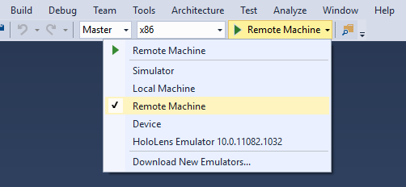
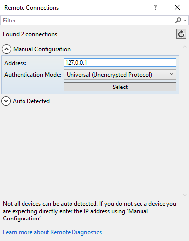
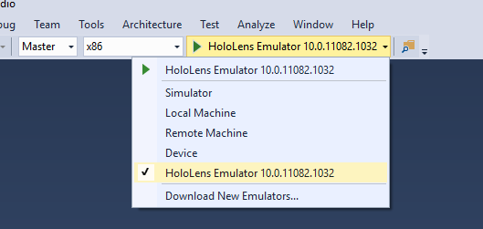

# Using Visual Studio to deploy and debug

Whether you want to use DirectX or Unity to develop your mixed reality app, you will use Visual Studio for debugging and deploying. In this section, you will learn:
* How to deploy applications to your HoloLens or Windows Mixed Reality immersive headset through Visual Studio.
* How to use the HoloLens emulator built in to Visual Studio.
* How to debug mixed reality apps.

## Prerequisites
1. See [Install the Tools](install-the-tools.md) for installation instructions.
2. Create a new Universal Windows app project in Visual Studio 2015 Update 1 or Visual Studio 2017. C#, C++, and JavaScript projects are all supported. (Or follow the instructions to [create an build an app in Unity](holograms-100.md).)

## Enabling Developer Mode

Start by enabling **Developer Mode** on your device so Visual Studio can connect to it.

### HoloLens
1. Turn on your HoloLens and put on the device.
2. Perform the [bloom](gestures.md#bloom) gesture to launch the main menu.
3. Gaze at the **Settings** tile and perform the [air-tap](gestures.md#air-tap) gesture. Perform a second air tap to place the app in your environment. The Settings app will launch after you place it.
4. Select the **Update** menu item.
5. Select the **For developers** menu item.
6. Enable **Developer Mode**. This will allow you to [deploy apps from Visual Studio](using-visual-studio.md) to your HoloLens.
7. Optional: Scroll down and also enable **Device Portal**. This will also allow you to connect to the [Windows Device Portal](using-the-windows-device-portal.md) on your HoloLens from a web browser.

### Windows PC

If you are working with a Windows Mixed Reality headset connected to your PC, you must enable **Developer Mode** on the PC.
1. Go to **Settings**
2. Select **Update and Security**
3. Select **For developers**
4. Enable **Developer Mode**, read the disclaimer for the setting you chose, then click Yes to accept the change.

## Deploying an app over Wi-Fi (HoloLens)
1. Select an **x86** build configuration for your app 

2. Select **Remote Machine** in the deployment target drop-down menu 
3. For C++ and JavaScript projects, go to **Project > Properties > Configuration Properties > Debugging**. For C# projects, a dialog will automatically pop-up to configure your connection.
  a. Enter the IP address of your device in the **Address** or **Machine Name** field. Find the IP address on your HoloLens under **Settings > Network & Internet > Advanced Options**, or you can ask Cortana "What is my IP address?"
  b. Set Authentication Mode to **Universal (Unencrypted protocol)**
4. Select **Debug > Start debugging** to deploy your app and start debugging
5. The first time you deploy an app to your HoloLens from your PC, you will be prompted for a PIN. Follow the **Pairing your device** instructions below.

If your HoloLens IP address changes, you can change the IP address of the target machine by going to **Project > Properties > Configuration Properties > Debugging**

## Deploying an app over USB (HoloLens)
1. Select an **x86** build configuration for your app

2. Select **Device** in the deployment target drop-down menu
3. Select **Debug > Start debugging** to deploy your app and start debugging
4. The first time you deploy an app to your HoloLens from your PC, you will be prompted for a PIN. Follow the **Pairing your device** instructions below.

## Deploying an app to your Local PC (immersive headset)

Follow these instructions when using a Windows Mixed Reality immersive headset that connects to your PC or the [Mixed Reality simulator](using-the-windows-mixed-reality-simulator.md). In these cases, simply deploy and run your app on the local PC.
1. Select an **x86** or **x64** build configuration for your app
2. Select **Local Machine** in the deployment target drop-down menu
3. Select **Debug > Start debugging** to deploy your app and start debugging

## Pairing your device (HoloLens)

The first time you deploy an app from Visual Studio to your HoloLens, you will be prompted for a PIN. On the HoloLens, generate a PIN by launching the Settings app, go to **Update > For Developers** and tap on **Pair**. A PIN will be displayed on your HoloLens; type this PIN in Visual Studio. After pairing is complete, tap **Done** on your HoloLens to dismiss the dialog. This PC is now paired with the HoloLens and you will be able to deploy apps automatically. Repeat these steps for every subsequent PC that is used to deploy apps to your HoloLens.

To un-pair your HoloLens from all computers it was paired with, launch the **Settings** app, go to **Update > For Developers** and tap on **Clear**.

## Deploying an app to the HoloLens Emulator
1. Make sure you have **[installed the HoloLens Emulator](install-the-tools.md)**.
2. Select an **x86** build configuration for your app.

3. Select **HoloLens Emulator** in the deployment target drop-down menu
4. Select **Debug > Start debugging** to deploy your app and start debugging

## Graphics Debugger

The Visual Studio Graphics Diagnostics tools are very helpful when writing and optimizing a Holographic app. See [Visual Studio Graphics Diagnostics on MSDN](https://msdn.microsoft.com/library/hh315751.aspx) for full details.

**To Start the Graphics Debugger**
1. Follow the instructions above to target a device or emulator
2. Go to **Debug > Graphics > Start Diagnostics**
3. The first time you do this with a HoloLens, you may get an "access denied" error. Reboot your HoloLens to allow updated permissions to take effect and try again.

## Profiling

The Visual Studio profiling tools allow you to analyze your app's performance and resource use. This includes tools to optimize CPU, memory, graphics, and network use. See [Run diagnostic tools without debugging on MSDN](https://msdn.microsoft.com/library/dn957936.aspx) for full details.

**To Start the Profiling Tools with HoloLens**
1. Follow the instructions above to target a device or emulator
2. Go to **Debug > Start Diagnostic Tools Without Debugging...**
3. Select the tools you want to use
4. Click **Start**
5. The first time you do this with a HoloLens, you may get an "access denied" error. Reboot your HoloLens to allow updated permissions to take effect and try again.

## Debugging an installed or running app

You can use Visual Studio to debug a Universal Windows app that's installed without deploying from a Visual Studio project. This is useful if you want to debug an installed app package, or if you want to debug an app that's already running.
1. Go to **Debug -> Other Debug Targets -> Debug Installed App Package**
2. Select the **Remote Machine** target for HoloLens or **Local Machine** for immersive headsets.
3. Enter your device’s **IP address**
4. Choose the **Universal** Authentication Mode
5. The window shows both running and inactive apps. Pick the one what you’d like to debug.
6. Choose the type of code to debug (Managed, Native, Mixed)
7. Click **Attach** or **Start**

## See also
* [Install the tools](install-the-tools.md)
* [Using the HoloLens emulator](using-the-hololens-emulator.md)
* [Deploying and debugging Universal Windows Platform (UWP) apps](https://msdn.microsoft.com/library/windows/apps/xaml/mt613243.aspx)
* [Enable your device for development](https://docs.microsoft.com/windows/uwp/get-started/enable-your-device-for-development)
