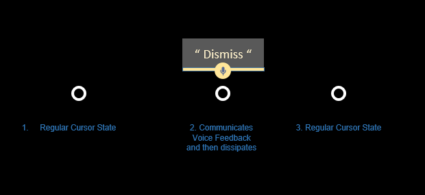

# Voice input

Voice is one of the key forms of input on HoloLens. It allows you to directly command a hologram without having to use [gestures](gestures.md). Voice input can be a natural way to communicate your intent. Voice is especially good at traversing complex interfaces because it lets users cut through nested menus with one command.

Voice input is powered by the [same engine](https://msdn.microsoft.com/library/windows/apps/mt185615.aspx) that supports speech in all other Universal Windows Apps.

 

## Voice and gaze

When using voice commands, gaze is typically used as the targeting mechaninism, whether with a cursor ("select") or to direct your command to an application in front of you, even when there is no visible gaze cursor ("see it, say it"). Of course, some voice commands don't require a target at all, like "go to start" or "Hey, Cortana."

 

>[!VIDEO https://www.youtube.com/embed/eHMkOpNUtR8]

## Device support

<table>
    <colgroup>
    <col width="25%" />
    <col width="25%" />
    <col width="25%" />
    <col width="25%" />
    </colgroup>
    <tr>
        <td><strong>Feature</strong></td>
        <td><a href="hololens-hardware-details.md"><strong>HoloLens (1st gen)</strong></a></td>
        <td><strong>HoloLens 2</strong></td>
        <td><a href="immersive-headset-hardware-details.md"><strong>Immersive headsets</strong></a></td>
    </tr>
     <tr>
        <td>Voice input</td>
        <td>✔️</td>
        <td>✔️</td>
        <td>✔️ (with microphone)</td>
    </tr>
</table>

## The "select" command

**HoloLens (1st gen)**

Even without specifically adding voice support to your app, your users can activate holograms simply by saying "select". This behaves the same as an [air tap](gestures.md#air-tap) on HoloLens, pressing the select button on the [HoloLens clicker](hardware-accessories.md#hololens-clicker), or pressing the trigger on a [Windows Mixed Reality motion controller](motion-controllers.md). You will hear a sound and see a tooltip with "select" appear as confirmation. "Select" is enabled by a low power keyword detection algorithm so it is always available for you to say at any time with minimal battery life impact, even with your hands at your side.

**HoloLens 2**

In order to use the "select" voice command in HoloLens 2, you first need to bring up the gaze cursor to use as a pointer. The command to bring it up is easy to remember -- just say, "select". 

To exit the mode, simply use your hands again, either by airtapping, approaching a button with your fingers, or using the system gesture.

 
*Say "select" to use the voice command for selection*

## Hey Cortana

You can also say "Hey Cortana" to bring up Cortana at anytime. You don't have to wait for her to appear to continue asking her your question or giving her an instruction - for example, try saying "Hey Cortana what's the weather?" as a single sentence. For more information about Cortana and what you can do, simply ask her! Say "Hey Cortana what can I say?" and she'll pull up a list of working and suggested commands. If you're already in the Cortana app you can also click the **?** icon on the sidebar to pull up this same menu.

**HoloLens-specific commands**
* "What can I say?"
* "Go home" or "Go to Start" - instead of [bloom](gestures.md#bloom) to get to [Start Menu](navigating-the-windows-mixed-reality-home.md#start-menu)
* "Launch <app>"
* "Move <app> here"
* "Take a picture"
* "Start recording"
* "Stop recording"
* "Increase the brightness"
* "Decrease the brightness"
* "Increase the volume"
* "Decrease the volume"
* "Mute" or "Unmute"
* "Shut down the device"
* "Restart the device"
* "Go to sleep"
* "What time is it?"
* "How much battery do I have left?"
* "Call <contact>" (requires Skype for HoloLens)

## "See It, Say It"

HoloLens has a "see it, say it" model for voice input, where labels on buttons tell users what voice commands they can say as well. For example, when looking at an app window in HoloLens (first gen), a user can say the "Adjust" command which they see in the App bar to adjust the position of the app in the world.

When apps follow this rule, users can easily understand what to say to control the system. To reinforce this, while gazing at a button in HoloLens 1 (first gen), you will see a "voice dwell" tooltip that comes up after a second if the button is voice-enabled and displays the command to speak to "press" it. To reveal voice tooltips in HoloLens 2, show the voice cursor by saying "select" or "What can I say" (see below). 

 
*"See it, say it" commands appear below the buttons*

## Voice commands for fast hologram manipulation

There are also a number of voice commands you can say while gazing at a hologram to quickly perform manipulation tasks. These voice commands work on app windows as well as 3D objects you have placed in the world.

**Hologram manipulation commands**
* Face me
* Bigger | Enhance
* Smaller

## Discovering voice commands

Some commands, like the commands for fast manipulation above, can be hidden. To learn about what commands you can use, gaze at an object and say, "what can I say?". A list of possible commands pops up. You can also use the gaze cursor to look around and reveal the voice tooltips for each button in front of you. 

If you want a complete list, just say, "Show all commands" anytime. 

## Dictation

Rather than typing with [air taps](gestures.md#air-tap), voice dictation can be more efficient to enter text into an app. This can greatly accelerate input with less effort for the user.

 
*Voice dictation starts by selecting the microphone button on the keyboard*

Any time the holographic keyboard is active, you can switch to dictation mode instead of typing. Select the microphone on the side of the text input box to get started.

# Adding voice commands to your app

Consider adding voice commands to any experience that you build. Voice is a powerful and convenient way control the system and apps. Because users speak with a variety of dialects and accents, proper choice of speech keywords will make sure that your users' commands are interpreted unambiguously.

### Best practices

Below are some practices that will aid in smooth speech recognition.
* **Use concise commands** - When possible, choose keywords of two or more syllables. One-syllable words tend to use different vowel sounds when spoken by persons of different accents. Example: "Play video" is better than "Play the currently selected video"
* **Use simple vocabulary** - Example: "Show note" is better than "Show placard"
* **Make sure commands are non destructive** - Make sure any action that can be taken by a speech command is non destructive and can easily be undone in case another person speaking near the user accidentally triggers a command.
* **Avoid similar sounding commands** - Avoid registering multiple speech commands that sound very similar. Example: "Show more" and "Show store" can be very similar sounding.
* **Unregister your app when not it use** - When your app is not in a state in which a particular speech command is valid, consider unregistering it so that other commands are not confused for that one.
* **Test with different accents** - Test your app with users of different accents.
* **Maintain voice command consistency** - If "Go back" goes to the previous page, maintain this behavior in your applications.
* **Avoid using system commands** - The following voice commands are reserved for the system. These should not be used by applications.
   * "Hey Cortana"
   * "Select"
   * "Go to start"

### Voice's strengths

Voice input is a natural way to communicate our intents. Voice is especially good at interface **traversals** because it can help users cut through multiple steps of an interface (a user might say "go back" while looking at Web page, instead of having to go up and hit the back button in the app). This small time savings has a powerful **emotional effect** on user’s perception of the experience and gives them a small amount superpower. Using voice is also a convenient input method when we have our arms full or are **multi-tasking**. On devices where typing on a keyboard is difficult, **voice dictation** can be an efficient alternative way to input. Lastly, in some cases when the **range of accuracy** for gaze and gesture are limited, Voice might be a user’s only trusted method input.

**How using voice can benefit the user**
* Reduces time - it should make the end goal more efficient.
* Minimizes effort - it should make tasks more fluid and effortless.
* Reduces cognitive load - it's intuitive, easy to learn, and remember.
* It's socially acceptable - it should fit in with societal norms in terms of behavior.
* It's routine - voice can readily become a habitual behavior.

### Voice's weaknesses

Voice also has some weaknesses. Fine-grained control is one of them. (for example a user might say "louder," but can’t say how much. "A little" is hard to quantify. Moving or scaling things with voice is also difficult (voice does not offer the granularity of control). Voice can also be imperfect. Sometimes a voice system incorrectly hears a command or fails to hear a command. Recovering from such errors is a challenge in any interface. Lastly, voice may not be socially acceptable in public places. There are some things that users can’t or shouldn’t say. These cliffs allow speech to be used for what it is best at.

### Voice feedback states

When Voice is applied properly, the user understands **what they can say and get clear feedback** the system **heard them correctly**. These two signals make the user feel confident in using Voice as a primary input. Below is a diagram showing what happens to the cursor when voice input is recognized and how it communicates that to the user.

 
*Voice feedback states for cursor*

## Top things users should know about "speech" in mixed reality
* Say **"Select"** while targeting a button (you can use this anywhere to click a button).
* You can say the **label name of an app bar button** in some apps to take an action. For example, while looking at an app, a user can say the command "Remove" to remove the app from the world (this saves time from having to click it with your hand).
* You can initiate Cortana listening by saying **"Hey Cortana."** You can ask her questions ("Hey Cortana, how tall is the Eiffel tower"), tell her to open an app ("Hey Cortana, open Netflix"), or tell her to bring up the Start Menu ("Hey Cortana, take me home") and more.

## Common questions and concerns users have about voice
* What can I say?
* How do I know the system heard me correctly?
   * The system keeps getting my voice commands wrong.
   * It doesn’t react when I give it a voice command.
* It reacts the wrong way when I give it a voice command.
* How do I target my voice to a specific app or app command?
* Can I use voice to command things out the holographic frame on HoloLens?

## Communication

For applications that want to take advantage of the customized audio input processing options provided by HoloLens, it is important to understand the various [audio stream categories](https://msdn.microsoft.com/library/windows/desktop/hh404178(v=vs.85).aspx) your app can consume. Windows 10 supports several different stream categories and HoloLens makes use of three of these to enable custom processing to optimize the microphone audio quality tailored for speech, communication and other which can be used for ambient environment audio capture (i.e. "camcorder") scenarios.
* The AudioCategory_Communications stream category is customized for call quality and narration scenarios and provides the client with a 16kHz 24bit mono audio stream of the user's voice
* The AudioCategory_Speech stream category is customized for the HoloLens (Windows) speech engine and provides it with a 16kHz 24bit mono stream of the user's voice. This category can be used by 3rd party speech engines if needed.
* The AudioCategory_Other stream category is customized for ambient environment audio recording and provides the client with a 48kHz 24 bit stereo audio stream.

All this audio processing is hardware accelerated which means the features drain a lot less power than if the same processing was done on the HoloLens CPU. Avoid running other audio input processing on the CPU to maximize system battery life and take advantage of the built in, offloaded audio input processing.

## Languages

HoloLens 2 also supports additional languages. Keep in mind that speech commands will always run in the system's display language even if multiple keyboards are installed or if apps attempt to create a speech recognizer in a different language.

## Troubleshooting

If you're having any issues using "select" and "Hey Cortana", try moving to a quieter space, turning away from the source of noise, or by speaking louder. At this time, all speech recognition on HoloLens is tuned and optimized specifically to native speakers of United States English.

For the Windows Mixed Reality Developer Edition release 2017, the audio endpoint management logic will work fine (forever) after logging out and back in to the PC desktop after the initial HMD connection. Prior to that first sign out/in event after going through WMR OOBE, the user could experience various audio functionality issues ranging from no audio to no audio switching depending on how the system was set up prior to connecting the HMD for the first time.

## See also
* [Voice input in DirectX](voice-input-in-directx.md)
* [Voice input in Unity](voice-input-in-unity.md)
* [MR Input 212: Voice](holograms-212.md)
