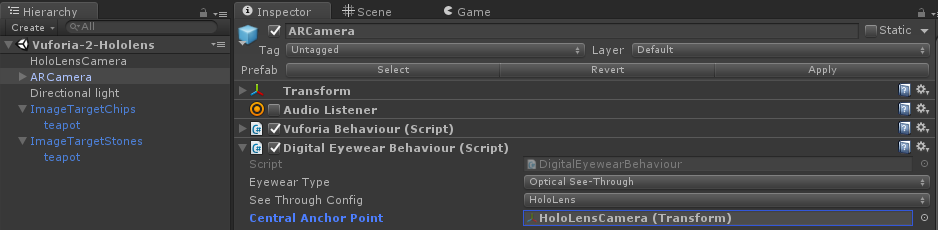
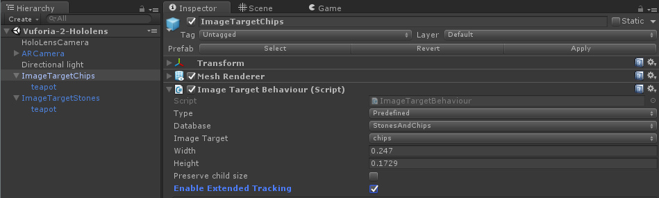

# Using Vuforia with Unity

Vuforia brings an important capability to HoloLens – the power to connect AR experiences to specific images and objects in the environment. You can use this capability to overlay guided step by step instructions on top of machinery or to add digital features to a physical product.

Enterprise developers – you can use VuMarks to uniquely identify each piece of machinery on a factory floor – right down to the serial number. VuMarks are scalable into the billions and can be designed to look just like a company logo. They are the ideal solution for adding AR to any product that HoloLens can see.

Existing Vuforia apps that were built for phones and tablets can easily be configured in Unity to run on HoloLens. You can even use Vuforia to take your new HoloLens app to Windows 10 tablets such as the Surface Pro 4 and Surface Book.

## Get the tools

[Install the recommended versions](install-the-tools.md) of Visual Studio and Unity and then configure Unity to use Visual Studio and the preferred IDE and compiler. You will also need to install [Visual Studios tools for Unity](https://msdn.microsoft.com/library/dn940025.aspx).

When installing Unity, be sure to install the Windows Store platform, and also the .NET Scripting Backend. Windows Store components can also be installed afterwards from the Build Settings dialog when the Windows Store platform is selected.

## Getting started with Vuforia

Vuforia’s support for HoloLens is implemented in version 6.1 of the Vuforia Unity extension. The best starting point, to understand the structure and organization of a Vuforia HoloLens project in Unity, is with the [Unity HoloLens sample](https://developer.vuforia.com/downloads/samples). This provides a complete HoloLens project that includes the Vuforia Unity Extension for Windows 10 as well as a pre-configured scene that can be deployed to a HoloLens.

The scene implements a Vuforia to HoloLens camera binding, along with the build settings necessary to deploy a HoloLens app. It shows how to use image targets and extended tracking to recognize an image and augment it with digital content in a HoloLens experience. You can easily substitute your own content in this scene to begin experimenting with the creation of HoloLens apps that use Vuforia.

### Configuring a Vuforia App for HoloLens

Developing a Vuforia app for HoloLens is fundamentally the same as developing Vuforia apps for other devices. You’ll simply need to apply a binding between the Vuforia ARCamera and the HoloLens scene camera, and enable extended tracking on your targets. You can then apply the build settings described in the Building and Executing a Vuforia app for HoloLens section. That’s all that’s needed to enable Vuforia to work with the HoloLens spatial mapping and positional tracking systems.
1. Enable **Extended Tracking** on your targets
2. Bind the **ARCamera** to the HoloLens scene camera

### Binding the HoloLens scene camera

Vuforia uses the ARCamera prefab as its scene camera in a Unity project. You’ll need to bind the scene camera used by HoloLens to the ARCamera to enable Vuforia to interact with HoloLens. The [Vuforia HoloLens sample](https://library.vuforia.com/articles/Solution/Working-with-the-HoloLens-sample-in-Unity) shows how to configure the [scene camera](camera-in-unity.md) used by HoloLens.

**Follow these steps to bind the HoloLens scene camera to the Vuforia ARCamera:**
1. Add an ARCamera and HoloLens scene camera to your scene Hierarchy
2. Set up the scene for stereo rendering in the ARCamera’s digital eyewear behavior component.
    * Eyewear type = Optical See-Through
3. Select HoloLens as the device configuration
    * See Through Config = HoloLens
4. Bind the HoloLens scene camera to the ARCamera
    * Drag the HoloLens Scene camera onto the Central Anchor Point field

 
*Unity editor window showing the HoloLensCamera selected*

## Building and executing a Vuforia app for HoloLens
1.  [Add an Eyewear App License Key](https://library.vuforia.com/articles/Solution/How-To-add-a-License-Key-to-your-Vuforia-App) in the ARCamera Inspector
2.  Apply the recommended [Unity engine options for power and performance](performance-recommendations-for-unity.md)
3.  Add the sample scenes to **Scenes in Build.**
4.  Set your platform build target for Windows Store in **File > Build Settings.**
5.  Select the following platform build configuration settings
    * SDK = Universal10
    * UWP Build Type = D3D
6.  Define a unique **Product Name**, in **Player Settings**, to serve as the name of the app when installed on the HoloLens.
7.  Select **Landscape Left** as the in **Player Settings > Resolution and Presentation**
8.  Check **Virtual Reality Supported** + **Windows Holographic** in **Player Settings** > **Other Settings**
9.  Check the following Capabilities in **Player Settings** > **Publish Settings**
    * InternetClient
    * WebCam
    * SpatialPerception - if you intend to use the Surface Observer API
10. Select Build to generate a Visual Studio project
11. Build the executable from Visual Studio and install it on your HoloLens

>[!IMPORTANT]
>**Visual Studio Build Configuration:** Be sure to set your build target for x86. Note that the EAP release supports only 32 bit builds.

## Extended tracking with Vuforia

[Extended tracking](https://library.vuforia.com/articles/Training/Extended-Tracking) creates a map of the environment to maintain tracking even when a target is no longer in view. It is Vuforia’s counterpart to the spatial mapping performed by HoloLens. When you enable extended tracking on a target, you enable the pose of that target to be passed to the spatial mapping system. In this way, targets can exist in both the Vuforia and HoloLens spatial coordinate systems, though not simultaneously.

 
*Unity settings window*

**Enabling Extended Tracking on a Target**

Vuforia will automatically transform the pose of a target that uses extended tracking into the HoloLens spatial coordinate system. This allows HoloLens to take over tracking, and to integrate any content augmenting the target into the spatial map of the target’s surroundings. This process occurs between the Vuforia SDK and mixed reality APIs in Unity, and does not require any programming by the developer - it's handled automatically.

**Here is what occurs...**
1. Vuforia’s target Tracker recognizes the target
2. Target tracking is then initialized
3. The position and rotation of the target are analyzed to provide a robust pose estimate for HoloLens to use
4. Vuforia transforms the target's pose into the HoloLens spatial mapping coordinate space
5. HoloLens takes over tracking and the Vuforia tracker is deactivated

The developer can control this process, to return control to Vuforia, by disabling extended tracking on the TargetBehaviour.

## See also
* [Install the tools](install-the-tools.md)
* [Coordinate systems](coordinate-systems.md)
* [Spatial mapping](spatial-mapping.md)
* [Camera in Unity](camera-in-unity.md)
* [Exporting and building a Unity Visual Studio solution](exporting-and-building-a-unity-visual-studio-solution.md)
* [Vuforia documentation: Developing for Windows 10 in Unity](https://library.vuforia.com/articles/Solution/Developing-for-Windows-10-in-Unity)
* [Vuforia documentation: How to install the Vuforia Unity extension](https://library.vuforia.com/articles/Solution/Installing-the-Unity-Extension)
* [Vuforia documentation: Working with the HoloLens sample in Unity](https://library.vuforia.com/articles/Solution/Working-with-the-HoloLens-sample-in-Unity)
* [Vuforia documentation: Extended tracking in Vuforia](https://library.vuforia.com/articles/Training/Extended-Tracking)
