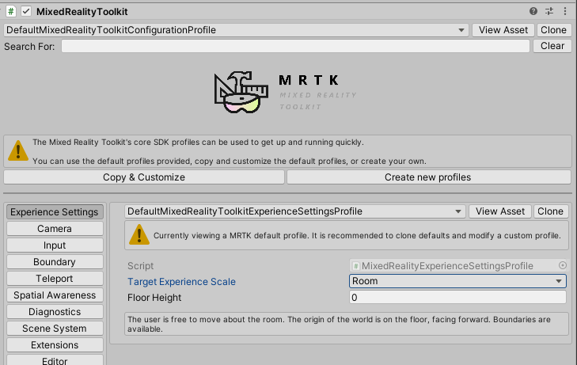

# Experience settings

One of the challenges of creating UI for Mixed Reality is aligning across different experiences. With MRTK, you can set the `Target Experience Scale` and the `Content Offset` for your scene, will configue the following 
to behave appropriately for the target scale.

- Mixed Reality Scene Content
- Boundary System

  

## Target Experience Scale

The **Target Experience Scale** specifies the environment for which the experience is designed. It can take on the following values.

* *OrientationOnly* - An experience which utilizes only the headset orientation and is gravity aligned. The coordinate system origin is at head level.
* *Seated* - An experience designed for seated use. The coordinate system origin is at floor level.
* *Standing* - An experience designed for stationary standing use. The coordinate system origin is at floor level.
* *Room* - An experience designed to support movement throughout a room. The coordinate system origin is at floor level.
* *World* - An experience designed to utilize and move through the physical world. The coordinate system origin is at head level.

## Content Offset

This parameter specifies the height above the floor to offset [Mixed Reality Scene Content](scene-content.md) when **Alignment Type** is set to **Align with Experience Scale**
